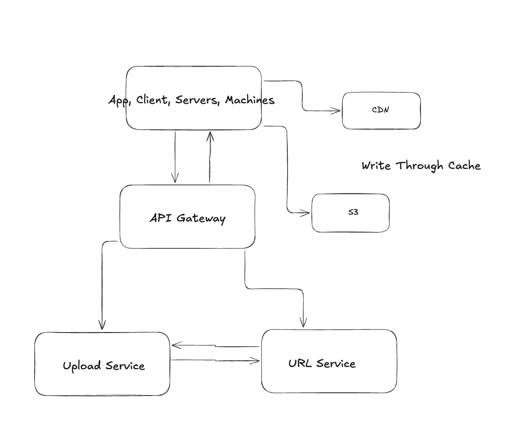
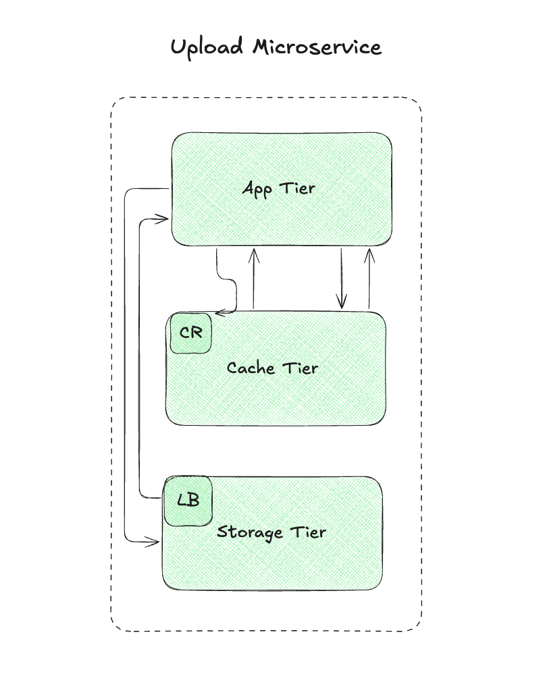

# Design a Pastebin-like Web Service

## Problem Statement
Design a web service that allows users to paste or upload text and generate unique URLs that can be shared to access the uploaded text.

### Key Requirements:
1. Users should be able to upload or paste text.
2. Users should be able to generate a unique URL to access the uploaded text.
3. Data and links should expire after a specific time span automatically, and users should also be able to specify expiration time.
4. The system should not have any downtime, offer minimum latency, and no data should be lost.

### Deliverables
1. Implementation of top-down steps of a system design interview for the use case.
2. **Extension 1:** Identify all the APIs involved.
3. **Extension 2:** Come up with the database schema.

### Clarifying Questions

### 1. What should be the limit on the amount of text a user can paste at a time?
- We can limit users to not have pastes bigger than **10MB** to stop the abuse of the service.
- Assume **1 million new pastes per day**.

### 2. Should we impose size limits on custom URLs?
- Since our service supports custom URLs, users can pick any URL that they like, but providing a custom URL is not mandatory.
- It is reasonable (and often desirable) to impose a size limit on custom URLs to maintain a consistent URL database.

### 3. Would we have any links that are private?
- No, the system that we are designing will have all the links as public. Adding privacy to the links is beyond the scope of this problem.

### 4. What would be the read: write ratio of the application?
- The read: write ratio can be assumed as **10:1**.

---

## Functional Requirements  
- As a user, I should be able to upload or paste the text.
- As a user, I should be able to generate a unique URL to access the uploaded text.
- As a user, I must be able to specify expiration time  
  - Default setting, document does not expire
- As a system, I should assign a default expiration time if one is not provided 
- As a platform, Data and links should expire after a specific timespan automatically  
  - Soft delete, then after 30 days, hard delete   

---

## Non-Functional Requirements  
- Availability is more important than consistency. The system must not have any downtime.  
- Latency must be below 500ms  
- No data should be lost  
- Pastes are only text  
- Traffic is not evenly distributed  

**Data**
- Text: 10MB  

**Users**
- 500 Million Users  
- 100M DAU  
- 100K Links shared per day  
- 1M paste/upload per day  
- 20K new users a year  
- 10:1 Read/Write Ratio (Read heavy)  

**Microservices**
- Upload Service  
- URL Service  
- Expiration Service  

**Out of Scope**
- Accounts  
- Analytics  
- Payments/Ads  
- Auth  
- Monitoring/Logging/Alerting  

---

## High level architecture 


--- 

## Deep dive into the Upload Service 


--- 

## Scale App Tier - CPU 

**createPaste**
- Three api's calls in parallel. 
    - Cache the file in a CDN for low latency access
    - Get presigned URL & Upload data (text) to S3 for durability
    - Send data to API Gateway
- Assumption, if User created a unique URL, don't create a system 
  generated URL
- Create system generated URL (Use a distributed ID generator) 15ms 
- Persist metadata in NoSQL Database with a TTL Index 20ms 
- Add id:uniqueUrl to metadata cache 5ms
- Return uniqueUrl to User 

Total ~ 40ms

**ReadPaste**

- Check cache for id, if found, return content - 5ms  
- Check DB for uniqueUrl, if not expired, return - 20ms 
- Add uniqueUrl to Cache - 5ms
- Return - 1ms
Total 30ms

**RPS**
1m pastes per day / 100,000 (seconds per day) 
= 10 RPS * 40ms 
= 400ms CPU time/Sec
100m reads per day / 100,000 (seconds per day) 
=  1000 RPS * 30ms 
= 30,000ms CPU time/sec
Total (30,400) / Capacity (30,000)
= 1 Server
Total Servers we need is 2 servers, with 3x replications = 6 Servers

### Scale App Tier - Network (Amount of data coming in + amount of data going out)  

**createPaste**

user_id (int64), expires_in(timestamp), unique_url(char60)
8bytes + 12bytes + 60 bytes + 1kb (overhead) = 1.1kb
Total = 1.1kb

**readPaste**

user_id(int64), unique_url(char60)
8bytes + 60bytes + 1kb (overhead) 
= 1kb

Total = 1kb

**Totals**

(1.1kb * 10rps)  + (1kb * 30,000 rps) 
= 40,000kb/s 
= 40MB/s

**Summary**

1 server capacity = 1.25 GB/s (10Gbit)
1 server to handle network traffic

---

### Scale Storage Tier 

**Requirements for storage**
- The large data content needs to be stored in object storage like S3 and 
cached in a CDN to geographically distribute content. 
- The MetaData Will be stored in a NoSQL DB with a TTL to soft delete 
- Needs to be optimized for reads

**Tables**
paste: user_id (int64), s3_link (varchar60), expired_at(timestamp), unique_url(char60)
user: userId(int64), name(char30), etc

**pasteTable**: 100million at any point in time
8 bytes + 8 bytes + 60 bytes + 60bytes = 128bytes.  
128bytes * 100M
= 128B Bytes * (how long do we want to persist the data) 3 years 
= ~600B Bytes 
= 600Gb

**userTable:** 1Billion Users
8 bytes + 8 bytes + 8 bytes 
= 25 bytes * 1Billion = 25Billion Bytes * 10 years storage 
= 75B bytes / 1 billion (GB) 
= 25GB

**Total = 1TB**

**Summary**
* 1TB of data. One server can handle 10Tb. Let's add one more to reduce utilization
* 1 Server * 3x replication = 3 servers
* Availability is important, AP system with 3 replicas needs w.q=2 and r.q=2
* May want to consider a single leader replica so that two users don't get the same unique url.
* Also, we can partition by uniqueUrl.

**Requirements for s3**

10MB of data * 1Billion Pastes per year  
= 10B MB / 1Billion (TB) = 10TB * 3 years 

Total = 30TB

**Summary**
* Will have a cron job our lambda functions that will hard delete expired data after 30 days. This
* will significantly reduce our storage requirements

---

## Scale Cache Tier 

**What are we storing?**
- Storing
    - uniqueId:stringifiedMetaData
100 bytes (size) * 1m (entries/day) * 5(days) * 20% 
= < 50MB

**What is the eviction policy?**
- LRU (Most popular)

**Cache Expiration**
- TTL for cached pastes to ensure freshness

**Storage Requirements**
50MB data required, one server can handle 10Tb of data, so we'll only need 1 server for the cache

## Generating URLs 

1. **Take the MD5 hash of the users ip_address + timestamp (epoch)**
    - MD5 is a widely used hashing function that producrs a 128 bit hash value 
    - MD5 is uniformly distrubutes

2. **Base 62/64 encode the MD5 hash**
    - Base 62 encodes to [a-zA-Z0-9] which works well for urls, eliminating the need for escaping special characters
    - T here is only one hash result for the original input and Base 62 is deterministic (no randomness involved)

```
function baseEncode(num, base = 62) {

    const characters = "0123456789ABCDEFGHIJKLMNOPQRSTUVWXYZabcdefghijklmnopqrstuvwxyz";

    let digits = [];

    while (num > 0) {

        let remainder = num % base; // Get the remainder

        digits.push(remainder);     // Store the remainder

        num = Math.floor(num / base); // Update num with integer division

    }

    // Reverse the digits array to get the correct order

    digits = digits.reverse();

    // Map the remainders to their corresponding characters

    let encodedString = digits.map((digit) => characters[digit]).join('');

    return encodedString || "0"; // Return "0" if num is 0

}

url = base_encode(md5(ip_address+timestamp))[:URL_LENGTH]
```

---

## Other Considerations 

**1. Deleting Expired Links**
* Can use a TLL Index on the data base to soft delete
* Can run an inexpensive batch job every x hours to check for expired links.

**2. Upload to S3 from Client, Send to Microservice, then Send to S3?**
* Typically, the upload would go directly from the client to S3 (via a presigned URL). You can send the file to your microservice first if you need to do something with the data before storing it. Once processed, the microservice can push the data to S3. However, uploading directly from the client to S3 can be more efficient and reduce the load on your backend.

**3. 10MB Text in cache?**
* Storing 10MB of text in a cache is reasonable, but it depends on your caching solution's limits and the 

**4. frequency of access.**
* If this text needs to be retrieved frequently and doesn't change much, it can be cached for performance. However, be mindful of cache eviction policies and memory usage.

**5. How long does it take to get presigned url from s3?**
* <10-50ms

**6. Is the text upload async?**
* If the upload process uses presigned URLs for direct S3 interaction, it is generally asynchronous. The client initiates the upload, and once completed, you can receive notifications (e.g., via S3 event triggers or Lambda) that the upload is done.

**7. Should we have a cron job that will compact (clean)  expired data?**
* Yes, it's good practice to clean up expired data to avoid unnecessary storage costs. You can implement a cron job or scheduled Lambda function to clean up expired files. S3's lifecycle policies can also help automate this by setting rules to delete or archive files after a certain time period.

**8.  TTL for CDNs?**
* The TTL (Time to Live) for content in a CDN (like CloudFront) depends on your caching configuration. For example, you can set the TTL in the cache control headers for your files. The TTL defines how long the CDN will hold onto the cached copy of a file before it checks the origin server (in this case, S3) for an updated version. Shorter TTLs result in more frequent updates but may increase load on your origin.

**9. How do we expire a file?**
* To expire a file in a CDN, you can either:
1. Set cache control headers with an explicit expiration date/time.
2. Use CloudFront invalidation (or similar CDN tool) to explicitly remove cached versions of a file.
3. In S3, you can use lifecycle policies to delete or archive objects based on age or other criteria.


**10. What happens when a req get's dropped? Complete/Incomplete**
* Send a unsuccessful 4xx status cd


**11. Database tables/entities (how much should I talk about dbs? indexes, normalization, connection pools, Primary keys/ foreign keys, etc)**
* Yes, depending on the problem, interview, position, etc

