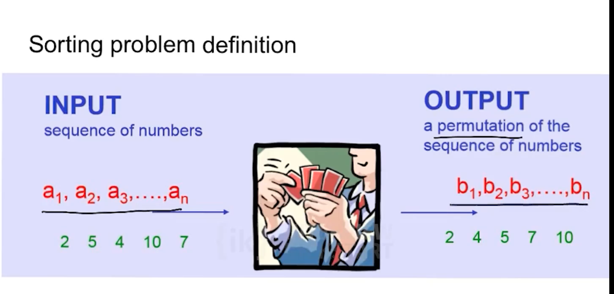
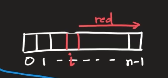

# Intro 

## Applications
- Searching for a value is faster in a sorted array than an unsorted array.
- Can find duplicates easily using sorting (all items with equal value appear in consecutive positions).
- Matching items in two or more files.
- Can find median and top k values quickly.
- The truncated top of an immense sorted list is the universal UI.

## Other Benefits 

- Sorting provides a valuable case study of how to attack programming problems in general. E.g, algorithm design strategies like "Decrease and conquer", and "Divide and conquer".

- Sorting provides an excellent illustration of how to analyse algorithms to determine their performance, so that you can then choose between competing methods.

## Brute Force Selection Sort 
- Simplest design strategy, and the most straightforward approach. 




**A brute force algorithm**
- Locate the smallest item and put it in the first place.
- Then select the next smallest item and put it in the second place. And so on...
- Sorting by repeated selection: "Selection Sort"
- Final output ordering generated one by one in sequence.




```javascript 
function selectionSort(arr) {
  const sorted = [...arr]; // Create copy to avoid mutating input
  let minValue, minIndex;

  for (let i = 0; i < sorted.length; i++) {
    minValue = sorted[i];
    minIndex = i;
    
    for (let j = i + 1; j < sorted.length; j++) {
      if (sorted[j] < minValue) {
        minValue = sorted[j];
        minIndex = j;
      }
    }
    
    // Only swap if needed
    if (minIndex !== i) {
      [sorted[i], sorted[minIndex]] = [sorted[minIndex], sorted[i]];
    }
  }

  return sorted;
}

const unsortedList = [4, 3, 5, 8, 9];
const sortedList = selectionSort(unsortedList);
console.log(sortedList); // [3, 4, 5, 8, 9]
```

**How do we analyze the algorithm?**
1. First, we have to argue the the algorithm is correct. 
2. Then, look at the performance of the algorithm  (is it efficient)

**Performance**
- it will take up processing time 
    - How long the algorithm takes to run (running time)
- It will take up space (memory)
    - How much memory does the algorithm use to run? 