# Intro 

## Support Period Expectations 
- Minimum Monthly Expectations: 1 mock interview each month moving forward 
- Complete Career Skills Curriculum (in the next 3 weeks) 
    - Getting interviews
    - Optimizing Performance 
    - Making a successful career transition 

**Am I ready or not?**
- When I'm ready technically, I will be 100% aware that i'm ready. At this point in time, I should already have interviews lined up. 
    - I will need to take real live interviews at real interviews   
    - Full on-site interviews, this will help me build awareness around what i'm comfortable with 

**Interview with 1 company each month** 
- Do not interview with my target companies 
- Interview with tier 2 companies first 
    - With all the topics that I will see, I am comfortable, then go after tier 1 companies 

## Intro To Secure Interviews at Your Dream Companies

**Interview strategy module** 
- How to secure more interviews 
    - Have companies in back pocket 
- Foundation material 
    - Identifying your targets 
        - Why this first? 
            - Attract recruiters 
            - Sell you throughout the interview process 
                - Responsibilities in my role or function
                - Targeting projects that are interested and relative to their company
                    - How did you succeed on that project that's similar to our internal project 
                - Selling myself to high priority teams
        - Why do I care about the team of a company vs the company. I.E. AWS vs Amazon 
            - Attract the right teams during team matching
            - Is every team created equal?
            - What does it mean to be on an impactful team?
            - More challenging projects, getting to scale or at scale, security from layoffs, high visibility, members that get promoted, working with the most cutting edge tools and technologies, paid more, better stock options
            - When you're in the hiring committee, every candidate, has the right profile match, has passed the technical bar and the behavior bar, I might have 25 people to hire, but only 4 openings, and 1 on a high profile position 
            - Big company is easy, if I know what to expect, if I know how to perform. 
    - Resume/LinkedIn 

**Class session**
    - How to organize a transition 
    - Systems, processes in place, that are designed to make things easier 
    - Researching your targets (what to prepare for) 
        - Do apply to 200 companies... 
        - Apply to the most direct path to progress
    - How to apply **(linkedin/SEO)**
    - LinkedIn SEO 
        - It's a search engine, a recruiter get's profiles that match 
            - LinkedIn get's to know the recruiter and provides matches that are meaningful to the user 
        - Work on keywords that are meaningful 
    - Recruiter communication (common RPS patterns)
        - If it doesn't work 
            - The rec closes 
            - They made a mistake 
            - On the phone call, I did not market myself well enough

**Assignment**
- Curate resume/interview 
    - Tier 1 
    - Tier 2 

**Test Review**
- Workshop resume and situations

# Intro to Behavioral Interviews & Interview Skills 

If someone else is in the room with you, you're behavior is being assessed.

**Phone screen** is the first. 

**Two critical factors in the hiring process**
1. Implementation - How I executed and the quality. 
2. Behavior - We are hiring people that work in a team. 1/3 people are rejected because of behavior 
    - **Competitive advantage** 

**What i'll do**
- Foundation material 
    - Identifying common behavioral patterns 
        - There are only so many things that can be assessed, but there is common patterns 
- Class session 
    - Structure and strategy 
        - Tell me about x,y,z
    - Other assessments 
    - How you are graded/auditing performance 
    - Interview anxiety 
        - It will not go away entirely, learn to work with it 
- Assignment 
    - Build out top 5 behavioral interview responses 

**Performance Audits**
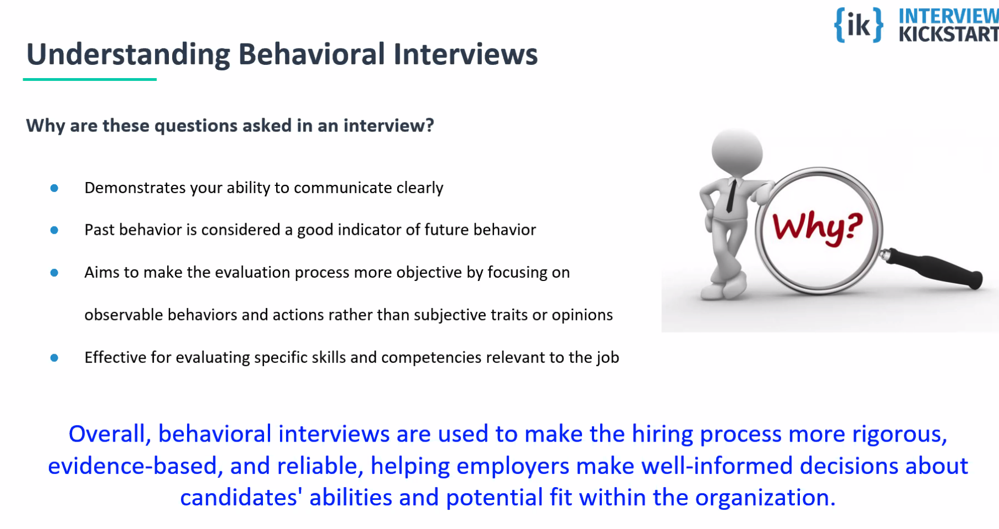
- How are you graded? 
- Self assessment on how each interview/company is doing 
    - Getting better from one interview to the next 
- Drive strategic coaching sessions and mock interviews
    - Be an outlier  
    - The most successful people,
        - Average salary increase 
        - Quantity of quality offers
    - **Every phone screen**, technical interview, onsite, deserves an audit. 
        - Need to have a clear understanding and structure ways to improve. 

## Intro to Offer Negotiations 

- Be an a position to grow in my career/pay for the next 3-5 years 

**Identifying the common goal**
- What is it? Build consensus 
- Creating leverage 
- Framing - the common goal 
    - Negotiations starts with the first phone screen 
    - I will lose leverage if I handle the conversations incorrectly 
    - If done correctly, some companies will bid on their own offer. 
- Goal is at maybe 50% pay increase from current salary and at least a **10% offer increase post offer**

**Assignment**
- Research target range 

**Test review**
- Negotiation scenarios, what if ....

**What I'll Produce**
- Negotiation Cheat Sheet 
    - Market value 
    - How to create leverage 
    - What you can negotiate
    - Build strategic plan as offers start to roll in the door. 

# Foundations 

## Understanding Behavioral Interviews

Why are these questions asked in an interview?

- Demonstrates your ability to communicate clearly
    - How to articulate story in a clear and coherent manner
- Past behavior is considered a good indicator of future behavior
- Aims to make the evaluation process more objective by focusing on observable behaviors and actions rather than subjective traits or opinions
    - Validates specific set of behaviors the companies is looking for
- Effective for evaluating specific skills and competencies relevant to the job

Overall, behavioral interviews are used to make the hiring process more rigorous, evidence-based, and reliable, helping employers make well-informed decisions about candidates' abilities and potential fit within the organization.

- Every company is different, some are more technical some are more behavioral. Most of the time it's a **50/50 split**

---

**Types of Behavioral Interview Questions**  

**Situation-Based:**  
- Describe a situation where you were competing priorities and were unable to get everything done on time.  

**Action-Based:**  
- Describe the actions you took to ensure a project was completed on time.
- Step by step approach  

**Problem-Solving:**  
- Share an example of a difficult technical problem you faced and how did you solve it.  
    - How do I handle issues 

**Teamwork:**  
- Provide an example of a successful collaboration with another team.  
    - Documentation story 

**Leadership:**  
- Describe a time when you took the lead on a project.  
    - Nuances, how did I demonstrate my leadership

**Communication:**  
- Tell me about a situation where effective communication was crucial.
    - Can other people understand the situation

**Adaptability:**  
- Describe a situation where you had to adapt to unexpected changes.  
    - Behaviors, can talk about 
    - What's new in the project 

**Achievement-Oriented:**  
- Share a specific accomplishment you are proud of in your career.  

**Conflict Resolution:**  
- Provide an example of a conflict you resolved between you and another colleague.  
    - How did I navigate the conflict, how did I earn trust. 

**Customer-Service Oriented:**  
- Share an example of a time when you went above and beyond to satisfy a customer.  
    - A customer can be another team. 
    - Focus on the customer need 

**Time Management:**  
- How do you prioritize tasks when faced with multiple deadlines?  
    - What's important to me
    - What should I consider first? 
        - No project manager
        - Competition projects

**Failure/Challenge Questions:**  
- Share a situation where you failed or made a mistake. How did you recover and what did you learn?  
    - Showcase how I'm learning and curious
    - Asking questions, figuring out the information I don't know 
    - Learning the system - 
    - Fall forward! 

---

**Did I actually answer the question** 
- I want to make sure the answer is correct and what the interview is looking for. I really have to think about what the question is and figure out if the answer I prepared is on track to to be correct 

**What if I did experience this circumstance**
- I can say, I didn't get exposure to scale, but If I was was in this situation, this is how i'd go about solving the situation. 
- But, lead the conversation to my strength, it's okay to say I'm unfamiliar with "Oracle DB" for example but talk about what I know.

Here is the extracted text from the image:

---

**How to know what questions could be asked?**  
Preparation is incredibly important

**Previous Interviews (Gather Data)**
- There are a million different ways to ask these questions. Keep track of questions asked in previous interviews and add to your tracker.  
    - Look at mission statements, know about the mission statement, know about the project, and be able to answer questions in a meaningful way.
    - Think about what the questions are, do a brain dump to make sure I can highlight the important aspects in my experience

**Recruiter**
- We want you to get the job. Just ask.  
  - What are some areas you have seen people fail at in this interview?  
  - Do you have any documentation to help me prepare?
    - Leet_code, videos, youtube channel, documentation, etc. 
  - Why is this job open, is it a new team, or why if it's a backfill, why did the previous people leave?

**Company Page**
- TeamBlind, Glassdoor, forums, current employees, or the company website.  
- [Amazon’s 15 Leadership Principles](https://www.amazon.jobs/en/principles)  

**Job Description**
- The JD will have good information you can pull from. 
    - Somethings it's a template, but other times it's custom from the hiring manager. 
        - How do you know it's unique, specialized team it's more detailed and introducing the team, other big companies that are always hiring it will most likely be generic. 

**Note:** *Not all companies or even the departments will have the same interview. The more data you have the better you can prep.

---

**What is The S.T.A.R. Method?**
Situation 
- Set the scene and give necessary details of your example 
- If i'm going to watch a movie, the "S" is the **trailer for the movie**

Task 
- Describe what your responsibility was in that situation 
    - Describe what my responsibility is in this situation
    - Challenges in the problem 
        - Makes things more meaningful 
        - i.e. Not delivering a project on time, and I talk about the challenges 
            - How ever, two people are went on vacation, but at the end we still delivered on time and within scope. 

Action 
- Explain exactly what steps you took to address it 
    - How do I problem solve, what are the step by step. 
    - If I was given a project, but not given any direction to finish the project, what will I do, what is my first step

Results
- Share what outcomes your actions achieved 
- Should be a really strong result
    - The ending of the movie
    - How did we measure success
    - What were the KPIs 
    - Results in productivity, cost savings, performance, etc. 

---

**Mimicry: Model of Emotional Contagion**
During social interactions, people tend to automatically align with, or mimic their interactor's facial expressions, vocalizations, postures and other bodily states. Automatic mimicry might be implicated in empathy and affiliation and is impaired in several pathologies

**Example:**
When around a group of people laughing it almost become contagious each person feeding off each other. Or when we see someone that just did something extremely embarrassing we almost are embarrassed for them. This helps our self conscious with empathy.

**How to use this to your advantage and not a disadvantage:**
When we are giving examples about past experiences especially in behavioral interviews it's important to get the listener to experience it from your point of view. If you sounds excited and passionate about something, others will too feel that same excitement.

- Get the listener to experience from my POV
- Tonality, approach, and excited
    - If I feel deflated, pointer finger at other people, then that shows not well. 
- Take ownership and discuss what I learned in the process. 
    - Put guardrails in case the other team doesn't deliver on time, give my team extra time to deliver. 
- Show behavior of my abilities to navigate and to solve problems and conflicts

---

**12 Things to consider when building your examples**

**Understand the Job Requirements:**
Tailor your responses to the specific skills and competencies required for the position. Review the job description and
focus on highlighting experiences relevant to the role.

- Highlight experiences that are relative to the role 

**Use the STAR Method:**
This framework helps you provide a clear and organized response, allowing the interviewer to follow your thought
process.

- Showcase how I went above and beyond. 

**Be Specific and Detailed:**
- Specific examples make your responses more credible and memorable.
- Find a balance between high level approach and being specific and detailed. 

**Quantify Achievements:**
Use numbers, percentages, or other measurable metrics to highlight the impact of your actions. This adds credibility and demonstrates the tangible results of your efforts.

- Data is important, I know how to measure success, I know about KPIs, etc.  
- Think about current experience, previous experience, and at the end, why I align to this job. 
- Why am I the best person 
    - I want you consider me as at top candidate and here's why... 
- This work that i'm doing is impactful for "this" goal
- Give the all the information they need but be concise 
- Trajectry, milestones, 

**Three bullet points** answer the question in three bullet points, and don't oversell. 
- What do I bring to the table 
    - 1. Leadership 
    - 2. Technical knowhow 
    - 3. I have experience in LLMs/deep learning

When asked a question I didn't prepare for, it's easier to draw on my experience

Data points to share 
- Productively 
- Adoption Rate 
- Cost savings 
- Net promoter scores 

---

**12 Things to consider when building your examples**

**Highlight Transferable Skills:**
Emphasize transferable skills that are applicable to the position. Even if your previous roles were in different industries or functions, highlight skills that are universally valuable, such as communication, problem-solving, and leadership.

**Practice, but Stay Authentic:**
Practice your responses to common behavioral questions, but avoid memorizing scripted answers. Your responses should feel natural and authentic, reflecting your genuine experiences and personality.

- Don't ramble on questions I don't know how to answer. Stick to the framework

**Link Experiences to Company Culture:**
If possible, connect your experiences to the company's values and culture. Show how your past behaviors align with the organization's mission and goals, demonstrating that you would be a good cultural fit.

- When the interview asks "Do you have any questions for me?" 
    - It's always impressive to do my homework. 
        - Shoes that I take initiative and that i'm resourceful. 
- When presenting my self 
    - Talk about a personal story, and how I algn to their values, mission, and culture, it's important to them 
    - **Very impressive** 
    - Ask thought-full questions 
        - Give the interviewers a reason to remember you. It's a story, or maybe it's a demeanor, but make it memorable. 

Here is the extracted text from the image:

---

**Address the "Why" Behind Your Actions:**  
- In addition to describing what you did, explain the rationale behind your actions. This provides insight into your thought process and decision-making abilities.  

**Be Concise:**  
- While providing sufficient detail, be mindful of your response length. Aim for a balance between thoroughness and conciseness to keep the interviewer engaged.  

**Choose Relevant Examples:**  
- Select examples from your past experiences that are most relevant to the skills and qualities the interviewer is seeking. Focus on situations that align with the challenges you may face in the new role.  
    - Give examples withing my last 5 years of experience.
    - Be relevant - don't bring things up from college. 

**Be Positive and Professional:**  
- Even when discussing challenges or failures, focus on what you learned and how you improved rather than dwelling on the negative aspects.
    - Take ownership - work isn't always a perfect place. 

**Remember that behavioral interviews are an opportunity for you to showcase your skills and competencies through real-life examples. By carefully constructing your responses, you increase your chances of leaving a positive and lasting impression on the interviewer.**  

- Balance --- If it's my way or the highway, then I'm not going to get hired. 

---

**Common questions and best approach**

**What do you know about us?**
- DO YOUR RESEARCH!!!
- If you know know anything about the company then why would you want to work there
- Even if you know 100% know, still come with a good idea.
- Used their own company page, linkedin, crunchbase, builtin, or even Youtube.com to get a better idea.
**Example**
    - Interview at META, one of the values was building community. She talked about how she was a first generation immigrant and she talked about why community was important because most of her family, friends, are still in her country, so she used the platform to meet new people and become members in facebook communities. So why would she not want to work for facebook and help make them become successful. 
        - Talk about why I use the platform and why would you not want to make the company successful if I am a user of the product and I believe in the mission statement of building community. 
- Get a good sense of culture in the company - is diversity important. 

**What has you interested in us?**

- Talk about the company and NOT the job posting/position imaged. As a huge data person, I was
- We can see that you applied to the job and know you're interested
- Tie your excitement about the company to something
personal

**Example** I remember the day when I would use AskJeves.com as the go to place for our search engine. It wasn't until I came across Google search to see what I was truly missing. Since then, Google has expanded to places I would have never using excel on a daily basis. Now, it's only Sheets. I want to be a part of the next thing that Google will prevail in.

- Personal story, what's important to the business and what's important to me. 

--- 

**Common questions and best approach**
When explaining why you left a job, focus
on positive aspects such as seeking growth opportunities, a desire for new challenges, or alignment with the company's values and mission. Always frame your reasons in a way that emphasizes your professionalism and commitment to contributing positively in a new role.

**Why are you looking for a new opportunity?**
- It's okay to be laid off. Especially in this market.
    - Recruiters understand the market. But be ready to answer questions if they want to dig into the reason. 
    - It wasn't my fault 
- Don't make it about a person, management style, or anything negative about current work.
- Bad Examples:
    - "I left because my team members were lazy, and it was affecting my performance."
    - "I couldn't get along with my colleagues/boss, and the working environment was toxic."
    - "I left because I wasn't happy after just a few months, and it happened a few times."

--- 

**Sample Questions**

Backend Engineer 

Data Engineering

Android Developer 

Cloud Solutions Architect

Test Engineering 

SRE (Infrastructure, Cloud, DevOps)

# Foundations Review Class

- Negative questions - Am I self-aware of my weakness and am i'm improving on that weakness 
    - Failures are almost given, fail and fail fast. We take the learning from the failures and take that as leverage for my next opportunity. 
    - Even if I failed, what I'm I doing to make sure this failure doesn't happen again. 
    - What guardrails am I putting up so that it doesn't happen again

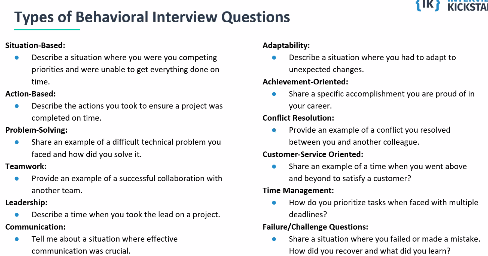

- point-in-time question
    - Think about all the details of the answer
    - Interviewers will poke holes in the answer. They will need to know if I'm making it up.
        - What the problem was, what actions you toke, and if it was solved. 
- Difficult problem and how to solve it - Choose examples that are difficult. If it's a small debugging problem, that's not really difficult. 
    - Dig withing my experience and where I managed the difficulty and articulate what that difficulty and complexity. 
- Teamwork/leadership - Can sometimes be coaching, mentoring, stepping up and helping someone 
- Communication 
    - Verbal and written 
- Adaptability 
    - How do I deal with ambiguity/ how do I adopt. 
- Achievement oriented 
    - If you have a conflict with someone, can you still work with that person? 
    - PM, manager, different team 

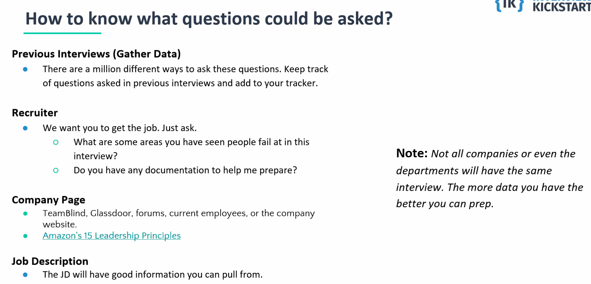

- Get insights from the recruiter 
- Do my own research - there's a lot of people that have gone through the same interviews. 
- Hire fungable developers and place them on the correct team that can use their skill sets. 

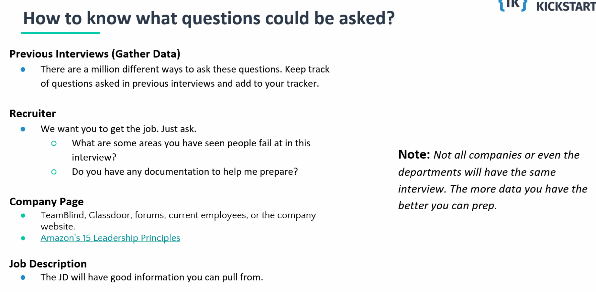
- Very much aligned with how the recruiter is feeling for the day 
    - Stars have to align but at the end of the day, preparation is the most important 

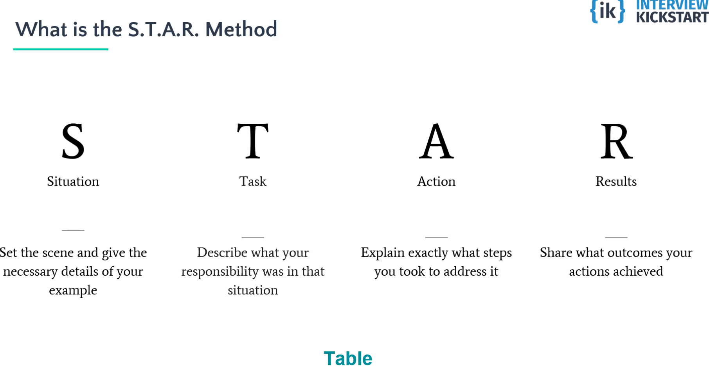
- **Think of situation as a trailer to a story.**
- **Make sure I mention the challenges** - Short teammates because of leave or vacation. 
- Results to need to realated to the challenges, in fact 

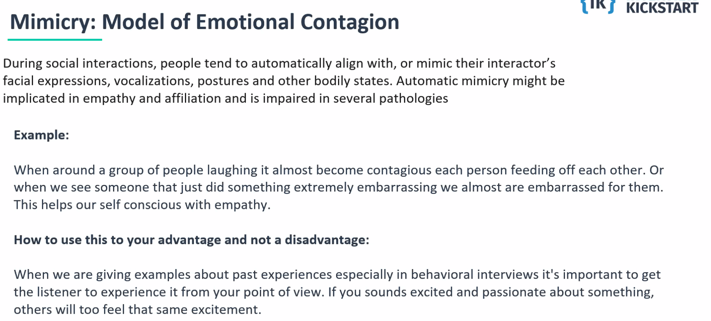
- Really take the time to do a brain dump of all your experience. It's so hard to recall all the specific details --- 
- Be prepared to answer questions that I did not prepare for. This is the reason whey a **brain dump** will come in handy. Even though I didn't prepare for a question, I can start thinking about the those situations from the brain dump. 
    - Think about all the major projects i've done, what are the metrics, the accomplishments, write it down, so it's fresh in my brain, I can fallback to an example.
    - Don't always go back to the same experience. 

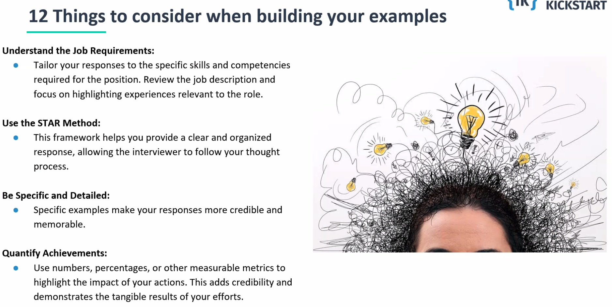

- How can I make sure there's is recall, that the interview remembers be. 
- 

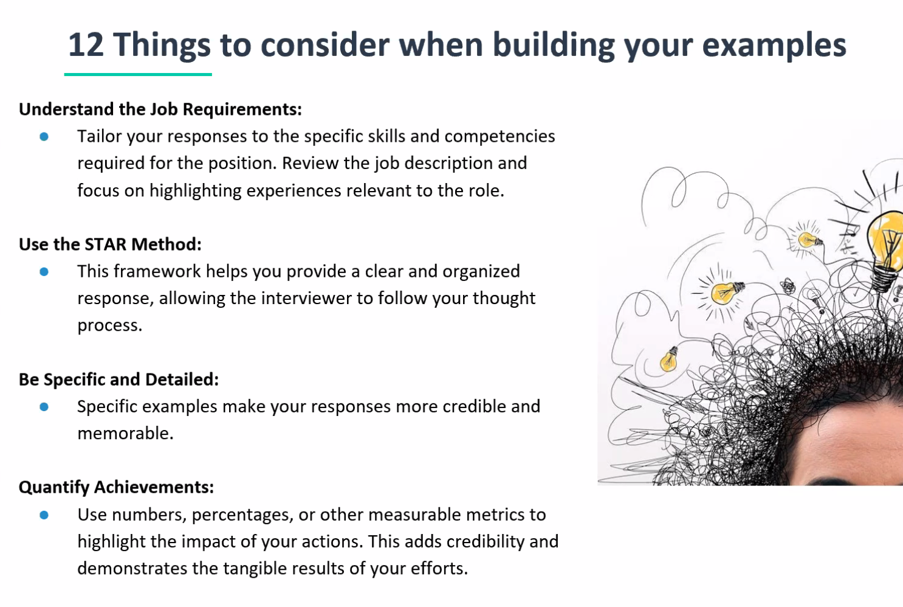

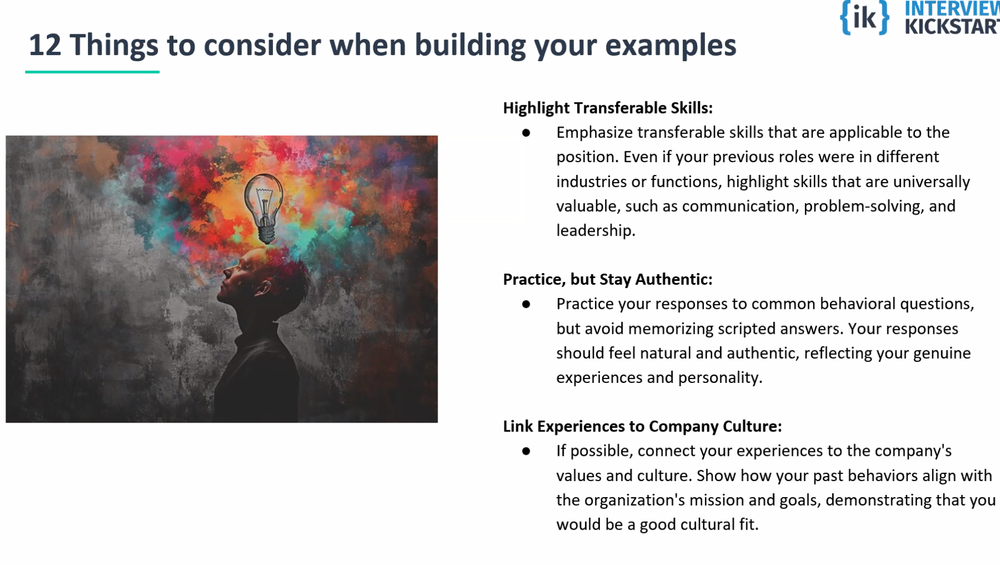

- Ask questions, especially when the ask for questions 
    - Prepare thoughtful questions 
    - Gives insights to my personality and what I do to prepare for the interview

Transferable skills 

- Started my own business - even if it's not in tech --- There's so many things I'm going to learn as an entrepreneur
    - They really want me to own my career --- in and out of scope 
    - It was a passion of mine 
- Be authentic - during this time I felt strong about the community and building the business - I got it to where it was now and now i'm going back to
- Pick the right things to say and highlight the right things to say. 
- Write a very completing ane robust, experience, trajectory and journey, why I started in tech --- and why I started building community and sustainable agriculture - I wanted to help people directly in my community 
    - Talked about how I help other farms get online.
    - Really sold his story - Really took my step to do it in a different area. 
- 

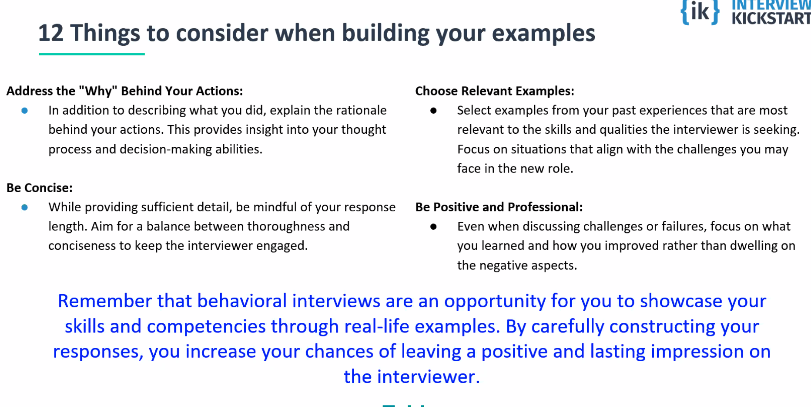

- Only talk about relevant answers - as it relates to the work and the workplace. Don't talk about an experience at church. 

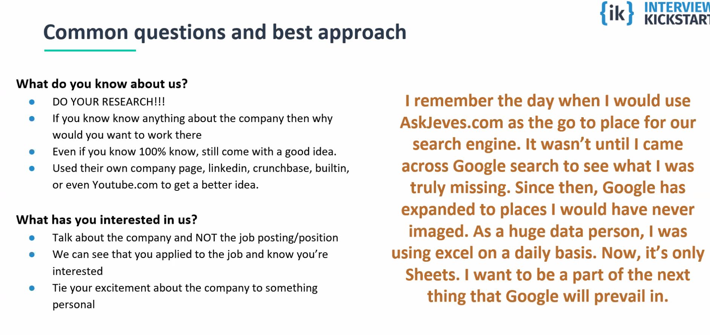
- Ask clarifyying question 

**Make sure I answer the question correctly**

Pick the right example that will answer the question

- **Example:** tell me about a time you were able to deliver the project on a tight deadline 
    - Deliver results 
    - 

**Example:** Tell me a time when you were assigned a project and you had to learn from it
