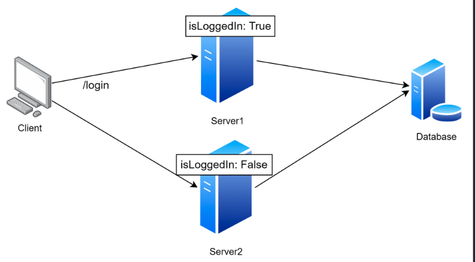
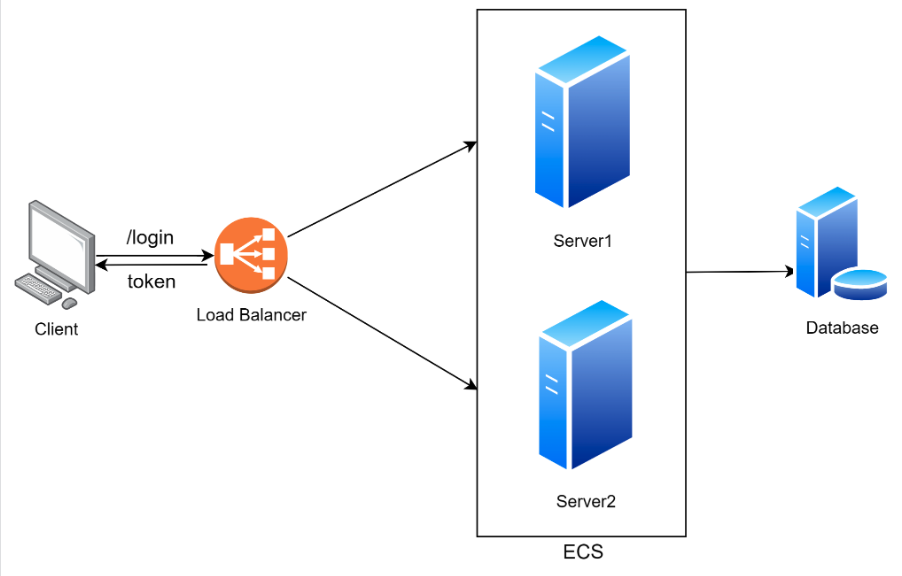
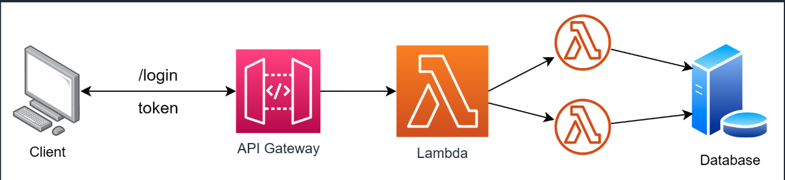

# VM and Containers

---

## What is virtualization? 

- A way for software to create an abstraction layer over computer hardware. 
- This allows the hardware of a single computer (like cpu and ram) to be divided into multiple virtual computers. 

---

## What are Virtual Machines 

A **Virtual Machine (VM)** is an emulation of a physical computer. It runs on a **hypervisor**, which allows multiple VMs to share the same physical hardware. Each VM has its own **operating system (OS), kernel, and resources (CPU, memory, storage, networking)**.

**Pros of VMs**
✔ **Strong isolation** – Each VM runs a separate OS, reducing security risks.  
✔ **Supports multiple OSs** – Can run Linux, Windows, or other OSs on the same hardware.  
✔ **Good for legacy applications** – Useful for apps that require a full OS environment.  
✔ **More stable and secure** – Less affected by issues in other VMs.  

**Cons of VMs**
❌ **Heavy resource usage** – Each VM requires its own OS, consuming more memory and CPU.  
❌ **Slower boot times** – Starting a VM takes longer due to the full OS initialization.  
❌ **Less efficient scaling** – Running multiple VMs on the same machine leads to overhead.  

- An emulated computer (guest OS) running within a computer (host OS)
    - Can be interacted with in the same way as a “normal” operating system with UI
    - Isolated resources act as a sandbox environment, which is extremely helpful for testing
    - Can run multiple programs at the same time like a normal operating system
- Every VM includes a full copy of it’s operating system, any applications it’s running and necessary dependencies 
    - This can take up tens of GBs and can be slow to boot
- They are installed on the host usually using a machine image file like .iso

---

## What are containers? 

A **Container** is a lightweight, standalone executable package that includes everything needed to run an application (code, libraries, dependencies) but **shares the host OS kernel** instead of running its own.

**Pros of Containers**
✔ **Lightweight** – Containers share the host OS, reducing overhead.  
✔ **Fast startup** – Containers start almost instantly.  
✔ **Efficient resource usage** – More applications can run on the same hardware.  
✔ **Easier portability** – Works the same across different environments (e.g., dev, test, production).  
✔ **Great for microservices** – Containers are ideal for breaking applications into smaller services.  

**Cons of Containers**
❌ **Less isolation** – Since they share the host OS kernel, security risks can be higher.  
❌ **OS dependent** – Containers must run on compatible OS types (e.g., Linux containers on Linux).  
❌ **Complex management** – Large-scale container deployments require orchestration (e.g., Kubernetes).  

- Containers are an abstraction at the application layer
    - This packages all code and dependencies together
    - Multiple containers can run on the same machine and share the OS kernel with other containers
- Run as isolated processes in user space
- Containers take up significantly less space than VMs
- Defined by a base image with “layers” on top of it
    - Base image tends to be OS + language runtime
    - Layers usually copy executables and define startup script

### VMs vs. Containers: A Comparis

Virtual Machines (VMs) and Containers are both technologies used to package and run applications in isolated environments. However, they differ in architecture, performance, and use cases.

---

**Key Takeaways**
| Feature            | Virtual Machines (VMs) | Containers |
|-------------------|--------------------|-----------|
| **Isolation**      | Strong (separate OS) | Weaker (shared kernel) |
| **Performance**    | Slower (more overhead) | Faster (lightweight) |
| **Startup Time**   | Minutes | Seconds |
| **Resource Usage** | High (OS per VM) | Low (shared OS) |
| **Scalability**    | Lower | Higher |
| **Security**       | Stronger | Weaker (depends on config) |
| **Portability**    | OS-flexible | Needs OS compatibility |

---

## When to Use Each?

- Virtual machines tend to require a lot of manual maintenance
    - Infrastructure as Code tools like Ansible can help mitigate this problem though
- Containers are treated as expendable
    - Can run many containers on one system compared to usually just a few VMs
    - If a container gets in a bad state, killing and restarting it solves most problems and takes seconds, since they are much more lightweight
    - If a VM gets into a bad state, you may have to actually debug as it is a more involved process

**Use VMs when**  
- You need **strong security and isolation** (e.g., multi-tenant environments).  
- Running **multiple OS types** on the same hardware.  
- Hosting **monolithic applications** or **legacy software**.  

**Use Containers when**  
- You need **fast, lightweight deployments**.  
- Running **microservices** and **cloud-native applications**.  
- You want **better resource efficiency** and **scalability**.  

---


### Final Thought
VMs and containers **complement** each other rather than replacing one another. Many organizations use a **hybrid approach**—running containers inside VMs for both isolation and efficiency. If you're starting fresh with cloud-native applications, containers are likely the better choice. However, if security and multi-OS support are priorities, VMs may be the way to go. 🚀

**Compute (Processing Power)**
Cloud computing provides **virtual machines (VMs) and containers** to run applications. Instead of buying physical servers, you can rent computing power on-demand.  

💡 **Real-World Example:**  
- Netflix runs its video streaming services on Amazon Web Services (AWS) using **EC2 instances** (virtual machines).  
- Developers use **Google Cloud Run** to deploy applications in containers without managing servers.  

✅ **Why it matters?**  
- **Flexible & scalable**: Get more or fewer servers as needed.  
- **Cost-efficient**: Pay for what you use.  

---

---

## Docker

## Docker & Best Practices*

- Docker is a way to package software so it can run on any hardware
- It acts as the engine to manage containers

**What is Docker?**
Docker is an open-source platform that enables developers to automate the deployment of applications inside lightweight, portable **containers**. It allows applications to run **consistently across different environments** (e.g., development, testing, and production).  

**How Docker Works**  
Docker uses **containerization**, which packages applications and their dependencies together in an isolated unit. Unlike virtual machines (VMs), containers **share the host OS kernel**, making them **more efficient and faster to start**.  

- **Docker Engine**: Runs and manages containers.  
- **Docker Images**: Blueprint for containers (includes OS, application, and dependencies).  
- **Docker Containers**: Instances of images that run applications.  
- **Docker Compose**: Defines multi-container applications with YAML.  
- **Docker Hub**: Repository for sharing and storing Docker images.  

---

## Best Practices for Docker

**1. Write Efficient Docker files**
- Use a **minimal base image** (e.g., `alpine` instead of `ubuntu` for smaller size).  
- **Reduce layers** by combining commands (`RUN apt-get update && apt-get install -y package`).  
- **Use `.dockerignore`** to exclude unnecessary files (e.g., logs, node_modules).  

✅ **Example of a clean Dockerfile:**  
```Dockerfile
FROM node:18-alpine  # Lightweight base image
WORKDIR /app
COPY package.json .  
RUN npm install --only=production
COPY . .
CMD ["node", "server.js"]
EXPOSE 3000
```

---

**2. Use Multi-Stage Builds for Smaller Images**
Multi-stage builds help **reduce image size** by removing unnecessary build dependencies.  

✅ **Example:**
```Dockerfile
# Stage 1: Build
FROM golang:1.18 AS builder
WORKDIR /app
COPY . .
RUN go build -o myapp

# Stage 2: Create smaller final image
FROM alpine:latest
WORKDIR /app
COPY --from=builder /app/myapp .
CMD ["./myapp"]
```

---

**3. Run Containers as Non-Root Users**
By default, containers run as **root**, which is a security risk. Always **create and use a non-root user** inside the container.  

✅ **Example:**  
```Dockerfile
RUN addgroup -S appgroup && adduser -S appuser -G appgroup
USER appuser
```

---

**4. Keep Containers Stateless** 
- Stopping a container will cause all data to be loss.

Containers should be **ephemeral**—avoid storing **persistent data** inside containers. Instead, use **volumes** for storage.  

✅ **Use a volume for persistent storage:**  
```bash
docker run -v /my/data:/data mycontainer
```

---

**5. Limit Container Resources**
Prevent resource hogging by setting **CPU and memory limits**.  

✅ **Example:**  
```bash
docker run --memory="512m" --cpus="1" mycontainer
```

---

**6. Use Health Checks**
Define **health checks** to ensure your app is running properly.  

✅ **Example in Dockerfile:**  
```Dockerfile
HEALTHCHECK --interval=30s --timeout=5s --retries=3 \
CMD curl -f http://localhost:3000 || exit 1
```

---

**7. Use Environment Variables for Configurations**
Instead of hardcoding secrets/configs, use **environment variables** or Docker secrets.  

✅ **Example:**  
```bash
docker run -e DB_USER=myuser -e DB_PASS=mypassword mycontainer
```

---

**8. Use a Container Orchestrator (Kubernetes, Docker Swarm)**
For production environments, manage containers with **orchestration tools** like **Kubernetes** or **Docker Swarm** for scaling, monitoring, and load balancing.  

---

## Key Takeawa
✅ **Keep images small** (use minimal base images, multi-stage builds).  
✅ **Run as a non-root user** to enhance security.  
✅ **Use health checks** to ensure application uptime.  
✅ **Store data in volumes**, not inside containers.  
✅ **Limit CPU and memory usage** to avoid resource exhaustion.  
✅ **Use orchestration tools** for production scaling.  

By following these best practices, you’ll have **secure, efficient, and scalable** Docker containers that are easier to manage in production. 🚀

---

## Interview Question: Design a scalable system to handle and store customer input that can be run on any company machine.

- Containerization (Docker) → Runs the system with all dependencies.

- Orchestration (Kubernetes) → Handles scaling & deployment across machines.

---

# Scaling (Growing or Shrinking Resources Automatically)

## Compute Bound Services

- Maximum capacity is based on available instance resources
    - Resources usually include CPU/RAM
- Tends to be related to processing large data
    - Transcoding media
    - Big data analysis

--- 

## I/O Bound Services

- Maximum capacity is based on network, disk, or database throughput
- Assume your service is I/O bound unless you determine otherwise
    - Application servers that relay requests to databases usually don’t need a lot of RAM/CPU
    - Best practice to only use the resources you need to complete the task
- Decide what is the cause for scaling?
    - Need to write more data faster? - scale to bigger or faster storage
    - Need to handle more requests? - scale to faster CPU or more CPUs

---

Scaling ensures applications handle more users without crashing or wasting resources.  
- **Vertical Scaling (Scaling Up)** – Increasing a server’s CPU, RAM, or storage.  
- **Horizontal Scaling (Scaling Out)** – Adding more servers to share the load.  
- **Auto-Scaling** – Automatically adding or removing resources based on demand.  

💡 **Real-World Example:**  
- **Amazon.com** scales its cloud resources during Black Friday sales.  
- **Zoom** auto-scales its video conferencing servers when millions join calls at the same time.  

✅ **Why it matters?**  
- **Prevents downtime** during traffic spikes.  
- **Optimizes cost** by using only necessary resources.  

---

## Choosing the correct methodology

**Swarm of Bees**
- Horizontal scaling; many small instances
- Best to minimize costs, fits well for IO bound services
- Able to closely match traffic numbers, minimizing overall cost

**“Justice League”**
- Vertical scaling; large instance
- Best for when instances need a lot of CPU or RAM to process data

**Additional Considerations** 
- Cost plays a large role in decisions for scaling a company’s service
- Consider what instance types are available and what instance size you may need based on usage
- Scaling horizontally is a usually more costly due to extra hardware costs for some cases
    - For example, a low traffic project that tends to sit on 1 minimum instance, scaling horizontally is probably most cost effective, while a service that is constantly receiving traffic enough for multiple instances may be more cost effective for larger instance sizes 

---

## Optimizing Startup Latency

- Reducing time between scale request and serving traffic is always good
- Define ready checks and health checks to ensure users are not waiting
- Cloud provider will determine when to scale
    - Most provide startup script declarations to warm up the instance
    - If this script is not provided, user traffic may reach the program before it’s ready
    - These requests will not be given to another instance, and will cause latency for users

--- 

## Testing Scaling Systems

**Load Generators** 
- Send test traffic (aka generate load) to services to test their ability to handle traffic

**Maintaining SLAs**
- Latency
- Caching - TTL

--- 

## Interview Question 

A small company’s service API just went viral. Suddenly it’s receiving 10x the traffic it normally is. The company is unable to keep up with demand and begins to throttle requests due to high CPU usage on its server. Design a system that can solve this problem.

- Use auto-scaling configuration 

---

# Stateless & Stateful Programming 

--- 

## Stateful Programming

- When you have a small number of servers, you can use them to store data between requests for faster lookup
- A stateful system has memory of past events
- In-RAM caching can be a powerful tool, especially when bundled with session stickiness




---

## Stateless Programming

- Functions and services are idempotent
- A method is idempotent if an identical request can be made with the same effect while leaving the server in the same state
- State is tracked outside of the service; in a database, for example
    - Maintain session and user data in separate, shared datastore
- The service does not lose data if an instance crashes or fails
- No side effects in the service itself



---

## But what about the cloud?

- Building stateless services in the cloud is usually the optimal solution
- Manage caching and session data in a cross-instance datastore
    - RDBMS/Key Value store
    - Elasticache, hazelcast, etc.
- Consider “Chaos Engineering” where services are randomly shut off to test
    - How should the system behave? How does stateless programming help here?

** Is this serverless?

- Serverless architecture is a common buzzword
    - In general, these are cloud-native solutions that don’t use traditional instance counts
    - Usually billed based on usage rather than time; great for small projects with low traffic
- This tends to use stateless programming for compute
    - State data is retained using stateful datastore services
- No More Scaling!
    - Instance sizes and counts no longer apply; the cloud provider manages that for us

**Serverless Example**
AWS Lambda Functions can be invoked to process requests meaning there is no server running 24/7




## Interview Question 

You are asked to improve a company’s current architecture. They noticed when a server goes down, users are reporting losing session data. 

# Cloud Native Primitives 


## Data Centers, Availability Zones, and PoPs

**Datacenter**
- A big building with a lot of hardware
- May actually be multiple buildings with dissimilar infrastructure (e.g. separate power grid)

**Availability Zone**
- Within a datacenter, a set of hardware that should fail separately from other hardware
- If us-west-2a has an outage, us-west-2 users can fallback to us-west-2b resources with little impact 

**Point of Presence (PoP)**
- Usually leased hardware in a third-party datacenter used to decrease latency to local users
- Generally this is a term used by cloud consumers; cloud providers focus on DCs and AZs

## Virtual Machines in the Cloud

- Just because you shouldn’t use them, doesn’t mean you can’t
    - AWS: EC2 (Elastic Compute Cloud)
    - GCP: Compute Engine
- Usually best for initial migration from old hardware to cloud
    - Can map one-to-one with existing resources
    - Create firewall/network rules; these can be used later as you upgrade your infrastructure
    - Always On until you turn it off; you pay whether you use it or not

---

## Containers in the Cloud

- Containers are a step in the right direction 
    - AWS: ECS (Elastic Container Service)
    - GCP: App Engine Flex Environment
- Clean, simple, and easy
    - Solves many problems related to using Virtual Machines
    - Makes it much simpler to fix “it works on my machine” using Dockerfile directives
    - Understanding how containers work is foundational to understanding cloud-native solutions

---

## Functions in the Cloud

- Functions are quick and easy to make, but can be hard to maintain
    - AWS: Lambda Functions
    - GCP: Cloud Functions
- Scales quickly and efficiently
- Pay per request; don’t pay if you don’t have traffic

---

## Applications in the Cloud

- Distributed Monoliths bridge gap between containers and functions
    - AWS: Elastic Beanstalk
    - GCP: App Engine Standard Environment
- Use common language entrypoints to optimize runtime
    - No need to worry about runtime executable in container, for example
    - Use spec file to define required resources

---

## Relational Databases in the Cloud

- Still hard to scale, but easier than buying new hardware
    - AWS: RDS
    - GCP: Cloud SQL
- Cloud tooling helps to manage complexities of RDBMS
    - Autoscaling (Usually at least disk, sometimes also RAM and CPU)
    - Automatic secure backups (be sure to test them!)
    - Console-based user management

---

## Key/Value Datastores in the Cloud

- Harder to query, but much easier to scale and much lower cost
    - AWS: DynamoDB
    - GCP: Cloud Firestore (originally Firebase)
- If you usually do “lookup by ID(s)”, strongly consider a K/V Store
    - K/V engine uses key to lookup correct “shard” for data
    - Shards are easy to scale, and can be cached and distributed across many availability zones

---
 
## Files/Blobs/Objects in the Cloud

- Forget Apache; we can serve static files without a separate server
    - AWS: Simple Storage Service (S3)
    - GCP: Cloud Storage
- Storage “buckets” are namespaced and usually come with a FQDN (Fully Qualified Domain Name)
    - Use a CNAME DNS entry to use your own domain name
    - Make sure you check your permissions; do you really want this open to the public?
    - Consider signed requests when it makes sense; it takes extra time but is more secure

---

## API Gateway

- Fully managed service for RESTful and Websocket APIs 
- Acts as a layer between client and backend services
- It handles all the processing of the requests to the APIs including traffic management, authorization, throttling and monitoring

---

## Users in the Cloud

- Hashing passwords manually is outdated; use a managed system
    - AWS: Cognito
    - GCP: Google Identity Platform
- Define user pools, groups, and federated identities
    - These tools make it easy to add common features, e.g. “admin” booleans
    - They generate signed tokens, making it a quick solution for most common requirements

--- 

## Queues in the Cloud

- Move your state into a cloud queue to handle concurrently across instances
    - AWS: Simple Queue Service (SQS)
    - GCP: Cloud Tasks
- Queues are difficult to manage, but are ideal for processing lots of data
    - User-facing API receives request and adds task to queue; usually returns tracking ID
    - Backend services pull from queue and update tracking ID with current status

---

## Pub/Sub Methodology

- Polling for data is expensive and inefficient; pub/sub uses realtime sockets
    - AWS: Simple Notification Service (SNS)
    - GCP: Cloud Pub/Sub
- Publish data to topics; subscribers receive this data if they’re listening
    - No need to store in a database, but clients not listening to the topic will never see it
    - Ideal for realtime updates, especially when the data is also stored in DB for later use


# 5 Key Cloud-Native Primitives

Cloud-native primitives are foundational concepts that help build applications optimized for the cloud. These primitives allow for **scalability, resilience, automation, and flexibility** in modern applications. Here are five key cloud-native primitives, explained simply with real-world examples.  

---

## 1. Containers
**Definition:** Containers package an application and all its dependencies so it can run consistently across different environments.  

🔹 **Why it matters:** Containers ensure that apps run the same way in development, testing, and production.  
🔹 **Example:** Imagine you’re delivering a meal kit. If all ingredients are packed together (containerized), the customer gets the exact meal you intended, no matter where they are.  
🔹 **Real-World Example:** Docker and Kubernetes orchestrate containers to deploy and scale apps reliably in the cloud.  

---

## 2. Microservices
**Definition:** Instead of building a single large application, microservices break it down into smaller, independent services that communicate with each other.  

🔹 **Why it matters:** It’s easier to scale, update, and maintain parts of an application independently.  
🔹 **Example:** Think of a food delivery app. One microservice handles user authentication, another manages orders, and another tracks deliveries—each can be updated separately.  
🔹 **Real-World Example:** Netflix uses microservices so that recommendations, payments, and streaming all work independently.  

---

## 3. Serverless Computing
**Definition:** Serverless computing allows developers to run code without managing servers. Cloud providers automatically allocate resources as needed.  

🔹 **Why it matters:** You only pay for what you use, and the system scales automatically.  
🔹 **Example:** Imagine a coffee shop that only turns on its coffee machines when someone places an order—no wasted energy.  
🔹 **Real-World Example:** AWS Lambda executes code only when triggered (e.g., responding to website clicks or data updates).  

---

## 4. Service Mesh
**Definition:** A service mesh helps microservices communicate securely and efficiently without needing custom code for networking.  

🔹 **Why it matters:** It improves security, observability, and traffic management for microservices-based applications.  
🔹 **Example:** Think of a highway system with traffic lights and lanes that automatically adjust to prevent congestion.  
🔹 **Real-World Example:** Istio and Linkerd manage service-to-service communication in cloud-native apps.  

---

## 5. Auto-Scaling
**Definition:** Auto-scaling dynamically adjusts computing resources based on traffic demand.  

🔹 **Why it matters:** Your application can handle traffic spikes without over-provisioning resources.  
🔹 **Example:** A theme park adds more ticket booths when the line gets long and removes them when the crowd shrinks.  
🔹 **Real-World Example:** Kubernetes automatically scales up web servers during a sale event and scales them down afterward.  

---

## Key Takeaways:
✅ **Containers ensure consistency across environments.**  
✅ **Microservices make applications modular and easier to scale.**  
✅ **Serverless computing removes the burden of managing infrastructure.**  
✅ **Service meshes streamline microservices communication and security.**  
✅ **Auto-scaling ensures efficient resource use and cost management.**  

Cloud-native architectures leverage these primitives to create **highly scalable, resilient, and efficient applications** in the cloud.

# Infrastructure As Code (IaC)

## Managing Cloud Resources Idiomatically

- Manually spinning up resources is error-prone and hard to replicate
- Use common spec files (e.g. YAML) to define the expected output
- Add comments for architecture decisions; quickly deploy improvements
- New environment? Just give the IaC engine new credentials and target
- Don’t make changes in the console; those won’t persist in the next deploy

## Managing Cloud Resources Idiomatically

- This also allows for version control of your infrastructure (allows us to roll back code if needed)
- As you make changes to code, peers can review it rather than viewing the actual infrastructure in the cloud
- This is more maintainable and reliable
- Commit yaml files to a repository. Many people can put their eyes on it. 

---

## Classic Infrastructure as Code Tools

**Terraform**
- Maintained by Hashicorp; they make other powerful tools for enterprise cloud computing
- Uses drivers to target multiple cloud providers; requires rewrite if deploying to new provider

**Ansible**
- Open source via RedHat; Python based
- Uses Playbook to target specific hosts; can be used for cloud or on-prem resources

---

## Cloud Specific Infrastructure as Code Tools

**Cloudformation**
- AWS only
- Define stacks and templates to create AWS resources

**Pulumi**
- Uses Javascript functions to define provider-specific resource setup scripts
- Requires rewrite to deploy to new cloud provider

**Klotho**
- New tool by new startup
- Uses in-code comments to define features
- Can deploy to multiple clouds without requiring rewrite

---

## Using IaC to Improve Developer Quality of Life

**Chaos Engineering** (popularize by Netflix)
- Experiment with system’s ability to withstand unexpected conditions
- Popularized by Netflix; designed to improve end-user experience with resilience
- Randomly delete resources in the console; how does the system react?
- IaC tools can be used to restore lost resources, but do users notice a hiccup?

**Development Pipeline Testing**
- Verify you can recover from a total loss of existing infrastructure
- How quickly can you get back online? How will you verify data integrity?

---

## Interview Question 

A company is growing rapidly and is finding a lot of developer time is spent provisioning new resources. Come up with a solution to solve this problem and give more time for developing features.

**Solution**
One effective solution is to **automate resource provisioning** using Infrastructure as Code (IaC) and self-service tools. Here's how it can work:

---

### Proposed Solution: Automation & Self-Service Platform

1. **Adopt Infrastructure as Code (IaC):**
   - **Tools:** Use Terraform, AWS CloudFormation, or Ansible to define your infrastructure declaratively.
   - **Benefits:** 
     - **Automates repetitive tasks:** Developers write code once and deploy consistently.
     - **Version Control:** Infrastructure definitions are stored in Git, enabling collaboration and rollback.
     - **Standardization:** Ensures that all environments (dev, test, production) are set up in a consistent manner.

2. **Implement a Self-Service Portal:**
   - **Features:** Create a web-based interface or CLI tool that allows developers to provision and manage resources on-demand.
   - **Benefits:** 
     - **Empowers developers:** They can quickly spin up environments without waiting for DevOps teams.
     - **Reduces bottlenecks:** Centralized management reduces manual intervention for every new resource.

3. **Integrate with CI/CD Pipelines:**
   - **Automation:** Integrate IaC scripts into your CI/CD pipelines, so new resources can be deployed automatically when changes are merged.
   - **Testing:** Use automated testing and validation to catch errors before they reach production.

4. **Monitoring & Feedback:**
   - **Track Usage:** Monitor resource usage and optimize costs and performance.
   - **Iterate on Tools:** Gather feedback from developers to refine the self-service portal and automation scripts.

---

### Real-World Examples:
- **Airbnb** and **Netflix** use IaC and self-service provisioning to quickly deploy and manage resources across multiple environments.
- **AWS Service Catalog** allows enterprises to create and manage approved IT services, enabling teams to deploy resources without direct DevOps intervention.

---

### Key Takeaways:
- **Automation frees developers:** IaC and self-service portals reduce manual provisioning, letting developers focus on feature development.
- **Consistency & Reliability:** Automated provisioning ensures standardized, repeatable deployments.
- **Scalability:** As the company grows, the platform can easily scale to support increased demand without requiring proportional increases in manual effort.

By implementing these strategies, the company can significantly reduce the time spent on resource provisioning, allowing developers to focus more on building new features and innovating.

# Analytics, Reporting, & Logs

## Cloud Logs

- Usually quickest and easiest way to find root cause of problems
    - Ensure your logs are helpful! You should be able to tell where the issue is coming from
    - console.log(‘error here!’) is not helpful; consider using human-readable codepath name
- Most cloud providers offer a console to see logs with ERROR severity
    - This is useful for seeing frequency of issues and verifying fixes
    - Acknowledge issues you’ve decided to tackle; close them when they’re fixed
    - Not all errors need to be fixed immediately; consider user impact and engineering time
    - Log Level Hierarchy: TRACE, DEBUG, INFO, WARN, ERROR, FATAL

---

## How Logs are Stored

- Usually only the last hour of logs are stored on the machine itself (if you’re not using serverless)
- Some type of log mover usually called a LogPusher will move the logs off the machine, compress them and store into a separate long term data store
- This will ensure logs can be audited properly

---

## Log User Activity 

- In addition to logging data and metrics from a running service, it is also important to log user activity within a cloud account
- This can be done with AWS CloudTrail or GCP Cloud Audit Logs
- This records user activity and API usage across services and allows for analysis and auditing for your infrastructure

---

## Cloud Analytics

- Log events with associated data that can be queried later in reports
    - Consider adding userID, timestamp, and request ID to make it easy to find related logs
- We can count logs to use as metrics, too!
    - “How many errors did we have?”
- Use time spans to measure latency and identify slow codepaths
    - Especially useful in microservice architecture with many downstream calls
    - These metrics are great to show infrastructure improvements, like co-locating databases

-- 

## Cloud Reports

- Use console tools to visualize analytics collected throughout your project
- Collate and correlate disparate metrics to show related trends
- Set up alert thresholds to page on-call engineers when necessary
- Tools to consider
    - AWS CloudWatch
    - GCP Operations Suite
    - Grafana (self-hosted or managed)

---

### Additional Features and Benefits

- **Centralized Log Management:**  
  - **What it is:** Aggregating logs from all systems into one central location.  
  - **Benefits:**  
    - Simplifies search and correlation across multiple services or regions.  
    - Enables unified monitoring, easier analysis, and centralized security audits.  
  - **Real-World Example:** Using the ELK stack (Elasticsearch, Logstash, Kibana) or Splunk to aggregate logs from web servers, databases, and microservices.

---

- **Real-Time Log Streaming and Analysis:**  
  - **What it is:** Continuously streaming logs for real-time monitoring and alerting.  
  - **Benefits:**  
    - Immediate detection of anomalies or security threats.  
    - Fast response times to incidents with live dashboards.  
  - **Real-World Example:** AWS Kinesis or Google Cloud Pub/Sub streams logs to monitoring tools for live dashboards and alerts.

---

- **Retention Policies & Archive Management:**  
  - **What it is:** Configurable log retention settings that automatically archive or delete old logs based on compliance or operational requirements.  
  - **Benefits:**  
    - Helps manage storage costs by retaining only necessary logs for a defined period.  
    - Ensures compliance with regulations that require logs to be kept for a certain duration.  
  - **Real-World Example:** Setting up AWS S3 lifecycle policies to move logs from hot storage to archival tiers like Glacier.

---

- **Advanced Querying and Anomaly Detection:**  
  - **What it is:** Using advanced analytics, including machine learning, to identify unusual patterns in log data.  
  - **Benefits:**  
    - Proactive detection of issues before they become critical.  
    - Automated insights into performance degradation or potential security breaches.  
  - **Real-World Example:** Integrating with a SIEM (Security Information and Event Management) tool to automatically flag anomalous behavior in system logs.

---

- **Integration with Incident Response & Automation:**  
  - **What it is:** Coupling logs and analytics with automated workflows for incident response.  
  - **Benefits:**  
    - Automatically triggers alerts, sends notifications, or even initiates remediation workflows when certain thresholds are exceeded.  
    - Streamlines the process of troubleshooting and resolving issues.  
  - **Real-World Example:** Using PagerDuty integrated with CloudWatch to automatically notify on-call engineers when error rates spike.

---

- **Correlation with Other Data Sources:**  
  - **What it is:** Combining log data with performance metrics, business metrics, and user activity data for a holistic view of the system.  
  - **Benefits:**  
    - Enables comprehensive root cause analysis that spans multiple layers of the stack.  
    - Helps in understanding the impact of technical issues on business outcomes.  
  - **Real-World Example:** Correlating application logs with Google Analytics data to determine how technical issues affect user behavior and conversion rates.

---

### Key Takeaways

- **Centralization & Real-Time Monitoring:**  
  By aggregating and streaming logs centrally, you can detect and address issues as they occur.

- **Retention & Compliance:**  
  Automated retention policies help manage storage and ensure that logs are available for audit and compliance purposes.

- **Advanced Analytics:**  
  Utilizing machine learning and advanced querying can transform raw logs into actionable insights.

- **Integration & Automation:**  
  Seamless integration with incident response tools and automation workflows minimizes downtime and accelerates troubleshooting.

- **Holistic View:**  
  Correlating logs with other operational and business metrics provides a comprehensive view of system health and performance.

---
