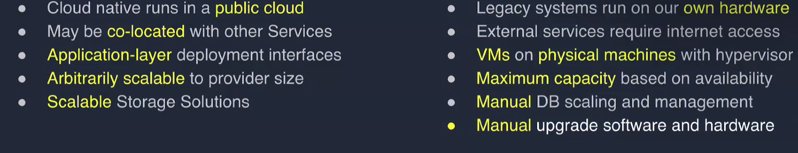
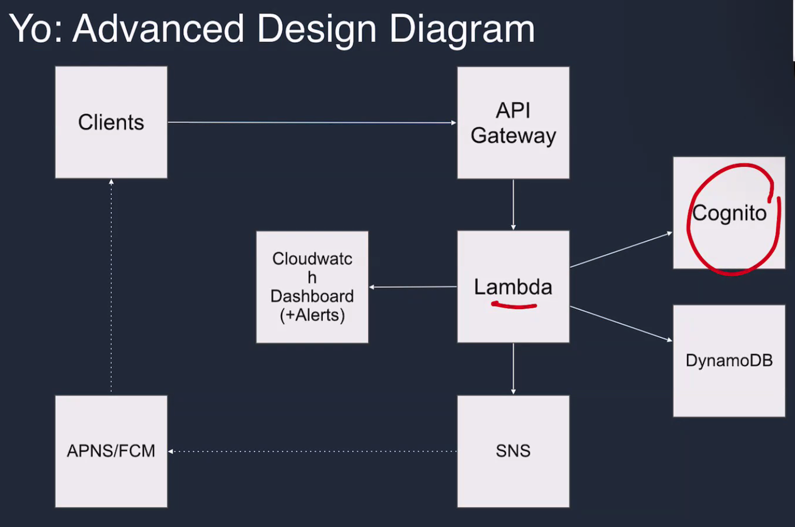
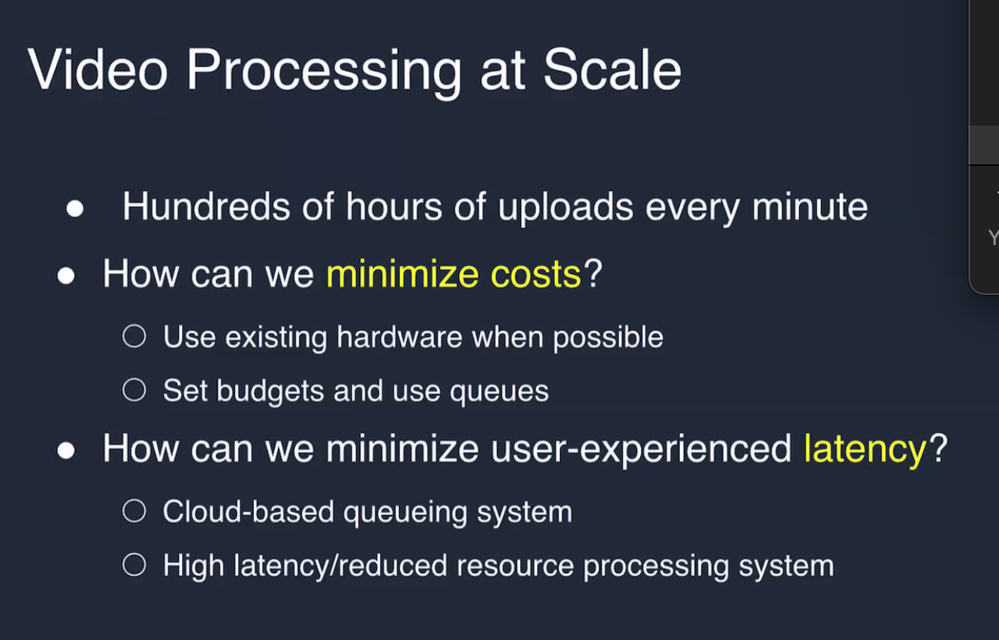
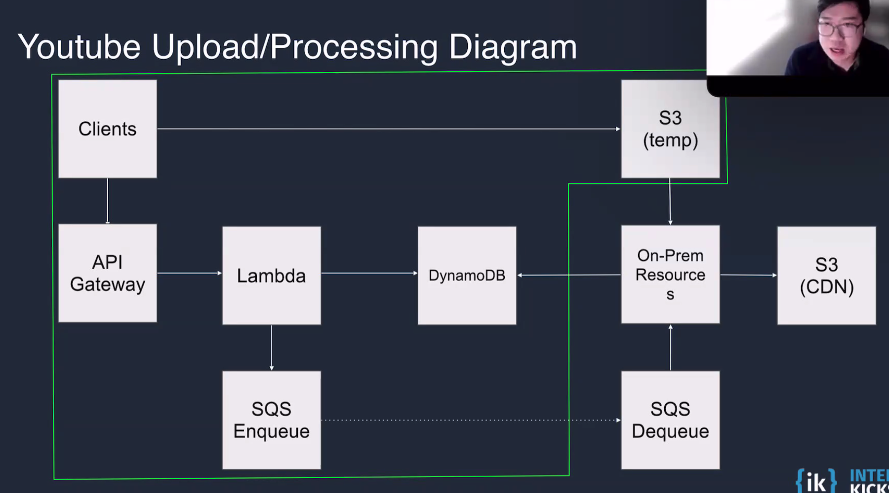
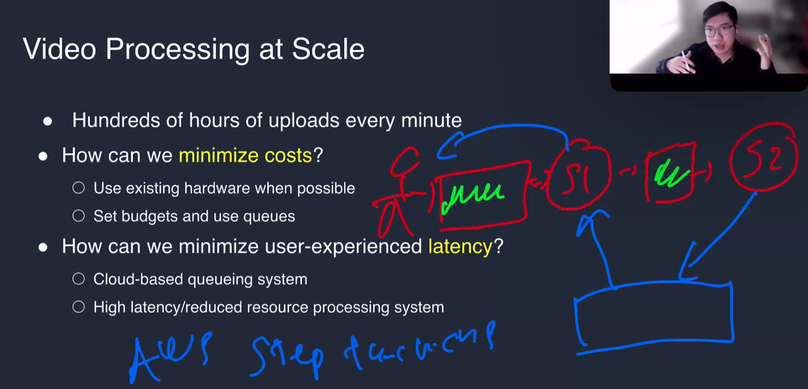

<!-- @import "[TOC]" {cmd="toc" depthFrom=1 depthTo=6 orderedList=false} -->

<!-- code_chunk_output -->

- [Cloud Primitives Reviews](#cloud-primitives-reviews)
- [Cloud Cost Considerations](#cloud-cost-considerations)
  - [Traffic Vs Time](#traffic-vs-time)
  - [The Cost of Architectural Complexity](#the-cost-of-architectural-complexity)
  - [What’s the difference between cloud native and legacy?](#whats-the-difference-between-cloud-native-and-legacy)
  - [What Make Cloud Infrastructure Different?](#what-make-cloud-infrastructure-different)
- [System Design Approaches](#system-design-approaches)
- [Interview Question: What kind of infrastructure would you use to create a simple, scalable HTTP service?](#interview-question-what-kind-of-infrastructure-would-you-use-to-create-a-simple-scalable-http-service)
  - [Case Study 1: Yo](#case-study-1-yo)
- [Yelp Case Study](#yelp-case-study)
- [Interview Question](#interview-question)
  - [Interview Questions: What are some problems we could run into when using cloud infrastructure?](#interview-questions-what-are-some-problems-we-could-run-into-when-using-cloud-infrastructure)
  - [Hug of Death](#hug-of-death)
  - [Thundering Herd](#thundering-herd)
  - [Managing Deployable and Code](#managing-deployable-and-code)
  - [Managing Secrets](#managing-secrets)
  - [Cloud Logs](#cloud-logs)
  - [Cloud Analytics](#cloud-analytics)
  - [Cloud Reports](#cloud-reports)
  - [Managing Cloud Resources Idiomatically (IaC)](#managing-cloud-resources-idiomatically-iac)
  - [Classic Infrastructure as Code Tools](#classic-infrastructure-as-code-tools)
  - [Pop Quiz: Imagine a project you're familiar with.](#pop-quiz-imagine-a-project-youre-familiar-with)
  - ["We tried cloud once, but some of our users started experiencing more latency than before!" How could that be?](#we-tried-cloud-once-but-some-of-our-users-started-experiencing-more-latency-than-before-how-could-that-be)
  - [How would you determine that a data structure and access pattern was more suited for a RDBMS system instead of a cloud-native key/value store?](#how-would-you-determine-that-a-data-structure-and-access-pattern-was-more-suited-for-a-rdbms-system-instead-of-a-cloud-native-keyvalue-store)

<!-- /code_chunk_output -->

**Instructor:** Thong Trans

# Cloud Primitives Reviews

1. **Cloud API Gateway**

- **Single entry point:** It's a single entry point to our applications. 
    - Public interface for our services. Proxy into other services, or routes, into the other services. 
- **Authentication/Authorization:** A smart way to protect your systems 
- **Rate limiting:**
- **Horizontal Scaling:**

2. **Lambda/Cloud Functions**

- **Containerized** abstraction function that will execute based on a trigger
- **Stateless** 
- **Pay-as-you-go** measured in available CPU and RAM. Paying for how much you have allocated
- **Code is scoped withing a function:** 
- **Low infrastructure** - 

3. **Elastic Beanstalk/Application Engines**

- Rather then maintaining a VM or a container, we can deploy an executable with metadata and the runtime is able to handle the system dependencies that we'd otherwise manage ourselves. 
- Deploying apps, handling capacity provisioning, load balancing, scaling, and application health monitoring.
- Use Elastic Beanstalk only if you need to mix static content with a backend (e.g., APIs, server-side logic). Otherwise, stick to S3!

4. **DynamoDB/Key Value Store**

- Key:Value data store
- Can horizontally scale
- Partition Key/Shard Key
- Still requires clustered management 
- Billed on read/writes that we use
- Indices and composite keys are a big advantage

5. **S3/File Storage** 

- Object Storage on Disk
- Distributed Globally: so you don't have to wait for video to download from a different country. 
- Pay for traffic and the disk to store the files, but don't have to pay for the traffic. 

6. **Simple Queue Service (SQS):**

- **Queue ensures a piece of data will be dequeued exactly one time**  
  - A client **enqueues** a **message** on a **queue** for another client to **dequeue**  
  - Great for processing arbitrary amounts of data with finite resources  
  - Consumer should be **idempotent** to avoid an event being consumed multiple times  
  - **FIFO** is supported - but limited **throughput** compared to normal queue  
  - Only one Consumer per message 
- Solves the problem of data flow bottlenecks/resources. 
- Items are pulled off the queue exactly once, a cloud provider handles that logic for us. 

7. Simple Notification (SNS)/Pub Sub 

- **Pub/Sub messaging allows real-time broadcasts to listeners**  
  - Similar to sockets: **publisher** sends **message** to **topic** for **subscribers** to hear 
  - Push notifications and real-time chat tend to be common use cases  

---

# Cloud Cost Considerations 

## Traffic Vs Time 

- **Traditional instances are billed based on time**  
  - Cost for instance resources per minute times minutes run  

- **Cloud Costs are billed on usage**  
  - Cost for read/write operation times read/write operations  

- **Which is better?**  
  - Depends on your usage  
  - Generally, small scale is more effective on Cloud  
  - Large scale projects may see value in time-based billing  

---  

## The Cost of Architectural Complexity

- Microservices are all the rage, but a distributed monolith may be better
    - 13 services with 1 instance each vs 1 service with 13 instances
    - Cost can be reduced with fewer instances, but consider cold-startup times
    - Small projects can get away with a single instance with a single service. 
    - Don't do it blindly, because it can blow up your cost quickly

Here is the extracted text from the image:

---

## What’s the difference between cloud native and legacy?

- **Cloud native**  
  - Cloud native runs in a “public cloud”
  - May be co-located with other Services
    - Latency and bandwidth decrease because the services are near
    - Security behind the venders firewall
        - i.e. May not have to go out into the internet to make api calls
  - Application-layer deployment interfaces
  - Arbitrarily scalable to provider size
    - As infinite as google is
  - Scalable Storage Solutions

- **Legacy**  
  - Legacy systems run on our own hardware
  - External services require internet access  
  - VMs on physical machines with hypervisor
  - Maximum capacity based on availability
  - Manual DB scaling and management + engineering resources(Planning for next year as opposed to auto-scaling)

---

## What Make Cloud Infrastructure Different? 

- Can scale arbitrarily to keep up with demand. 
    - If hosting myself, I have to manually set up capacity and may have to buy a new machine to scale up or out. 
    - Have to plan ahead for "next year" for the amount of servers I need to keep up with capacity. 
- Don't have to manually upgrade software

**Legacy Cloud vs Cloud Native Continued**
- Traditional instances are billed based on time
    - Cost for instance resources per minute times minutes run 

- Cloud Costs are billed on usage
    - Cost per read/write operation times read/write operations 

- Which is better?
    - Depends on your usage
    - Generally small scale is more effective on native
    - Large scale projects may see value in time-based billing

---

# System Design Approaches 

- How do I approach a system design using the technologies that's appropriate for the solution. What are the trade-offs. 

- **Functional vs. Non-Functional Requirements**
    - What does it mean for your system to be reliable? 

- **Understanding the scale of the problem**
    - Scale will help determine the solution you'd like to design 

- **Understanding the data types and its APIs**
    - How the clients interact with the system 
    - What kind of api calls 
    - From there, we can design the data model/entities 

- **High Level Design** 
    - 

- **Trade-offs discussion** 
    - 

---

# Interview Question: What kind of infrastructure would you use to create a simple, scalable HTTP service? 

**Ask questions**
- What type of data are we storing? 
- How many users do we currently have? What's the expected growth 3,6,9,12 months from now? 
- What is the API? 
- What's the size of our engineering team? 

---

## Case Study 1: Yo 

A want's to say "Yo" to person "B" 

**API Schema & Data Model**

- **POST/{userID}:** Sends a Yo to {userID} from the authorized user
- **GET/{userId}** Gets Yos sent to the authorized user

**Data Model** 

- Fields
    - Recipient(receiver)
    - Sender
    - Timestamp
- Composite Key: {recipientID}-{senderID}-{timestamp} (conceptually acts as a primary unique key)
    - Primary Key
- Partition Key {recipientID}-{senderID}
    - Quick Hash map to "go here" and quickly retrieve all messages

**Database Design**

We'll use a NoSQL Database because 
- The schema is simple 
- It scales very easily 
- No need for ACID compliance or Transactions 

---

**Key/Value Sharding: Why Keys Matter**

- Google's Bigtable paper is a good overview of how sharding systems work 
- We partition tables into tablets and annotate them with key ranges
- Key-Value Datastore is horizontally scaled by sharding data to servers 
- Sharding is based on hashing the key - key must be **high cardinality** to avoid hot zone and efficient query
- **High Cardinality**

**Why Does This Matter?**

- If we construct keys wisely, we can optimize reads
    - Our Yo API lists records for `{recipientID};` the keys then are`{recipientID}-* `
    - We could filter further: `{recipientID}-{senderID}`
- What if we swapped them?
    - `{senderID}{recipientID) {timestamp}`
    - Lookup would be `*-{recipientID}-*;` two wildcards is naturally harder than one!
- Scans are expensive: computationally and financially!
    - Make indices for important lookups
    - Imagine indices as another composite key, optimized for a specific lookup
    - The index will filter down to an ID, which we can then lookup trivially

**Recap on keys and Indexes (DynamoDB)**

- **Partition Key and Sort Key**
    - Partition Key determines where this data is located in the group of servers
    - Partition Key + Sort Key (Composition Partition Key) groups all data related to a partition key following by Sort Key.
    - In both cases, a row must be uniquely identified by Partition Key or (Partition Key + Sort Key) 
- **GSI and LSI**
    - GSI creates a different set of Partition Key + Sort Key
    - LSI reuses the same partition key but creates different Sort Key
- **Big Question: What are the query patterns we need?**
    -(Understanding this question is the key to design efficient database)
- How to partition for good performance on reads and writes. 

**Yo Lambda Function**

- We can write a Javascript function that uses the DynamoDB package
- Theoretically we could use separate functions
    - For simplicity, we will use one for both GET and POST
    - Can group this into one function if needed. 

**Quick Aside: Managing Functions like Microservice**
- Microservice architecture has been popular for a number of years
    - As the number of services increases, so too does the **complexity** of the system **(Tracing, Security, Discoverability, Network Partitions, Compatibility)**
    - How do you manage shared code across the services, and coordinate updates? O Poorly optimized microservice interactions can add a lot of latency
- Creating a function for each endpoint has similar drawbacks
    - If a function needs data from another endpoint, it either needs to reimplement or call it 
    - Creating **shared packages** helps reduce some of the stress of code sharing
- **Distributed Monolith** architecture reasons about code as a **single program**
    - The serverless architecture reduces the value of microservices in general
    - Versioning endpoints can solve some problems, but increase code complexity

**Review Slides**

**Cognito:** Will handle authorization/authentication
**APNS/FCM** Apple push notifications
**Cloudwatch Dashboard (+Alerts)**

# Yelp Case Study 

Here is the extracted text from the image:

---

**Yelp Architecture Diagram**  

- **API Gateway**  
- **App Engine**  
  - Usually receives language-specific HTTP request object  
  - Should write HTTP response using language-specific API  
- **Cloud SQL**  
  - **RDBMS** is great for complex queries like search filters  
  - Use **connection pool** where possible  

---

**(REVIEW SLIDES)** TODO

# Interview Question

- How could we optimize our first-party hardware resources with cloud infrastructure? 

**Video Processing at Scale**

- Hundreds of uploads every minute
- How can we minimize costs?
    - Use existing hardware when possible
    - Set budgets and use queues
- How can we minimize user-experienced latency?
    - Cloud-based queueing system
    - High latency/reduced resource processing system

---

## Interview Questions: What are some problems we could run into when using cloud infrastructure? 

**Noisy Neighbors**  

- On **shared hardware**, you rely on the **hypervisor** to keep allocation "fair"  
- Latency sensitive work can be slowed due to wait on resources  
  - **Multi-tenancy** is more cost effective, but can add dozens of milliseconds to latency  
  - Determine what your **latency targets** are, and set **alarms** to see when they fail  

---

**Cold Startup Latency**
- How long does it take your app to start up?
    - Consider connecting to databases, updating configuration data, etc.
    - Can your app receive traffic at this point?

- Use ready-checks, health-checks, and warmup endpoints
    - The cloud provider will manage when to scale, and will only send traffic when your instance
says it's ready
    - This prevents timeouts while waiting for the application to scale

--

## Hug of Death
See Slashdot effect
- Sudden increases in traffic can overwhelm resources; similar to a DDoS
Most databases have a connection limit based on instance type
- Although stateless services can scale effectively, some stateful connections may not
Use a cloud connection pool, e.g. HAProxy to maximize connections across instances Cloud-native datastores usually don't have connection limits
- Another great reason to consider using DynamoDB or Firestore if you can

---

## Thundering Herd 

---

## Managing Deployable and Code
Private git repositories Private artifact registries
- JAR
- NPM
- Docker
- etc

---

## Managing Secrets
- AWS Secrets Manager
- GCP Secret Manager
- Encrypt Data
    - Decrypt with app-level framework
    - Allows easy credential rotation without redeploying the service
    - Expensive (6 cents per secret per location) but worth it for large projects

## Cloud Logs
- Usually quickest and easiest way to find root cause of problems
    - Ensure your logs are helpful! You should be able to tell where the issue is coming from 
    - console.log('errorrrrrrr!') is not helpful; consider using human-readable codepath name 
- Most cloud providers offer a console to see logs with ERROR severity        
    - This is useful for seeing frequency of issues and verifying fixes
    - Acknowledge issues you've decided to tackle; close them when they're fixed
    - Not all errors need to be fixed immediately; consider user impact and engineering time

## Cloud Analytics
-Log events with associated data that can be queried later in reports
    - Consider adding userID, timestamp, and request ID to make it easy to find related logs 
- We can count logs to use as metrics, too!
    - "How many errors did we have?"
- Use time spans to measure latency and identify slow codepaths
    - Especially useful in microservice architecture with many downstream calls
    - These metrics are great to quantify infrastructure improvements, like co-locating databases

**Stakeholders**
  - Product managers want to know how their product is doing and whether or not 
  - Manager and upper leadership 

**Time series abstraction introductions by netflix**

---

## Cloud Reports
- Use console tools to visualize analytics collected throughout your project
- Collate and correlate disparate metrics to show related trends
- Set up alert thresholds to page on-call engineers when necessary
- Tools to consider
    - AWS CloudWatch
    - GCP Operations Suite
    - Grafana (self-hosted or managed)

**Stakeholders**
  - Product managers want to know how their product is doing and whether or not 
  - Manager and upper leadership 

---

## Managing Cloud Resources Idiomatically (IaC)
- Manually spinning up resources is error-prone and hard to replicate
- Use common spec files (e.g. YAML) to define the expected output 
- Add comments for architecture decisions; quickly deploy improvements
- New environment? Just give the laC engine new credentials and target
- Don't make changes in the console; those won't persist in the next deploy

---

## Classic Infrastructure as Code Tools
- Terraform
    - Maintained by Hashicorp; they make other powerful tools for enterprise cloud computing
    - Uses drivers to target multiple cloud providers; requires rewrite if deploying to new provider
- Ansible
    - Open source via RedHat; Python based
    - Uses Playbook to target specific hosts; can be used for cloud or on-prem resources
    - Really good at managing low-level resources

---

## Using laC to Improve Developer Quality of
- Chaos Engineering
- Experiment with system's ability to withstand unexpected conditions
- Popularized by Netflix; designed to improve end-user experience with resilience O Randomly delete resources in the console; how does the system react?
- lac tools can be used to restore lost resources, but do users notice a hiccup? Development Pipeline Testing
- Verify you can recover from a total loss of existing infrastructure
- How quickly can you get back online? How will you verify data integrity?

---

## Pop Quiz: Imagine a project you're familiar with.
Describe the process you would use to redesign the system using cloud-native architecture.

- CAP Theorem 

**Describe the process of migrating to cloud-native**

Determine the data structure and access patterns (what is the API?)
Decide on a data storage solution that makes sense (K/V or RDBMS?) Note any external dependencies (e.g. APNS for push notifications)
Design the system in pencil; follow the data
Identify progressive improvements leading to the final design
    - Short term, medium term, and long term

## "We tried cloud once, but some of our users started experiencing more latency than before!" How could that be?

- Cold Starts (lookup netflix scaling cold starts)
- Noisy Neighbors 
- Location & Sharding 

## How would you determine that a data structure and access pattern was more suited for a RDBMS system instead of a cloud-native key/value store?

- Structured/Unstructured data 
    - Deeply nested shared objects (how many JOINs would I need?)
- Relationships 
- ACID Compliance/Transactions 
- Normalization/denormalized 
- Plans for the future 
- Scaling (do we want to leverage autoscaling horizontally)
    - Have a conversation for cost analysis

- Netflix Medium
- Uber engineering blogs 
- Connect AWS Conference (reconnect) 

