<!-- @import "[TOC]" {cmd="toc" depthFrom=1 depthTo=6 orderedList=false} -->

<!-- code_chunk_output -->

- [Databases](#databases)
  - [Objectives](#objectives)
  - [What are interviewers looking for?](#what-are-interviewers-looking-for)
    - [Backend Database Depth/Breadth](#backend-database-depthbreadth)
    - [Interviewers generally care](#interviewers-generally-care)
    - [Methodical interview approach](#methodical-interview-approach)
    - [What FAANG Interviewers Look For](#what-faang-interviewers-look-for)
    - [Database Toolbox](#database-toolbox)
  - [Databases Organizational Patterns](#databases-organizational-patterns)
    - [Relational DBs](#relational-dbs)
    - [NoSQL DBs](#nosql-dbs)
      - [Key Values Stores DBs](#key-values-stores-dbs)
      - [JSON Document DBs](#json-document-dbs)
      - [Columnar DBs](#columnar-dbs)
      - [In Memory DBs](#in-memory-dbs)
      - [Time Series DBs](#time-series-dbs)
      - [Spatial Databases](#spatial-databases)
      - [Graph Databases](#graph-databases)
      - [NewSQL DBs](#newsql-dbs)
      - [Choosing the Right Database](#choosing-the-right-database)
  - [Case Study](#case-study)
    - [How would you handle the data you collect?](#how-would-you-handle-the-data-you-collect)
    - [Use Cases](#use-cases)
    - [Database Size Calculation](#database-size-calculation)
    - [Solution](#solution)
      - [Web Crawler BFS vs DFS](#web-crawler-bfs-vs-dfs)
      - [Why BFS is Better for Web Crawlers:](#why-bfs-is-better-for-web-crawlers)
      - [Why DFS is Less Suitable for Web Crawlers:](#why-dfs-is-less-suitable-for-web-crawlers)
      - [Practical Considerations for Web Crawler:](#practical-considerations-for-web-crawler)
    - [Example of BFS-Based Web Crawler:](#example-of-bfs-based-web-crawler)
      - [Summary:](#summary)
      - [Observations](#observations)
  - [Case Study 2](#case-study-2)
    - [Strict Schema v/s Schemaless Databases](#strict-schema-vs-schemaless-databases)
    - [Use Cases](#use-cases-1)
    - [Entities](#entities)
    - [ER Diagram](#er-diagram)
    - [DB Integrity](#db-integrity)
    - [SOMETHING ELSE](#something-else)
    - [Multiple DBs Considerations](#multiple-dbs-considerations)
  - [Transactions](#transactions)
    - [ACID vs. BASE](#acid-vs-base)
    - [Concurrency Control](#concurrency-control)
    - [Optimistic - Data is not locked when it is read. After data is read, the system checks to see if it was changed and if so, then the transaction is rolled back.](#optimistic---data-is-not-locked-when-it-is-read-after-data-is-read-the-system-checks-to-see-if-it-was-changed-and-if-so-then-the-transaction-is-rolled-back)
      - [1. Optimistic Concurrency Control (OCC)](#1-optimistic-concurrency-control-occ)
      - [2. Pessimistic Concurrency Control (PCC)](#2-pessimistic-concurrency-control-pcc)
      - [3. Multi-Version Concurrency Control (MVCC)](#3-multi-version-concurrency-control-mvcc)
      - [4. Two-Phase Locking (2PL)](#4-two-phase-locking-2pl)
      - [🔑 Key Takeaways](#-key-takeaways)
    - [Case Study](#case-study-1)
      - [Concurrency Control for Peer-to-Peer Money Transfers in Facebook](#concurrency-control-for-peer-to-peer-money-transfers-in-facebook)
      - [Why Pessimistic Concurrency Control (PCC)?](#why-pessimistic-concurrency-control-pcc)
      - [Implementation Strategy: Using PCC with Row-Level Locks](#implementation-strategy-using-pcc-with-row-level-locks)
      - [**SQL Implementation (PostgreSQL Example)**](#sql-implementation-postgresql-example)
      - [Alternative: Hybrid Approach (OCC + PCC)](#alternative-hybrid-approach-occ--pcc)
      - [Final Takeaways](#final-takeaways)
  - [Database Performance](#database-performance)
    - [Execution Plan](#execution-plan)
    - [Query Optimizer](#query-optimizer)
    - [Database Query Performance](#database-query-performance)
    - [Case Study](#case-study-2)
    - [Scaling](#scaling)
    - [Case Study (Review)](#case-study-review)
      - [Primary-Secondary/Single Leader Replication](#primary-secondarysingle-leader-replication)
      - [Multiple Leader Replication](#multiple-leader-replication)
      - [Leaderless](#leaderless)
  - [Case Study](#case-study-3)
    - [Scaling and Performance of Sharded Databases](#scaling-and-performance-of-sharded-databases)
    - [Key Based Sharding](#key-based-sharding)
    - [Range Based Sharding](#range-based-sharding)
    - [Directory Based Sharding](#directory-based-sharding)
  - [CAP Theorem in DB System](#cap-theorem-in-db-system)
  - [Security](#security)
    - [Case Study](#case-study-4)
      - [Encryption](#encryption)
      - [Authentication: Verifying the identity of users or systems](#authentication-verifying-the-identity-of-users-or-systems)
      - [Authorization: Granting access based on roles or attributes](#authorization-granting-access-based-on-roles-or-attributes)
  - [Monitoring and Alerts](#monitoring-and-alerts)
    - [Case Study](#case-study-5)
      - [Monitoring and Alerts](#monitoring-and-alerts-1)
    - [Case Study](#case-study-6)
      - [Select a database type(s) for a social media website that includes search, user connections, user feeds, ads as well as payments. Design for scalability given peek events and hours. Design the ER diagram for a subsection of the entities indicating entities, relationships and constraints.](#select-a-database-types-for-a-social-media-website-that-includes-search-user-connections-user-feeds-ads-as-well-as-payments-design-for-scalability-given-peek-events-and-hours-design-the-er-diagram-for-a-subsection-of-the-entities-indicating-entities-relationships-and-constraints)
      - [Use Cases](#use-cases-2)
      - [Define scale and then database types](#define-scale-and-then-database-types)
      - [The Existing Model](#the-existing-model)
      - [Scale for the future](#scale-for-the-future)
  - [Cloud Database Performance](#cloud-database-performance)
    - [Cloud vs. On-Premises Databases](#cloud-vs-on-premises-databases)
    - [Running Databases in the cloud](#running-databases-in-the-cloud)

<!-- /code_chunk_output -->


# Databases

Konstantinos Pappas

## Objectives

- What are interviewers looking for
- Database organizational patterns
- Database internals
- Running Databases in cloud
- Real cases study & examples

## What are interviewers looking for?

Compensation for a reason?

**In Output:**

- **Great dev**
  - Go in uncharted territory, derive solutions from different options.
  - Align team together on a common goal to produce a force multiplier.
    - Synergize
  - Combined outputs from research.

- **Good dev**
  - Optimal solution for most of the problems, e2e solution.
    - Out of the box solutions
  - Get things done themselves

- **Average dev**
  - Starting out. Solutions are naive, may not be able to scale for a given set of users

**The top companies get what they pay for**

### Backend Database Depth/Breadth

- **Quantities of a Great developer** (Need to convince interviewer I excel along both of those axis)
  - **Depth**
    - Understand, explain, and weigh the fundamental advantages/disadvantages of different databases
  - **Breadth**
    - Need to compare and contrast different solutions before they go deep.
    - Familiar with or able to quickly research databases to solve any backend programming problem.
      - Graph, SQL, NoSQL,
    - Deep dive to find a solution for a particular problem

### Interviewers generally care

- **More about**
  - Chosen language proficiency
  - Approach to thinking about problems
  - Knowledge of databases to solve problems
  - Deep technical knowledge
  - The questions you ask
  - Non-functional requirements

- **Less about**
  - Choice of programming language
  - Experience with every database in their stack
    - More important is the database that's on my resume.
  - Memorization ability
  - Years of experience
  - Tools and techniques on your resume
  - Providing every detail you need

- Interviews will give you vague questions
  - Ask questions to clarify requirements
    - This is how problem-solving happens in real life.
  - In real life
    - Talk to people
    - Requirements analysis
    - Get buy-in from internal and external stakeholders.

- Make sure that I brush up on the items on my resume
  - Prove my technical knowledge

### Methodical interview approach

When approaching a database design problem during FAANG or any interview, we must highlight crucial salient (prominent, notable) points of our understanding of engineering and how it relates to technical and strategic business requirements at hand.

### What FAANG Interviewers Look For

- **Understand Requirements**
  - The purpose of the database
  - Will be dealing with technical and non-technical stakeholders.
  - Push back when the requirements are not realistic or achievable and maybe suggest some workarounds for those constraints

- **Critical Thinking**
  - Identify, analyze and define benefits including any drawbacks, for the decisions I make
  - Anticipate, and how all the pieces will work together

- **Articulate Reasoning**
  - Demonstrates that I thought critically about the problem.
  - Describe and support design decisions in front of others.
  - Interviewer will dig deeper into my thought processes.
  - Listen to the interviews, tips and suggestions, take them **seriously**.

- **Technical Knowledge**
  - Competency
    - Know my tools that are on my resume
    - Don't talk about things that I don't know about.
  - Study tools
  - Don't bring up things that I do not understand.
    - **Don't fake it**

- **Fault-Tolerant Design**
  - Analyze architecture, think of potential data loss, failures, internal/external outages, resiliency in nature

- **Scalable Design**
  - Needs to handle the number of users for the system.
  - May need to pick a data model that scales well.
    - Strict vs non-strict
  - May need to pick a db and data model that scales
    - Sheer volume
    - Schema evolution
      - I.e. Fixed schema vs evolving schema. Migrations are expensive.

- **Save Costs**
  - Every feature can add cost, don't pick the db with features that we don't use. It can complicate architecture and add cost without improving design.

### Database Toolbox

The more of these points that I have, the better "out of the box" solutions I will have.

These are all tools designed for specific jobs. Keep at least one of each in your interview toolbox.

- Transactions
- Search
- The cloud
- On-premises
- Low-latency
- Reducing costs
- Long-term storage
- Analytics
- Ephemeral storage
- Grouping
- Time series
- Big data

## Databases Organizational Patterns

Databases are crucial for managing and organizing large volumes of data. Different types of databases are designed to cater to specific use cases, ensuring optimal data storage, retrieval, and management.

Choice of database(s) in your architecture ideally should match the strengths of a specific database type(s) and data access requirements.

### Relational DBs

Relational databases store data in structured tables with predefined (fixed) schemas, using rows and columns.

**Use Cases**:

- Best suited for applications with structured data, such as
  - e-commerce platforms, financial systems, and human resources databases.

**Examples**:

- MySQL
- PostgreSQL
- Microsoft SQL Server

### NoSQL DBs

- NoSQL databases are designed to handle unstructured or semi-structured data and offer more flexible schemas.
- **Use Cases**:
  - JSON Document Stores - e.g. MongoDB, Couchbase
  - Key Value Stores - e.g. DynamoDB, Redis
  - Column-Family Stores: Optimal for managing and analyzing large amounts of data, especially in wide-column stores. e.g. Cassandra, HBase.
  - Graph Databases: Perfect for data with complex relationships, like social networks and recommendation engines. e.g. Neo4j, Amazon Neptune

#### Key Values Stores DBs

**Use Cases**

- Data warehousing, business intelligence, complex reporting

**Examples**

- Amazon Redshift, Google BigQuery

#### JSON Document DBs

**Use Cases**

- Data warehousing, business intelligence, complex reporting

**Examples**

- MongoDB, Couchbase

#### Columnar DBs

Store data in columns rather than rows, which enhance query performance for analytics

**Use Cases**

- Data warehousing, business intelligence, complex reporting

**Examples**

- Amazon Redshift, Google BigQuery

#### In Memory DBs

In-memory databases store data in the main memory, offering rapid data access and reduced latency

**Use Cases**

- Real-time analytics, caching frequently accessed data, high-performance applications

**Examples**

- Redis, SAP HANA

#### Time Series DBs

Efficiently store and retrieve time-stamped data points, often used for monitoring and IoT applications

**Use Cases**

- Sensor data analysis, monitoring systems, financial market data analysis.

**Examples**

- InfluxDB, OpenTSDB

#### Spatial Databases

Specialize in managing spatial and geographic data, enabling location-based queries.

**Use Cases**

- Geographic information system (GIS), mapping applications, location-based services

**Examples**

- PostGIS, Oracle Spatial

#### Graph Databases

Designed to store and manage interconnected data using nodes and edges.

**Use Cases**

- Social networks, recommendation systems, fraud detection

**Examples**

- Neo4j, ArangoDB

#### NewSQL DBs

Aim to combine the benefits of traditional relational databases with those of NoSQL databases, focusing on scalability and performance

**Use Cases**

- Large-scale applications

**Examples**

- CockroachDB, NuoDB

#### Choosing the Right Database

**Factors to Consider:**

Data structure, query complexity, scalability, data volume, performance requirements, consistency needs, budget, and future growth plans.

**Key Takeaway:**

Selecting the appropriate database type is crucial for optimizing data management and achieving desired application performance.

## Case Study

Design a storage solution for a web-crawler that scrapes the product and pricing information from a competitor's e-commerce website. Describe

### How would you handle the data you collect?

- Could be cycles in a web crawler
  - Check URLs?
- Should we store the images ourselves?
  - Discuss the pros and cons

### Use Cases

- Store/retrieve products by title, product id, other search terms
- Compare pricing in models (simple, hierarchical based on features)
- Serve images and metadata
- Deduplicate products / determine and avoid cycles
- Product similarity graph

### Database Size Calculation

- Assume 10 million unique product pages
- Average page size ~2MB
- Blob storage size = 10 million * 2MB = 20 TB
- Images can be stored in CDN (e.g. S3) and can be referred to via URLs
- Row size: (url: 50 b, hash: 16 b, blob: 16 b, title: 60 b, description: 150 b, last updated: 8 b), Total: ~ 300 bytes
- 10 million rows = ~ 3 GB of document storage
- Can be easily stored in a horizontally scalable MongoDB cluster.

**Note:** SQL Databases may be an overkill, because we don't use transactions, don't need ACID compliance, and there's no way to do similar products. I.e. if we store product A, and there's a similar product B, product B may not be scrapped yet.

- It's important to discuss trade-offs

### Solution

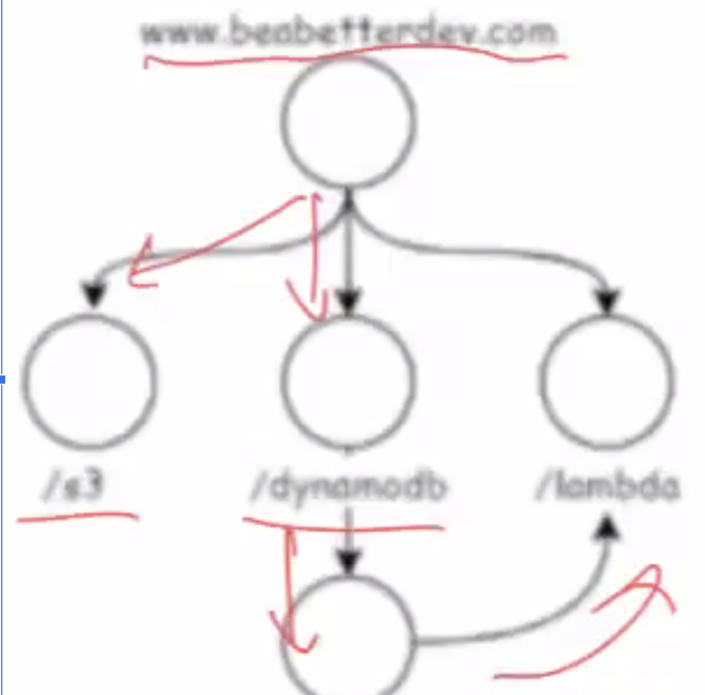

#### Web Crawler BFS vs DFS

When designing a **web crawler**, the choice between **Breadth-First Search (BFS)** and **Depth-First Search (DFS)** depends on the specific goals and constraints of the crawler. However, **BFS is generally preferred for web crawling** for several reasons:

---

#### Why BFS is Better for Web Crawlers:

1. **Finds Relevant Pages Quickly**:
   - BFS explores the web layer by layer, starting from the seed URL(s). This means it discovers pages that are **closer to the starting point** (e.g., the homepage) first, which are often more relevant or important.

2. **Avoids Getting Stuck in Deep Paths**:
   - DFS can get stuck exploring a single branch of the web graph (e.g., a long chain of links), which may lead to irrelevant or low-quality pages. BFS avoids this by exploring all links at the current depth before moving deeper.

3. **Prioritizes Popular Pages**:
   - Pages linked from many other pages (e.g., popular pages) are more likely to be discovered early in BFS, as they are reachable through multiple paths.

4. **Better for Politeness and Rate Limiting**:
   - BFS naturally spreads out requests across different domains and servers, making it easier to implement politeness policies (e.g., not overloading a single server with too many requests).

5. **Easier to Parallelize**:
   - BFS can be parallelized more easily than DFS because it processes nodes level by level, allowing multiple workers to explore different parts of the graph simultaneously.

---

#### Why DFS is Less Suitable for Web Crawlers:

1. **Gets Stuck in Deep Paths**:
   - DFS can go deep into one branch of the web graph, potentially wasting time and resources on irrelevant or low-quality pages.

2. **Delays Discovery of Important Pages**:
   - Important pages (e.g., those close to the seed URL) may not be discovered until much later in the crawl.

3. **Harder to Implement Politeness**:
   - DFS tends to focus on one server or domain at a time, making it harder to implement politeness policies and avoid overloading servers.

4. **Less Efficient for Large-Scale Crawling**:
   - DFS is less efficient for large-scale crawling because it doesn't prioritize breadth, which is important for discovering a diverse set of pages.

---

#### Practical Considerations for Web Crawler:

1. **Politeness**:
   - Implement delays between requests to avoid overloading servers.
   - Respect `robots.txt` files and crawl-delay directives.

2. **Duplicate Detection**:
   - Use techniques like **hashing** or **Bloom filters** to detect and avoid revisiting duplicate URLs.

3. **Prioritization**:
   - Use priority queues to prioritize important or relevant URLs (e.g., based on page rank, domain authority, or freshness).

4. **Distributed Crawling**:
   - Use multiple crawlers working in parallel to speed up the process and handle large-scale crawling.

5. **Storage**:
   - Store crawled data efficiently using databases or distributed file systems.

---

### Example of BFS-Based Web Crawler:

Here's a high-level pseudocode for a BFS-based web crawler:

```python
from collections import deque
import requests

def bfs_web_crawler(seed_url, max_pages):
    queue = deque([seed_url])
    visited = set()
    count = 0

    while queue and count < max_pages:
        url = queue.popleft()
        if url not in visited:
            visited.add(url)
            print(f"Crawling: {url}")
            count += 1
            try:
                response = requests.get(url)
                if response.status_code == 200:
                    # Extract links from the page
                    links = extract_links(response.text)
                    for link in links:
                        if link not in visited:
                            queue.append(link)
            except Exception as e:
                print(f"Error crawling {url}: {e}")

def extract_links(html):
    # Implement logic to extract links from HTML
    pass

# Start crawling
bfs_web_crawler("https://example.com", max_pages=100)
```

---

#### Summary:

- **BFS is generally better for web crawlers** because it discovers relevant pages quickly, avoids getting stuck in deep paths, and is easier to parallelize and implement politeness policies.
- **DFS is less suitable** for web crawling due to its tendency to explore deep paths and delay the discovery of important pages.
- Practical web crawlers often combine BFS with additional features like politeness, duplicate detection, and prioritization to improve efficiency and scalability.

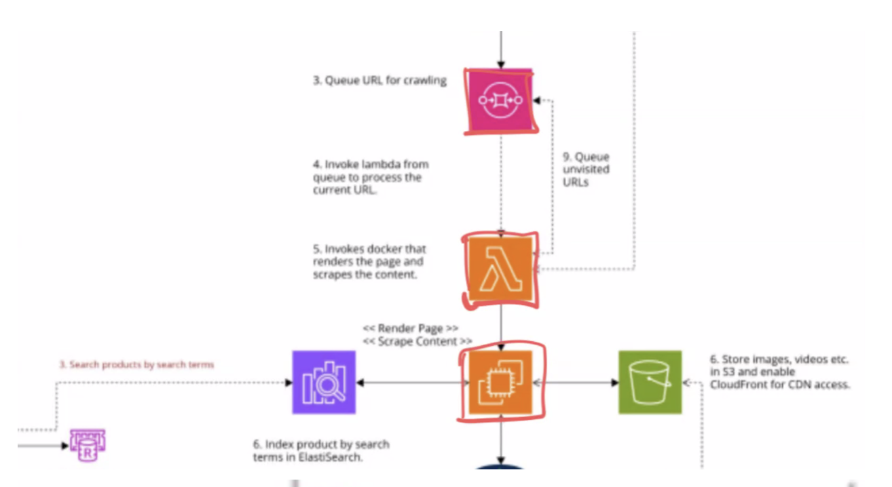
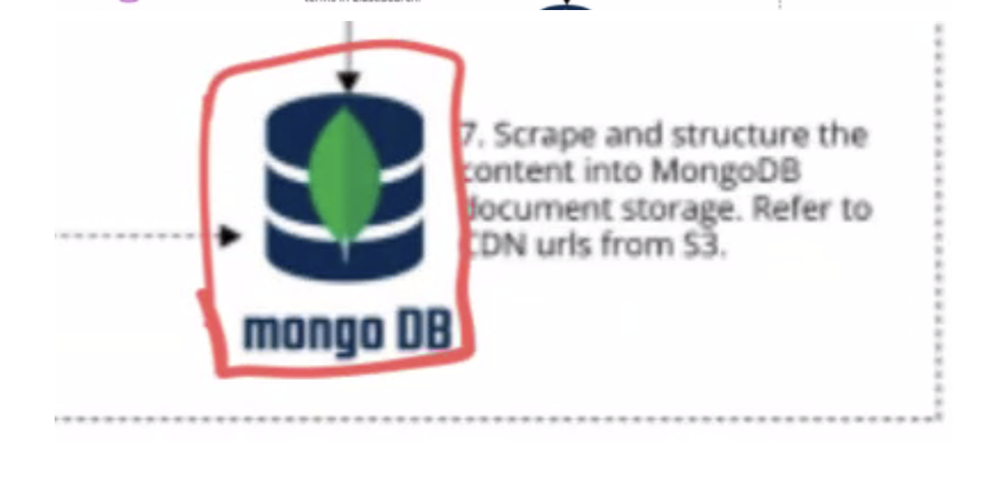
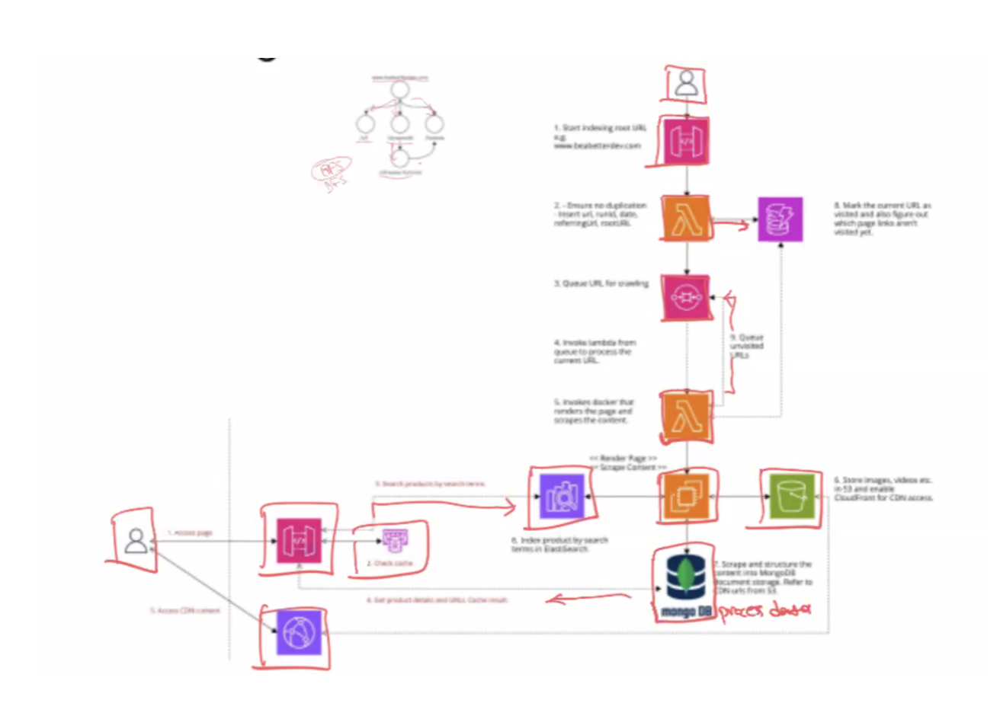

- Different dbs to support different aspects
  - Timeseries, NoSQL
- Using caching
  - Minimizes cost because we don't have to go all the way to the DB to get data
  - Scales better
- Store originally data to use later

#### Observations

- Combined strengths of various databases / storage solutions. Sometimes we may not have this luxury and we may have to come up with alternate solutions.
- Sharded requests by design (e.g. data and CDN resources on separate paths).
- Hosted solutions that scale horizontally (e.g. DynamoDB, Redis, ElasticSearch).
- Eventual consistency as and when pages are scraped and indexed.

## Case Study 2

Design a payment system for the Google Play Store. Define the type of database you would use and why? Design entities and relationships that satisfy storage requirements.

- Acid transactions, strict schema, etc...

### Strict Schema v/s Schemaless Databases

- **Criterias to consider when deciding between strict schema and schema-less dbs:**
  - Data structure and integrity v/s flexibility in schema
  - Predictable queries and optimization via heuristics via query optimizer
  - Normalization v/s nested JSON like structures
  - Scaling limitations for highly structured data v/s horizontally scalable schemaless dbs.
  - Speed of development and schema evolution for emerging requirements
  - Query complexity in case of hierarchical data models
  - Transaction requirements

### Use Cases

Two different types of users

- Developers can publish apps on Google Play store for various device types.
- Users can browse and select apps to install on their devices.
- Users can purchase apps using a payment method if the app is not free.
- In case of fraudulent transactions, users can contact customer service and get a refund.

### Entities

- **User**: Users of the Google Play Store. Each user can have many payment methods.
- **Payment Method**: Stores the payment details for each user.
- **App**: Each app is associated with a developer and has its price, category, and other details.
- **Developer**: Represents the creators/developers of apps.
- **Transaction**: Stores information about each payment transaction. It links users to the apps they purchase and includes details like the transaction date, amount, and status.
- **Refund**: Tracks refund information for transactions. In the case of refunds, a record is created to store details about the refunded transaction.

### ER Diagram

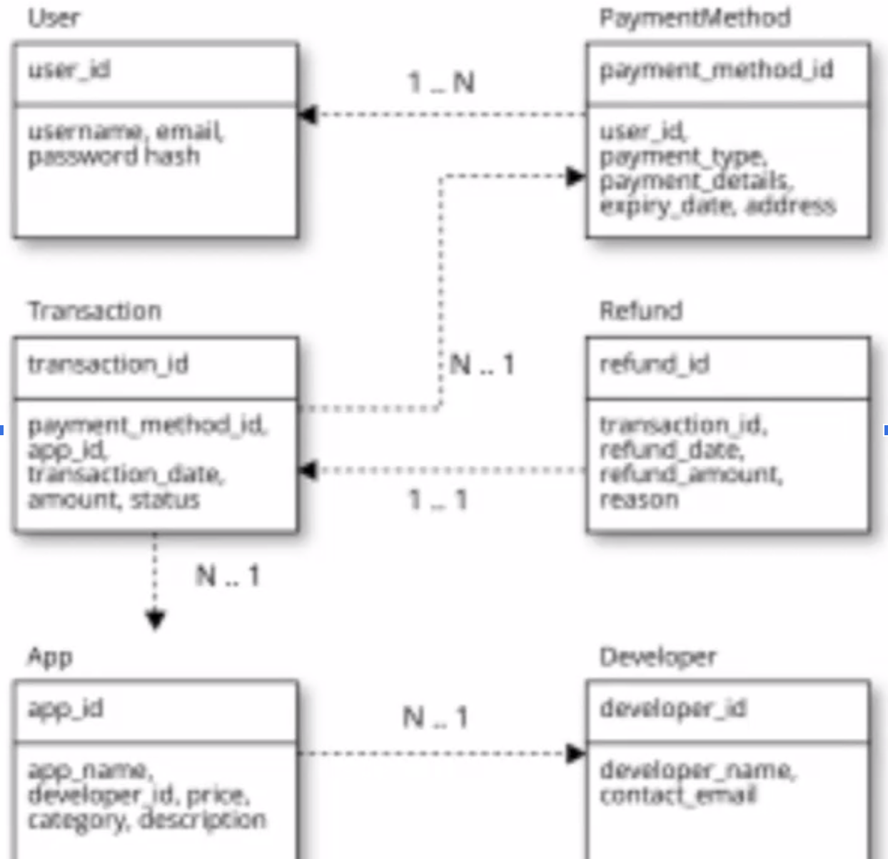

### DB Integrity

**TODO**

### SOMETHING ELSE

### Multiple DBs Considerations

- **Data Duplication**: Using different databases can lead to data duplication in some cases. You'll need strategies to manage redundancy and ensure updates are propagated correctly.
- **Scalability**: While both RDBMS and NoSQL databases offer scalability, they do so in different ways. Consider how your hybrid approach aligns with your scalability requirements.
- **Security and Compliance**: Handling sensitive payment information requires strict security measures. Ensure that both database types are configured with appropriate security protocols.

## Transactions

### ACID vs. BASE

- **BASE model stands for**
  - **Basically Available** - Increase availability by spreading and replicating data across the nodes of the database cluster.
  - **Soft State** - Volatile data values may change over time and are eventually consistent.
  - **Eventually Consistent** - Do not enforce immediate consistency and focus on being eventually consistent.
- For non-transactional requirements, it may be a better tradeoff that helps scale the database better via read replicas.
- BASE is typically implemented by NoSQL databases (e.g. MongoDB, DynamoDB) with multiple read replicas.
- **Example**: Updating social network feeds and likes.
  - When someone likes/unlike a post, updates can go to different servers, and different users can see different counts.

### Concurrency Control

### Optimistic - Data is not locked when it is read. After data is read, the system checks to see if it was changed and if so, then the transaction is rolled back.

Set at the DB level

- **Pessimistic** - Data is locked prior to read to eliminate parallel reads and any chances of rollback.

Both are ACID Compliance

Database concurrency control ensures multiple transactions can execute simultaneously without conflicts, maintaining **data consistency, integrity, and isolation**. Here's a streamlined breakdown of the key types and when to use them.

#### 1. Optimistic Concurrency Control (OCC)

👉 **Key Idea**: Assume conflicts are rare. Transactions work on a copy of the data and validate changes before committing.

🔹 **How it Works**:

- Read data → Perform operations → Check for conflicts before commit.
- If no conflicts, commit; otherwise, rollback and retry.

📌 **Best For**:
✅ Read-heavy workloads with low contention (e.g., analytics, reporting).
✅ Situations where frequent retries are acceptable.

#### 2. Pessimistic Concurrency Control (PCC)

👉 **Key Idea**: Assume conflicts will happen. Transactions lock data to prevent conflicts.

🔹 **How it Works**:

- A transaction locks the required data before reading/writing.
- Other transactions must wait for the lock to be released.

📌 **Best For**:
✅ High contention environments (e.g., banking, financial transactions).
✅ Scenarios where data integrity is **critical** and conflicts must be **avoided at all costs**.

#### 3. Multi-Version Concurrency Control (MVCC)

👉 **Key Idea**: Instead of locking, create multiple versions of data, allowing reads and writes to occur simultaneously.

🔹 **How it Works**:

- Readers get a snapshot (old version) while writers work on a new version.
- Reduces blocking but requires **garbage collection** of old versions.

📌 **Best For**:
✅ High-read, mixed-write workloads (e.g., PostgreSQL, MySQL InnoDB).
✅ Scenarios where readers shouldn't be blocked by writers.

#### 4. Two-Phase Locking (2PL)

👉 **Key Idea**: Ensures **strict** transaction ordering using **two phases**:

1. **Growing phase**: Locks are acquired but not released.
2. **Shrinking phase**: Once a lock is released, no new locks can be acquired.

📌 **Best For**:
✅ Strong consistency needs (e.g., ACID-compliant databases).
✅ Applications needing strict ordering (e.g., airline reservations).

#### 🔑 Key Takeaways

1. **Use Optimistic Control** if contention is **low** and retries are **acceptable**.
2. **Use Pessimistic Control** if contention is **high** and avoiding conflicts is **critical**.
3. **Use MVCC** if you need **high concurrency without locking** (best for read-heavy systems).
4. **Use 2PL** when **strict transaction sequencing** is a must.

By choosing the right concurrency control, you balance **performance, consistency, and scalability** for your specific application needs. 🚀

### Case Study

Suppose you are implementing a peer-to-peer money transfer system in Facebook. What concurrency control would you use and why?

#### Concurrency Control for Peer-to-Peer Money Transfers in Facebook

For a **real-time financial system like peer-to-peer money transfers**, the best concurrency control is **Pessimistic Concurrency Control (PCC) using row-level locks**.

#### Why Pessimistic Concurrency Control (PCC)?

1️⃣ **Prevents Race Conditions** → Ensures two users cannot transfer/withdraw funds at the same time, leading to inconsistent balances.
2️⃣ **Avoids Double Spending** → Prevents users from withdrawing more money than available.
3️⃣ **Ensures Atomicity** → Either the entire transfer succeeds or fails (no partial transactions).
4️⃣ **Minimizes Risk of Conflicts** → Unlike Optimistic Concurrency Control (OCC), which relies on retries, PCC **guarantees correctness** by locking rows **before modifying data**.

#### Implementation Strategy: Using PCC with Row-Level Locks

#### **SQL Implementation (PostgreSQL Example)**

```sql
BEGIN; -- Start transaction

-- Step 1: Lock sender's and receiver's accounts to prevent other transactions from modifying them
SELECT balance FROM accounts WHERE id = 1 FOR UPDATE; -- Lock sender
SELECT balance FROM accounts WHERE id = 2 FOR UPDATE; -- Lock receiver

-- Step 2: Check balance and perform transfer
UPDATE accounts SET balance = balance - 100 WHERE id = 1; -- Deduct from sender
UPDATE accounts SET balance = balance + 100 WHERE id = 2; -- Add to receiver

-- Step 3: Commit transaction
COMMIT;
```

✅ **Locks prevent other transactions from modifying the same accounts until this transaction completes.**
✅ **Guarantees balance correctness in a high-concurrency environment.**

#### Alternative: Hybrid Approach (OCC + PCC)

1️⃣ **Use OCC (versioning) for checking the balance first** (low contention reads).
2️⃣ **Switch to PCC (locking) for performing the transfer** (to avoid race conditions).
3️⃣ **Retries if a conflict is detected.**

#### Final Takeaways

- **Use Pessimistic Locking (PCC) for critical financial transactions** to prevent race conditions and double spending.
- **Optimistic Locking (OCC) is better for non-critical updates** but can cause retries in high-concurrency environments.
- **Hybrid approaches** can balance performance vs. safety, depending on system load.

✅ **For money transfers, always prioritize data integrity over performance!**

## Database Performance

Need to understand how DBs execute queries.

**Focus is on RDBMS**

### Execution Plan

**Execution Plan - ordered steps to access data from RDBMS.**

- Small queries can be problematic as well → use unit: time / IO.
- 10 > time. Reducing 1MM → 10K IO can ensure 10 parallel queries. 10 can be logical (from memory) or physical (from disk).

### Query Optimizer

**Query optimizer - generates the most optimized execution plan for a query. Uses optimization like:**

- Using / ignoring indexes on table based on table size (cardinality and rows).
- **Join ordering** based on table size (cardinality and rows).
- Includes indexes based on query clauses (if possible).
- Uses statistics to optimize queries.
- Flattening nested queries and transforming them into select-project-join queries.

### Database Query Performance

**Some query optimizers allow profiling of queries for tuning and debugging and yield ideas like:**

**Before we "shard", we can do these things below**

- Add clustered and non-clustered **indexes** for faster reads.
- Remove excessive indexes for faster writes.
- Reorder JOINs (smaller tables to the left).
- Query on filtered data set (not entire table).
  - Where comes before the JOIN. (data set is less because it's filtered)
- Use temporary tables and CTEs (common table expressions) for storing filtered data.
  - If using the same queries again and again, nested queries will be completed once and then it can be consumed very efficiently
- Only return a minimal set of columns.
  - Remove SELECT *
    - Don't need to fetch all the data
  - Reduce bandwidth and memory

### Case Study

Imagine you're working on a social media platform like Twitter, Instagram, or TikTok. Users are actively engaging by posting, liking, and commenting, especially during major global events such as a sports championship or breaking news. The platform handles a massive amount of real-time user activity and content retrieval requests.

**What needs to be computed**

- Scaling Challenges
  - Low latency
  - Proper use of indexes
  - Caching - reduce load on db
- Trending Topics
- Personalized Feeds
- Write heavy operations

**Indexing:**

- **Hashtag Indexing:** Use composite indexes on hashtags and timestamps to speed up trending content queries.
- **Partial Indexing:** Create indexes only for high-priority content (e.g., verified users or trending hashtags).
- **Text Indexing:** Enable full-text search for quick retrieval of posts containing specific keywords.
  - **TODO: RESEARCH**

**Caching:**

- **Feed Caching:** Cache user-specific feeds (e.g., top 50 posts) to reduce real-time computation.
- **Trending Cache:** Store trending hashtags, posts, or topics in in-memory caches like Redis.
- **Hierarchical Caching:** Use multi-level caching (e.g., user feed in L1 cache, trending topics in L2 cache).

### Scaling

- At the database system level following steps can reduce the latency of data 10:
  - Separate read replica / cache - for non-transactional data and reads.
  - Partition tables - reduce working and backup set, move old data to cold storage. Shard database/users - e.g. along geographical lines.

### Case Study (Review)

Imagine you're working at a large-scale e-commerce platform like Amazon or eBay. The platform handles millions of users and transactions daily. As the holiday season or a major sale event (e.g., Black Friday or Cyber Monday) approaches, traffic spikes to unprecedented levels.

What are the challenges?

- ...
- Zero downtime
- ...

**How can replication help?**

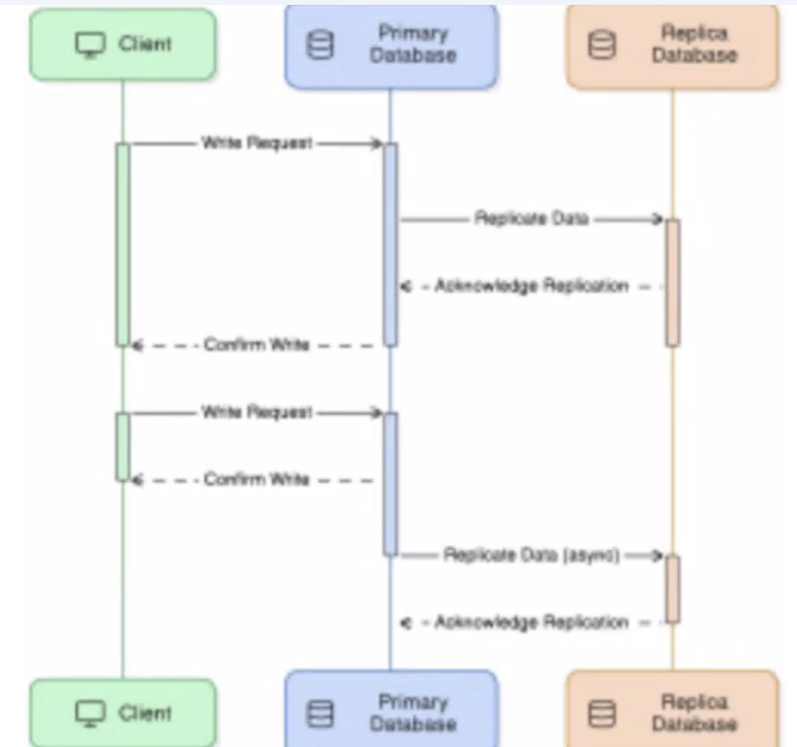

#### Primary-Secondary/Single Leader Replication

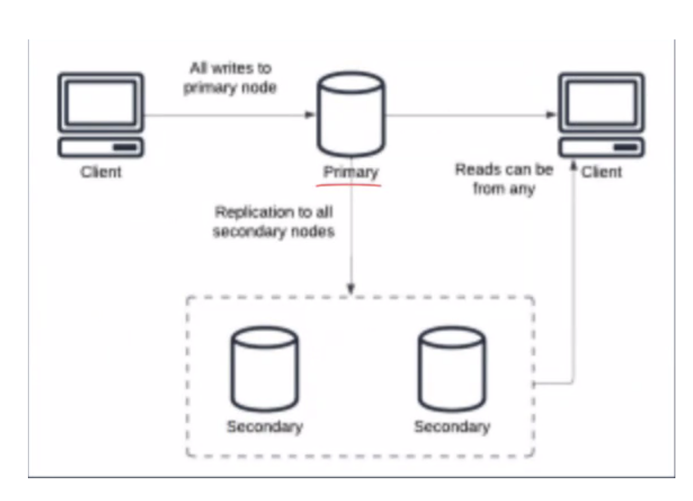

**Pros**

- **Highly performance**
- **...**
- **..**

**Cons**

- sadfa

#### Multiple Leader Replication

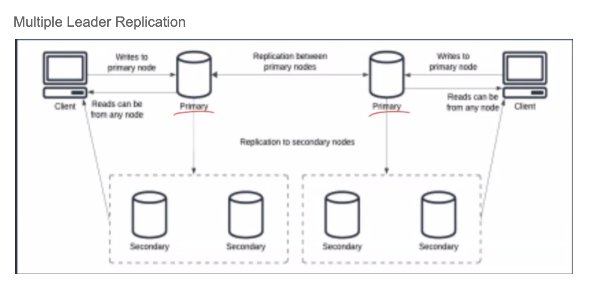

- Improves write throughput
  - Scales better
- ...
- Better fault tolerance
- Load balancing

**Cons**

- **Can have conflicts**
- **How to promote a secondary to primary when the primary goes down**
  - **Raft consensus algorithm**

#### Leaderless

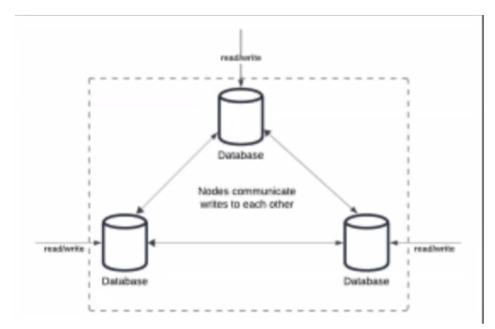

**Pros**

- No single point of failure
- ...
- ..

**Cons**

- Only have eventual consistency
- Need to have conflict resolution if same data is changed by multiple requests
- ...

## Case Study

Imagine you're working at a rapidly growing social media platform like Facebook or Twitter. Over the past few years, the platform's user base has grown exponentially, and as a result:

- The volume of posts, comments, likes, and other interactions has surged.
- The platform is now serving billions of active users across different geographic regions.
- The platform needs to store massive amounts of data related to users, posts, comments, media files, etc.

**Challenges**

- Scalability
- Latency, response time
- High availability
  - An outage can affect 1000s of users

**Solution**

Partition/Shard the database

- Break data into smaller pieces

**Pros**

- Reduce response times
- Durability
- Availability
- Different regions

**Cons**

### Scaling and Performance of Sharded Databases
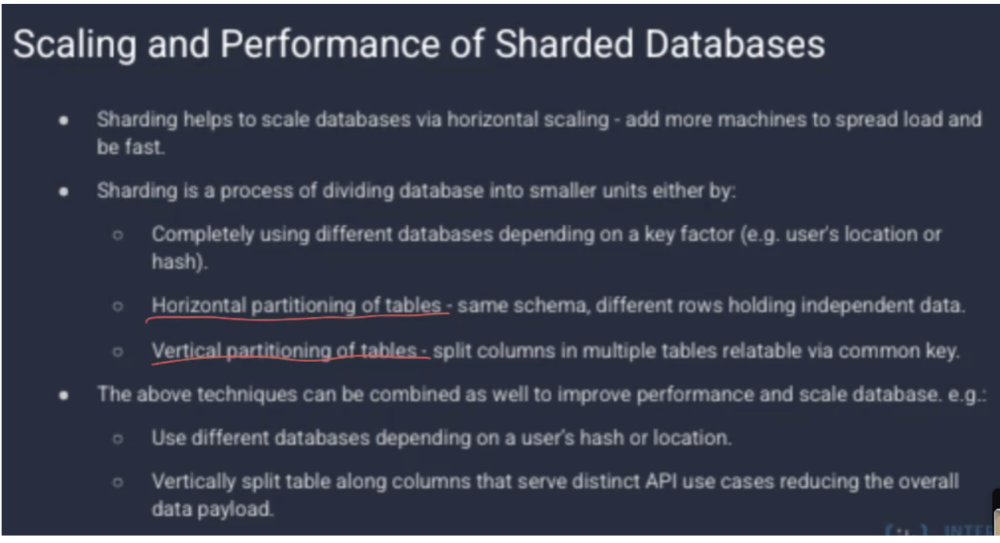

- Sharding helps to scale databases via horizontal scaling - add more machines to spread load and be fast.
- Sharding is a process of dividing database into smaller units either by:
  - Completely using different databases depending on a key factor (e.g. user's location or hash).
  - Horizontal partitioning of tables - same schema, different rows holding independent data.
  - Vertical partitioning of tables - split columns in multiple tables relatable via common key.
- The above techniques can be combined as well to improve performance and scale database. e.g.:
  - Use different databases depending on a user's hash or location.
  - Vertically split table along columns that serve distinct API use cases reducing the overall data payload.
- Shards must be autonomous and should not share compute resources.
- In some cases shards may replicate certain tables used as reference (e.g. conversion rates for weights).
- Sharding is usually implemented at the application level that determines shard to transmit reads and writes to.
- However, some database management systems have sharding capabilities built in, allowing you to implement sharding directly at the database level.

**Drawbacks of Sharding**

- Properly implementing a sharded database architecture is complex and non-trivial.
- Incorrect implementation can lead to data loss and corrupted tables.
- Complexity due to possible reads/writes from/to multiple shards while maintaining data integrity and consistency.
- Shards may become unbalanced and it may be quite hard to rebalance data across nodes.
- Sharding isn't natively supported by every database engine and hence involve custom sharding logic.

### Key Based Sharding

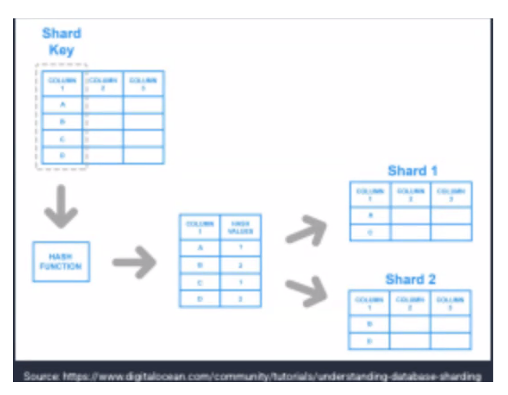

**Pros**

- 

**Cons**

### Range Based Sharding

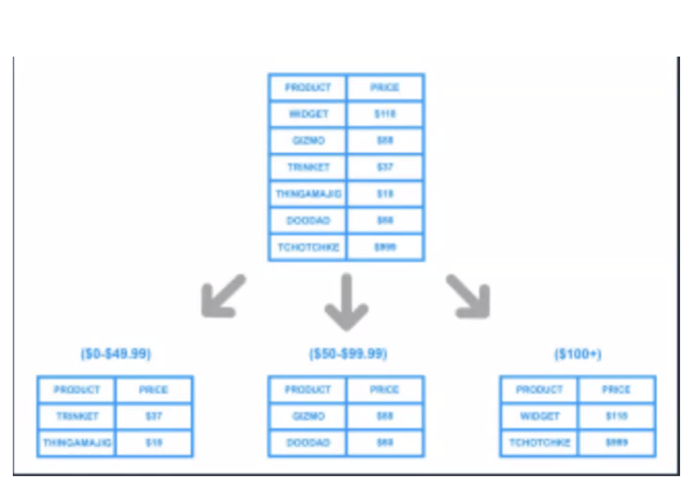

**Pros**

- 

**Cons**

### Directory Based Sharding

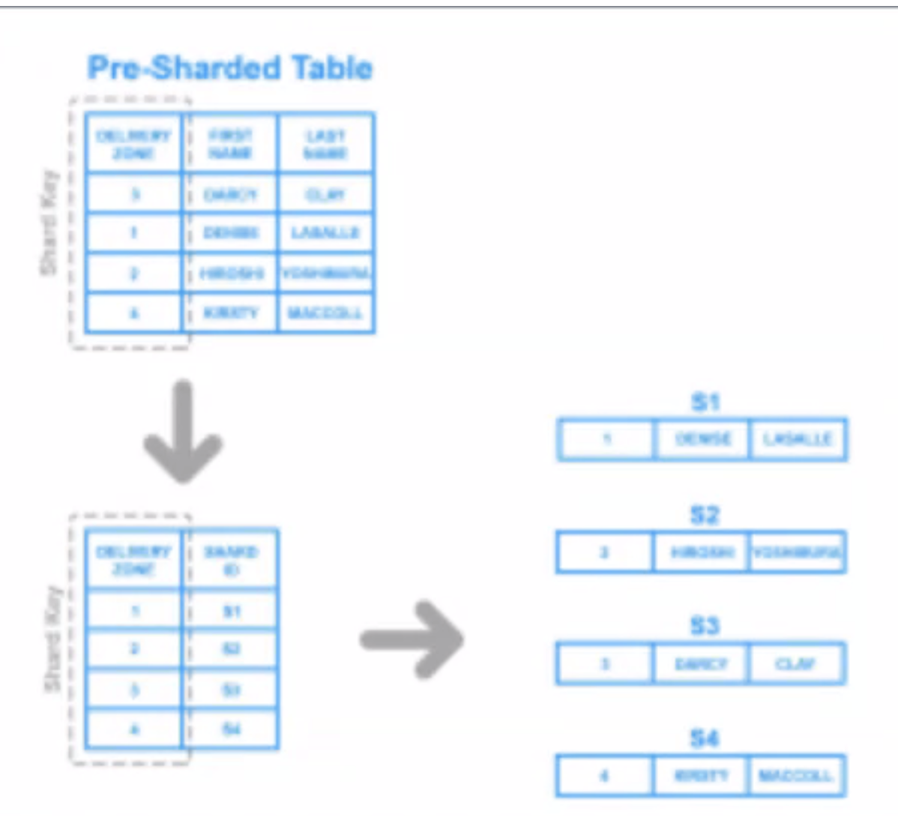

**Pros**

- 

**Cons**

- SPOF

## CAP Theorem in DB System

In a distributed system, Partition Tolerance is a fundamental requirement. Depending on your use case, you must choose between Consistency and Availability to best meet system demands.

**Case Study: Airline Booking System**

- **Scenario**: A user books a seat.
- **Requirement**: This booking must be consistent across the database to prevent double booking.
- **Priority**: Prioritize Consistency, even if it means temporarily compromising availability.

**Case Study: YouTube Uploads**

- **Scenario**: A user uploads a new video.
- **Requirement**: The video doesn't need to appear immediately across the database system.
- **Priority**: Prioritize Availability, as immediate consistency isn't critical in this case.

Think of other use cases where Consistency or Availability is prioritized over the other.

## Security

### Case Study

Imagine you're working at a highly regulated financial services platform like PayPal or Stripe. The platform handles millions of financial transactions daily, including sensitive data like credit card details, transaction amounts, and user personal information. As the platform expands, it faces growing challenges to ensure the security of this sensitive data while maintaining compliance with data privacy laws and financial regulations.

**Security Challenges**

- Data breaches

#### Encryption

- **At Rest**: Protects stored data using encryption algorithms (e.g., AES-256).
- **In Transit**: Secures data during communication using protocols like TLS/SSL.

#### Authentication: Verifying the identity of users or systems

**Methods**:

- **Password-based Authentication**: Secure password policies (minimum length, complexity).
- **Multi-Factor Authentication (MFA)**: Adds another layer (e.g., OTP, biometrics).
- **OAuth / JWT**: Token-based authentication for microservices.

#### Authorization: Granting access based on roles or attributes

**Methods**:

- **Role-based Access Control (RBAC)**: Assigns permissions based on roles.
- **Attribute-based Access Control (ABAC)**: Uses attributes (e.g., department, time of access).
- **Fine-grained Access Control**: Implementing least-privilege principles.

**Regulations examples**

- PCI-DSS
- GDPR
- SOX

Need to maintain all data blogs

## Monitoring and Alerts

### Case Study

Imagine you're working at a global online streaming platform like Netflix or Spotify. The platform serves millions of users worldwide who are constantly streaming videos, music, and other media content. As the platform expands, it faces significant challenges in maintaining **optimal performance** and ensuring the system remains **responsive and scalable**, especially during peak traffic times, such as new content releases, holidays, or live event streaming.

**Discover issues**

- Real-time monitoring
  - Metrics => alerts

#### Monitoring and Alerts

**Key Metrics to Monitor:**

- Common database performance metrics such as query execution time, CPU utilization, disk I/O, memory usage, connection counts, and replication lag.

**Monitoring Tools:**

- Tools such as Prometheus, Grafana, Datadog, New Relic, and Cloud-native monitoring solutions that provide real-time insights into database performance.

**Alerting Systems:**

- Setting up alerts based on thresholds like CPU usage > 80%, slow query execution times > 2 seconds, or disk space <10%. Integrating with Slack, email notifications, or PagerDuty for instant response.

### Case Study

#### Select a database type(s) for a social media website that includes search, user connections, user feeds, ads as well as payments. Design for scalability given peek events and hours. Design the ER diagram for a subsection of the entities indicating entities, relationships and constraints.

- What's the nature of the organization? Corporate vs. Startup

#### Use Cases

- User - Sign up and create a profile.
- User Connections - Add other profiles as friends.
- Posts - Add posts containing photos and videos, like and comment on posts.
- User Feeds - See posts that friends have added.
- Payments: ads, marketplace
- There may be many more use cases but for a limited case study we can scope down to the above use cases.

#### Define scale and then database types

- For smaller social media projects, start with simple RDBMS such as MySQL (open source). FB started like this!
- Use an associative table for defining friends (simple for direct friends, but not for transitive relationships).
- Posts can be its own table and comments can be associated with posts and nested within other comments.
- Transactions work for payments as well.
- Simple search can be done via tokenization, normalization and table lookup (building your own reverse index).

Simple data models are comprehensible, trackable, and can be optimized for faster reads at least for the next scale level.

#### The Existing Model

Once a critical scale point is reached and performance plateaus, scale the database preserving the model (if possible):

- Define row and columnstore indexes for faster queries.
- Horizontal scaling, followed by regionalization sharding (with horizontal scaling).
- Vertical sharding of tables (e.g. comments) and load in batches when/if user expands comments.
- Possibly denormalize tables or define views for reducing JOINS for frequently associated entities.
- Multiple read replicas for faster reads.
- Caches and periodic pre-computation for users' feed page.

#### Scale for the future

If the RDBMS model does not scale further, we can assess other types of databases (for non-payment/transactions):

- NoSQL for fluid user settings.
- Graph databases for efficiently determining transitive user relationships, suggest friends and nested comments.
- ElasticSearch database for handling free form search for posts/users.
- Geographically shared databases to reduce the lookup size.
- Redis cache for user's relationships and posts (with ttl) etc.
- Copy media/photos to edge caches and CDNs.

## Cloud Database Performance

- Set performance objectives or baselines
- Prototype software or hardware
- Analyze workload performance
- Test software builds for performance, before and after release
- Benchmark/baseline the software releases
- Run a proof of concept in the target environment (e.g. use SSD instead of HDD)
- Choose the right service tier
- Use tools to monitor performance
- Document analysis of performance issues
- Execute performance tuning in the cloud vs. on-premises

### Cloud vs. On-Premises Databases

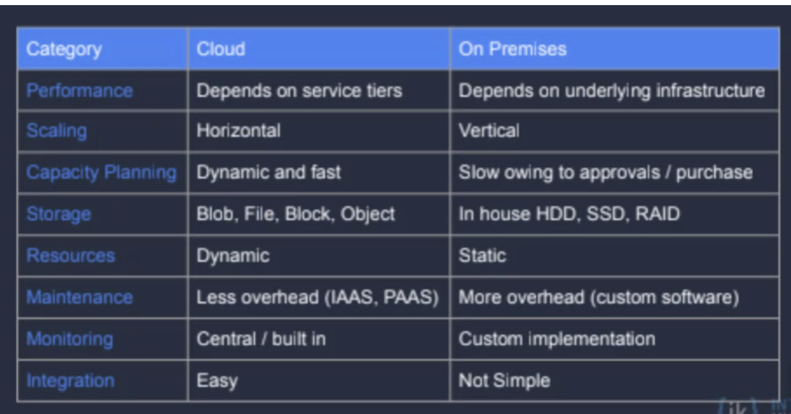

### Running Databases in the cloud

Cloud offers almost all types of database solutions:

- SQL databases - Amazon RDS, Oracle
- NoSQL databases - MongoDB, CouchBase
- Key/Value databases - Amazon DynamoDB, Redis
- Data Warehouses - Amazon Redshift, Teradata, Greenplum, Snowflake

As well as tools to stream data to these sources:

- Amazon Kinesis Data Streams
- Amazon Kinesis Data Firehose
- Amazon DynamoDB Streams

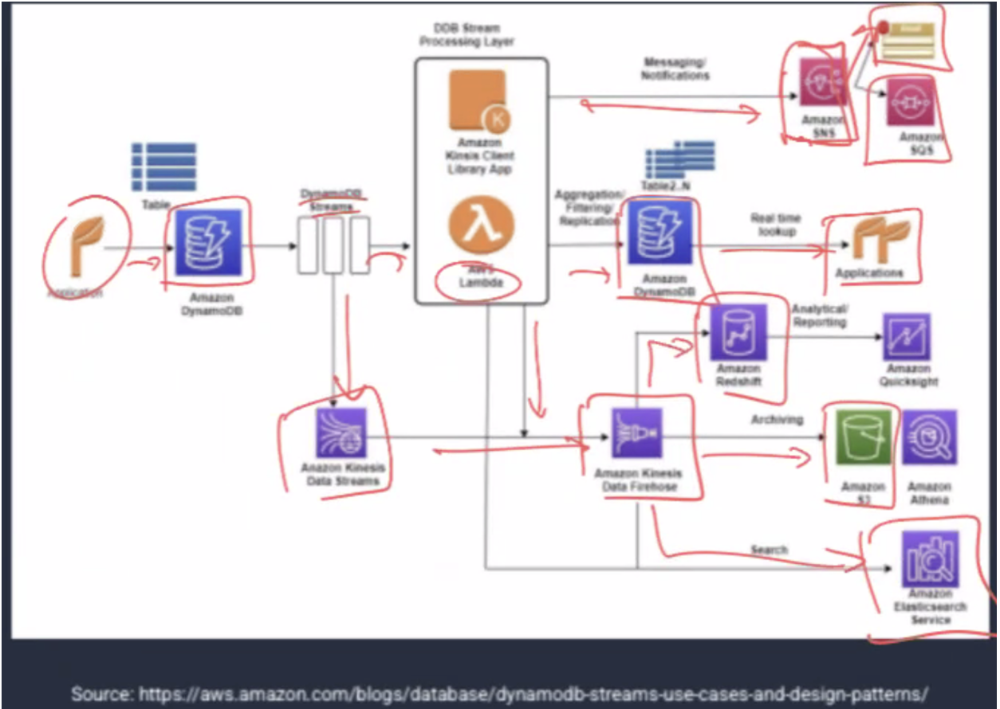

If we were to do this ourselves, it would be a big undertaking requiring lots of manpower to do so.

Use the proven solutions!