# Designing Stream Processing Systems

## Agenda

- Intro
- Online Processing System
- Batch Processing System
- Stream Processing System
- Examples of Stream Processing Systems
- Structure of Design Interviews
- Common Mistakes in System Design Interviews
- Message Queues and Distributed Systems
- Replication and Leader Election

---

## Intro

### Online Processing System
- A collection of components (subsystems) which interact with each other to expose an interactive piece of functionality.
- **Online Processing System w/ offline subsystems**: A subsystem within an online system can be an offline system.
  - Input is too large or a large number of files.
  - The output is large or a large number of files.
  - This is known as a **batch processing system**. It may run periodically, say once a day.
  - **Example**: Crawling/Indexing System within Google Search.

### Stream Processing System
- Sometimes, the input is not fixed and available in its entirety but keeps coming in as a stream.
  - There is a producer who keeps producing new input, and your program needs to consume the stream and keep generating new output in near real-time.
  - **Examples**:
    - System/Application Performance Monitoring System (e.g., DataDog or New Relic).
    - Trending topics.
    - Fraud detection.
    - Stock market surveillance.
    - IoT (e.g., doorbells).
    - Activity tracking.

---

Sometimes, a subsystem within an online service system can be an offline system.
- The input to it is large or a large number of files.
- The output is large or a large number of files.
- Your program thus becomes a **batch processing system**. It might run periodically, say once a day.

And sometimes, the above input is not fixed and available in its entirety but keeps coming as a stream. There is some producer who keeps producing new input, and your program needs to consume the stream and keep generating new output in near-real time. This is a **stream processing system**.

### SS1: Online Processing
- **Request-response**.
- **Reactive system**.
- **Multi-player games**.
- **Capacity**: Plan for spikes - leave room.

### SS2: Batch Processing
- **Scheduled/planned jobs** (e.g., CRON).
- **Search indexing**.
- **ML training**.
- Use planned hardware at 100%.
- **Throughput guarantee**.
- **Available hardware**.

### SS3: Stream Processing
- **Video streaming**.
- **Video doorbell**.
- **Conference call**.

---

## "Stream Processing" Before 2010

- **Message Brokers** such as ActiveMQ and RabbitMQ (AQMP based).
  - These systems were primarily intended to provide loose coupling between components of a system.
  - **Key characteristics**:
    - Smart broker and dumb clients (get message and do something).
    - Support for low latency message delivery, complex routing, and priority-based delivery.
  - **Limitations**:
    - Dealing with large volumes of high-velocity data.
    - Primarily architected to scale vertically.
    - Limited support for horizontal scale.
    - Works best when queue lengths are small.
    - Message delivery order not guaranteed.

---

## Identifying the Type of System

Being able to identify what type of system is extremely important. What to check:
- Does the system have a real-time component?
- Is there ‘lots’ of data?
  - If data is always coming in, then there is a lot of it.
- Data is read/looked at exactly one time (once).

---

## What Drove the Interest in Stream Processing Systems?

- Growth in data size and velocity.
- Expectation/need to analyze the data / process incoming data in real-time.
- Need for multiple downstream systems to operate on a high volume/velocity of data.

---

## Summary

- Data always coming in.
- Real-time.
- Processed once.
  - Look at the temperature and check, we don’t need to check it again tomorrow.

### Some Example Categories
- **Fraud detection**.
- **Banking system**.
- **Algorithmic trading and stock market surveillance**.
- **Trend detection** (e.g., Instagram trends).
- **Internet of Things applications** (e.g., data center with temp probes).
- **Activity tracking** (e.g., Apple Watch).

---

## Structure of Design Interviews

- Use time for the metric to tell you how well you are doing for both:
  - Interviewing.
  - Coding.
- **Interview**: 45 minutes, 5 minutes small talk. Break 45 minutes into 10-minute chunks.

### 10 Minutes => Understanding and Requirements
- Pick a short list of actionable requirements.
- The system I design will NEVER get implemented, so don’t try to make the perfect/complete solution.
- I need to prove “success” of my requirements.
  - Can you show me in your design that it can be “secure”?
  - Don’t just list “buzzwords”.

### 10 Minutes => High-Level Architecture Design
- Block diagram with system components.
- Or, start with what I’m good at. If I’m really good with data modeling, API, UI, start there first.
  - With the data model, I don’t need to create a complete table, but just the necessary fields. The goal is to convince the interviewer that I can design tables, not to show them a complete solution.
- Be really good with time management if I decide to do anything else.
- **Big trade-offs**:
  - AP - CP.
  - If there’s time: LB, cache, sharding.
    - **Load balancer**: Have to give two options so there’s a trade-off.
      - Does it round robin, send requests like in a circle, and it’s probably evenly spread?
      - Or does it query the other components and figure out which one is least busy, and then it routes traffic to the least busy component?
      - The trade-off is now we have to create the custom components.
      - We can do A, we can do B, we will do B because...

### 10 Minutes => Detailed Design
- Walk through one:
  - All requirements: (three requirements).
  - All components.
  - Show data flow: (talk about how the components talk to each other).
  - Internals: Be specific about what’s going on inside.

### 10 Minutes => Time for More Depth or Breadth
- Depends on the interviewer. Sometimes the interviewer wants to see how you struggle, change the system, etc.
- **Best outcome**: Deep-dive in an area of my expertise.

---

## Interview Considerations

- As I’m going through the design, mention things that I can go deeper on. This is one technique to use up more time.
- I don’t have to know ALL the details, but I should know more than “Use a quad tree in this situation.”
- The interviewer wants to know what you don’t know.
- Make a list of 10 things that are most appealing to me:
  - Sharding.
  - Caching.
  - Distributed file systems (week 2).
  - Distributed message queues (week 3).
- Then prepare to talk about these topics, for maybe 3-4 minutes each.
- Practice steering the conversation towards these topics.
- We’re not designing a good system or a real system. We’re not gold plating it.
- We’re trying to negotiate it down to make it easier for me, and less interesting.

---

## Most Common Mistakes

- The Requirements list is too long.
  - The system that I design in an interview will never get implemented.
  - The goal is to convince the interviewer that I can design good systems.
  - I can pick the “wrong” requirements.
    - For Netflix, I think video uploading is the most important and not the video streaming.
  - 3-4 requirements at most.
- Don’t over promise.
- Using your competitors' technologies (don’t do name dropping).
  - Example: Interviewing at Google and using AWS technologies.
  - Use generic technologies.
- Pick 4-5 topics to dive deep in.
- Learn how to steer the direction of the interview

---

## Message Queues - Design a Distributed Message Queue

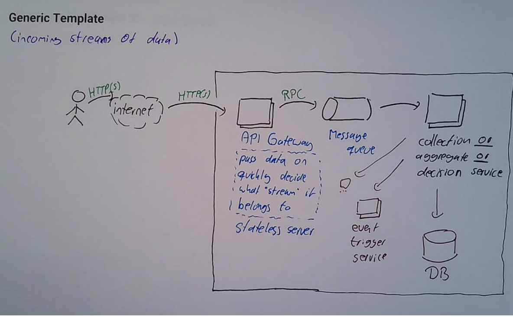

### Examples
- Kafka.
- Pulsar.
- RabbitMQ.

### Reasons for Using a Message Queue
- Should I be using a MQ, or should the components be talking directly to each other?
  - **Tradeoff**: Talking to each other introduces latency and additional complexity.
- **Availability/reliability/fault tolerance**:
  - **Tradeoff**: If one system goes down, the connection goes down.
  - And it can be much cheaper to make the message queue not go down than the server not go down. (Maybe I have real expensive hardware and we can’t afford to make it not go down.)
  - With the MQ, one system is downstream, the MQ is still available.
  - Cheaper to make a MQ reliable than it is to make a consumer (system) reliable.

  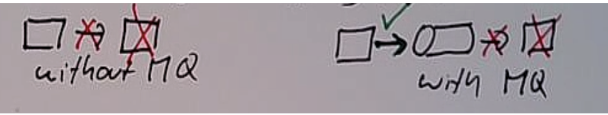

### Scalability: Smoothing RT Traffic Over Time
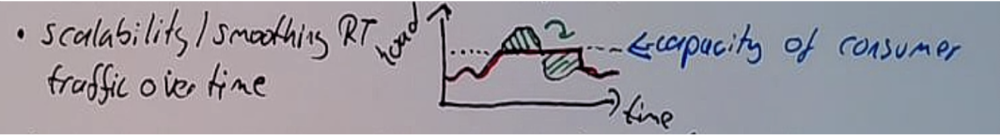

### Message Communication Semantics (Async)
- Can send messages to the queue and continue with other tasks without waiting for consumers to process them, improving throughput.
- **Multiple consumers**: One to many, broadcasting messages.
- **Reactivity**: With strict start and end time. No finite number of events.
- **Loose coupling**: Consumers distributed, publisher doesn’t know consumers.

### Advanced Features Once We Decide to Use MQ
- **Ordering of messages** (e.g., FIFO, timestamp order, …).
- **Telemetry / real-time diagnostics / observability**.
- **Filtering/priorities**:
  - Sometimes I want more important messages delivered first.
- **TTL (time to live)**: Dead letter queue.
- **Transformations of messages**: Each message gets a unique ID and timestamps, drop fields.

---

## Message Model

### How It Can Be Used
- **Publish-subscribe**: A message queue that’s using publish and subscribe semantics.
  - The consumer decides what message to get.
- **Point-to-point**: Consumers are identified by names (IDs).
  - When the producer puts the message in the queue, it needs to specify a receiver.
  - Producer decides (which consumer receives a message).
- **Topics (business/architecture)**:
  - Differentiates messages (tunnel, “virtual queue”).
  - Example: e-commerce.
    - Orders.
    - Cancellations.
- **Partitions (scale)**:
  - Used to distribute load, “sharding” of messages.
  - Round robin, hash, etc., geolocation, region, load-based.

  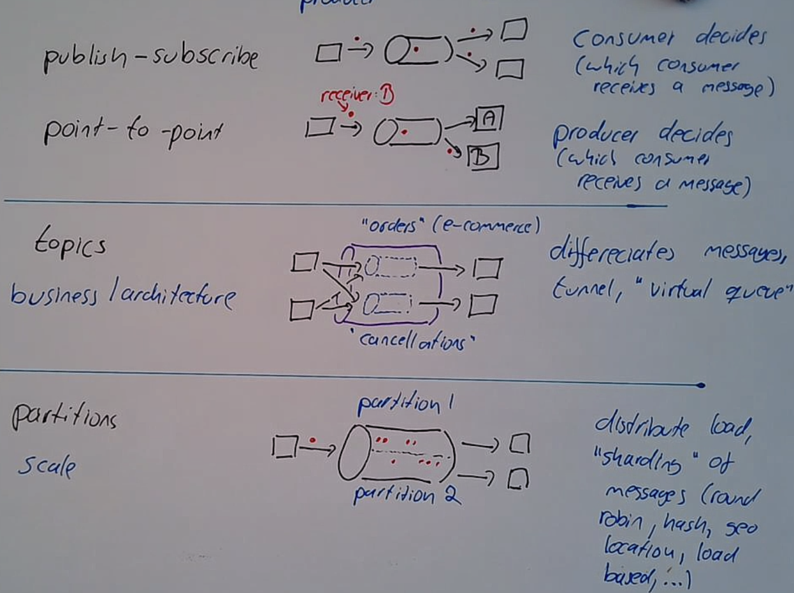

---

## What Happens When There Is an Unprocessed or Failed Message?

- **Retries**:
  - But eventually, if it’s still not successful.
  - The message is in a dead letter queue.

---

## How Messages Get Delivered (Implementation Details)

### How Messages Leave the Queue
- Two questions to answer. The producer is out of the picture now.
  - **Who makes messages leave the queue?** Push vs. Pull.
    - **Push (RabbitMQ)**:
      - The MQ is the “client” that makes the request, and the consumer is the “server” that answers the request.
      - MQ sends the messages to the consumer.
    - **Pull (Kafka)**:
      - The consumer is the “client” that makes the request, and the MQ is the “server” that answers the request.
      - Consumers send a request and then ask the MQ for the next message.
  - **At most once delivery**:
    - What are we worrying about, what primary resource are we protecting?
      - **Primary resources**:
        - Compute (CPU).
        - Network.
        - Disk.
        - Memory.
      - **Push**: Protecting the MQ from overfilling (memory).
        - Before I run out of memory, I can send out the memory.
        - Best for event-driven or real-time systems.
        - In the past, it used to be more popular.
      - **Pull**: Protect consumer from overloading (CPU).
        - Pulling the message exactly when I’m ready so I’m always at or near running at capacity.
        - Almost always want to do pull for streaming.
      - **At least once guarantee**.

---

## Use Cases

- **Push**:
  - More “real-time”.
  - Video/media streaming. Need packages at a certain time.
  - It’s okay to miss a frame in a video.
- **Pull**:
  - Data is “always” coming in.
  - Good choice for streaming.
  - Natural choice.

---

## Delivery Guarantees (Semantics)

- **Delivered means**:
  - It made it across the network (reached consumer).
  - **ACK**: When the consumer is done with the message.
    - **Push ACK**:
      - “OK” return code to send message RPC.
    - **Pull ACK**:
      - ACK is the second, separate RPC (each message has a unique ID).
      - I want to “ACK” this message with ID = ‘XXXXX’.
- **At most once delivery**:
  - Push model.
  - ACK count <= 1.
  - Can guarantee that I won’t deliver twice.
- **At least once delivery**:
  - Can guarantee that it will be delivered once.
  - But it can be delivered more than once. This happens when I send out, e.g., message 9, and it’s been a long while, and then someone else asks for message 9. Now, I’ll get back two ACKs. One from person one and one from person two.
  - ACK >= 1.
- **Exactly once delivery**:
  - ACK === 1.
  - Pull models.
  - Why would anyone choose anything else? It comes at a price.
    - Lock queue to not give the message more than once.
    - But, can’t wait “forever” for the ACK.
    - Distributed transactions: I’m giving you the next message as a transaction.
      - If the transaction fails, you cannot send the ACK back to me, and the transaction is invalid.
    - Two-phase commit protocol (expensive and nasty to implement) (need expertise in transactions to get this right).
    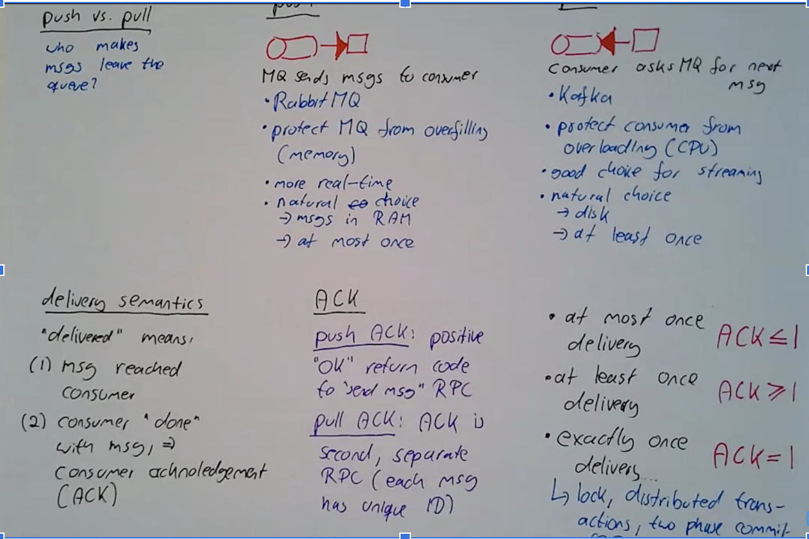

---

## Message Queue - High-Level Design

### Broker
- A machine running the MQ service (node).
- **Leader**: Broker that receives all writes.
- **Follower**: Broker that replicates messages, keeps copies, and does little less.
  - If a leader goes down, a follower can become a leader.

### Producer
- Get a lease from the control plane. First talks to the control plane to find out who the leader is for the next time period (e.g., 500ms).
- Then can talk to the write leader.

### Data Flow => Broker
- Broker first receives the message.
  - Can we guarantee that the message won’t be lost? Not at this point.
  - Assign distributed generated unique ID.
  - Persist message on the broker's local DISK HDD.
    - Payload.
    - UniqueID.
    - Last sent time.
    - Ack count.
    - Topic.
  - Write to WAL (write-ahead logging): Idempotent operation.
    - On disk, append-only data structure that gives us:
      - Atomicity & durability.
      - Each change (delta) is stored in a log entry.
      - Also useful for replication, having data on multiple machines.
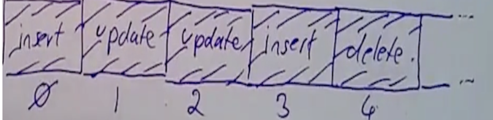
  - (Optionally) apply log entry (a method to get strong consistency).
    - Send log entry to all followers (in case leader goes down).
    - Wait to hear back from (optionally: all) followers.
    - Return “success” (I promise that I will not lose the message).

### Control Plane
- **Coordinator**:
  - Knows/decides what broker is the leader.
  - Can do that just by asking.
  - Every 100ms, send RPC to the broker and ask.
  - Also knows about all the brokers.
  - Hard-coded or variable depending on the need.
- **Meta Data**:
  - Knows all the brokers.
  - Generates unique ID.

### Write-Ahead Logging (WAL)
- On disk, append-only data structure.
- Gives atomicity and durability: Each change (delta) is stored in a .log entry.
- **Changes**:
  - Insert => update => update => insert => delete.
  - Each gets a lock entry.
  - Each change gets a unique number.
- Useful for replications:
  - Send log entry to all followers (write quorum).
  - The more followers that have the message, the safer it is.
- Apply change to persisted message.
  - If I pull a message, which message is the next one to be pulled?
  - In the broker, we have an index data structure to find the next message.
    - **FIFO**:
      - We have a doubly linked list, where I append to the beginning and remove from the end. Each list node contains the ID that I use to look up the file.
    - **Topics**:
      - A dictionary, where the keys are the strings of the name of the topics. The values are the FIFO doubly linked list.
    - **Pull protocol**:
      - Double linked list, remove from end and insert into a min-heap that’s ordered by timestamp.
      - The top of the min-heap is the oldest message and it’s pulled, but not ACK yet after a few milliseconds, then I pull from the double linked list.
      - We can use the log positions for many things.
        - If I don’t apply the log entry right away (a background worker is behind), then I can keep track of how far away the log has gone.
        - **Log position**: Maybe behind.
        - **Applied Log Position**: Current applied log.
        - **Append Position**: The next position.
        - **Replicated position for followers** (because we’ve got a success back from them).
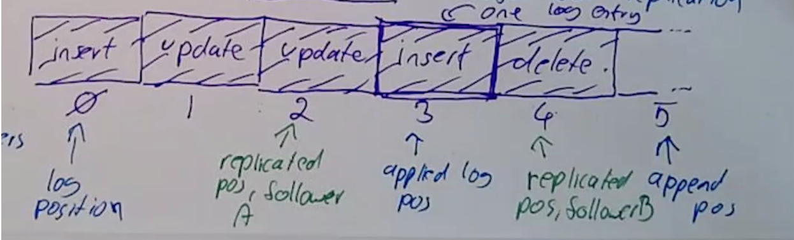

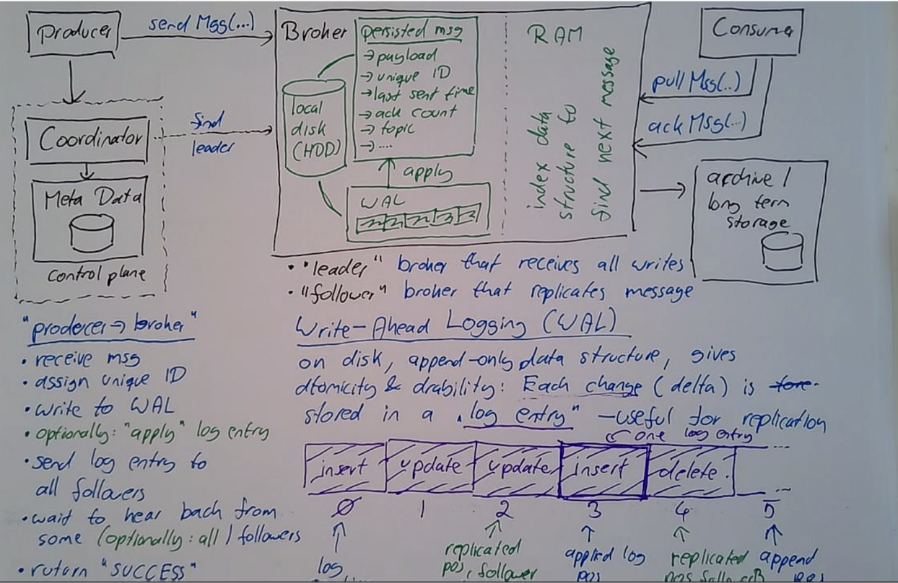
---

## Replication

- We know when a new log position is added.
- We can use the log positions for many things.
- **Replication Group**:
  - Odd number of brokers/replicas to break any ties.
  - One group per partition. Example: Two partitions = 6 brokers (for replication).

### Workflow
- **Broker/Replica A (follower)**:
  - Lock position is behind leader.
  - We can have an eventually consistent read.
- **Broker/Replica B (leader)**:
  - Replicate (RPCs) to broker A and broker C.
  - If lock positions in A/B are off, can send a catch-up call to catch them up.
- **Broker/Replica C (follower)**:
  - Reading from here, and we’re at the highest lock position.
  - Strongly consistent reading, because it has seen everything.
  - But, C doesn’t know it’s strongly consistent.
  - Have to send a catch-up to the leader to know if it’s up to date.

### Which Broker, of the 3 in the Replication Group, Should Be the Leader? Tie Breaker
- Complicated, use specialized software (ZooKeeper).
- It’s complicated, but my own responsibility, then I use my own “leader election” algorithm (consensus algorithm).
  - **Paxos**.
  - **Raft**.

### Raft Algorithm (Don’t Need to Know These Algorithms but the Thoughts Are Important)
- **GOAL**: One and only one leader at all times.
- Need to know two things:
  - Raft is a state machine.
  - A broker can only be a:
    - **Follower**:
      - If the machine boots up, it must be a follower.
    - **Leader**:
      - Leader sends “heartbeats” to followers.
      - As a follower, the heartbeats stop.
      - Leader is down, make myself a leader.
      - I have to be certain the leader is down.
      - A leader is alive and well, there is a problem on my end, and I didn’t receive the beat.
    - **Candidate (in-between state)**:
      - Make myself a candidate.
      - Numerical election.
      - **Terms**: 1, 2, 3, 4.
      - If I can’t agree on something complicated (who should be leader), then agree on a slightly weaker statement that’s easier to agree on.
        - “I’m the leader for election term 4.”
        - Automatically easier. Think of presidents. Two at the same time, but not for the same terms.
      - If I’m a leader, and I get a heartbeat from someone else with a higher term.

      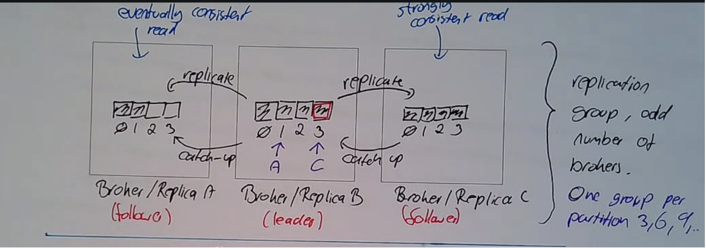

      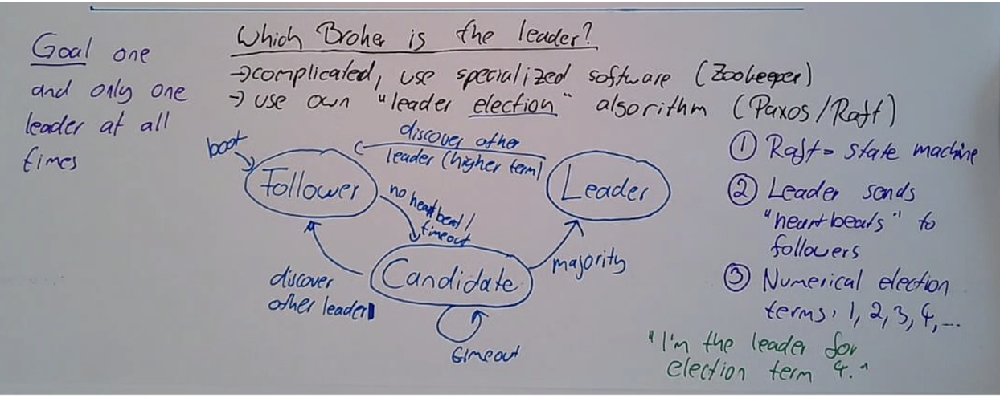

---

# Case Study: APM (Application Performance Monitoring)

### Problem Statement
Imagine a data center having thousands of servers (10,000) each emitting thousands of metrics per second (2000).

#### Examples:
- CPU utilization (`M_cpu`).
- Un-ACK’ed messages in a queue (`M_ack`).
- Non-empty shopping carts (`M_carts`).
- Count of incoming RPCs (`M_rpcs`).
- RPC latency (`M_latency`).

Build a central brain that ingests (metrics) and serves a dashboard from stored queries of the form:

```sql
FROM server(s)
SELECT metric (one metric)
WINDOW duration (time duration, 1)
COMPUTE functions
```

**Functions**:
- `min`
- `max`
- `avg`
- `percentile(p)`

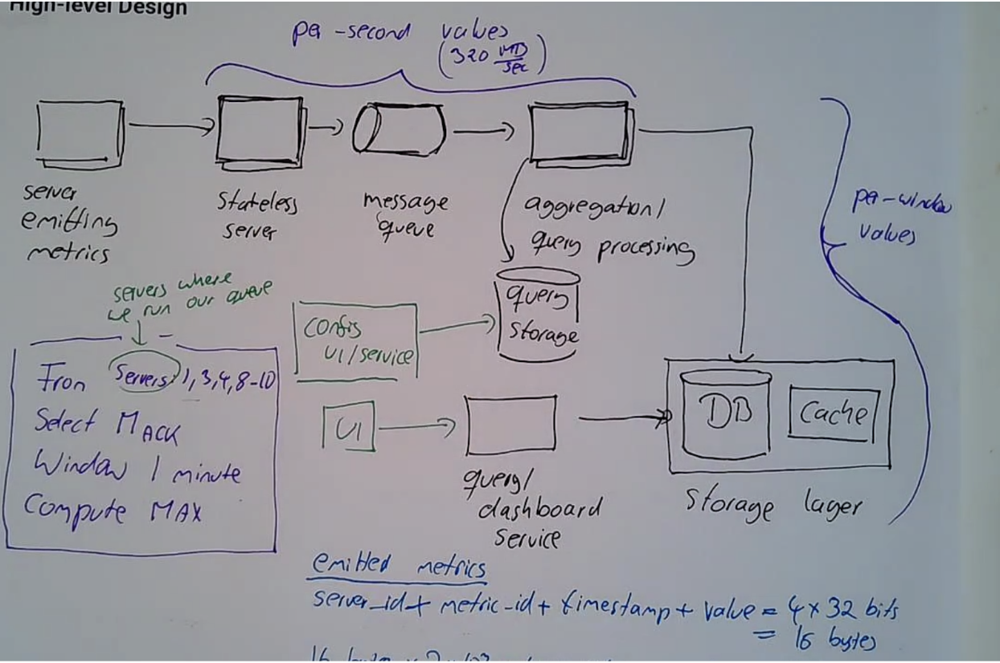
---

## Agents

### Things to Ask
- **Failures**:
  - Machine, OS, application.
  - Expected, missing data is a signal in itself.
- **Agent**:
  - Restart, check with heartbeat (supervisor service).
- **Network**:
  - Try again.
  - How often?
    - Exponential backoff (better): 10ms, 20ms, 40ms, 80ms.
    - This is really a binary search of all the possible things that can go wrong. This helps find out what the issue really is.
    - Fixed intervals.

### How Often Do You Publish?
- Snapshot every second (e.g., CPU).
- Aggregated:
  - RPC latency => highest RPC latency during that second.
- Depends on window length.

---

## Generic Template

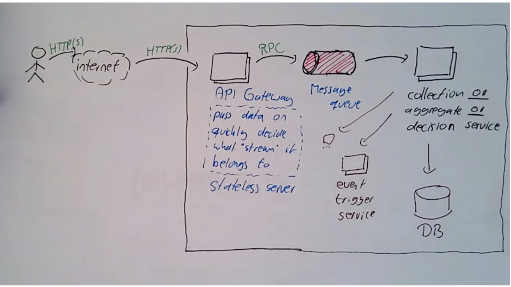

Now back it up, prepare two topics for each component.

### Server That Emits Metrics
- Servers don’t emit metrics, so go deep:
  - Machine.
  - OS.
  - Application.
- **Agent**:
  - Collects and emits the metrics.
  - **Two Questions**:
    - How often to publish?
      - Depends on how often data occurs.
      - Snapshot every second (e.g., CPU utilization).
      - Aggregated: RPC latency => highest RPC latency during that second.
    - Failures?
      - Machine, OS, Application.
      - Expected, missing data is a signal in itself (we would see the fluctuation on the graph).
      - Agent: Check with a heartbeat, reset (supervisor service).
      - Network Failure: Retry!
        - How often? Exponential backoff: 10ms, 20ms, 40ms, 80ms.
        - There are different reasons why a network would fail. Network switches (1ms), servers go down, etc. All the things that could go wrong require different times to go back online.
        - It’s really a binary search through all the possible errors.
        - Also helps with network clogs.
        - Fixed intervals.

### Stateless Server
- Send data between user and MQ.
- **Responsibilities**:
  - Receive metrics.
  - Unpack metrics.
  - Uncompress metrics (publish latency of RPC).
  - Decouple agent & queue.
  - Publish to MQ.

### How Many Topics? (How Should We Structure Our Metrics?)
- **One topic for everything**:
  - Too much.
- **One topic per server**:
  - Too many servers to manage.
  - Servers come and go.
- **One topic per metric**:
  - One query = one metric.
  - 2000 topics is manageable.
  - Adding metrics requires coding already.

### How Many Partitions Do I Need?
- **Metrics**:
  - Metric, server, time, value.
- **Idea**: Discard metrics not used in queries.

---

## MQ (Message Queue)

Here to protect the downstream service, the aggregation service.

### Topics:
- See above.

### Partitions:
- 320 MB/sec.
- Take a guess about throughput for state-of-the-art server.
  - A single broker can handle 100 MB/sec.
  - 320 / 100 = ~4 partitions.
- One replication (partition) group is three brokers (need an odd number of replications).
  - 4 partitions * 3 brokers in each partition.
  - So we need a total of 12 servers.
  - 4 * 3 = 12 servers.

---

## Aggregation Query Processing

### Query Storage
- All the data that’s not in a query, we dump.

### Config/UI Service
- **Two Questions/Topics**:
  - Algorithm.
  - Loop for one aggregation server.
    - Forever, no notion of “done”.
    - Another definition of Streaming.
    - For every query:
      - Find metric.
      - Collect values for the current window.
      - Aggregate (min, max, average, percentile).
      - Write data point for window to DB.
      - Ack to queue (can become a problem, see below).
    - Ack problem if other aggregation servers ask for the same metric.
      - Other consumers need to ask for the same metric while aggregation is happening.

### How to Divide the Work Between Multiple Aggregation Servers?
- Assign ranges of metrics to each aggregation server.
  - 1-500, 501-1000, etc.
- Pull only from topics for our metrics.

### How Many Aggregation Servers?
- Look at # messages in queue ~~ # messages consumed.
  - # messages in queue > # consumed: Means bigger data, fall behind, maybe lose data.
    - Autoscale UP automatically.
  - # messages consumed > # messages in queue:
    - Autoscale DOWN.
- In scalable systems, the right number of servers is always between two extremes. There’s always an upper bound, which is always too many servers.
  - There is always a good point in between, a calculated argument.
  - The only question is, how do I find the point in between.

---

## Storage Tier

### DB - Two Questions to Always Ask
- Is it read-heavy or write-heavy?
  - It’s write-heavy.
  - If data is generated by machines and looked at by humans, then it’s often write-heavy. & Vice versa.
- NoSQL vs SQL:
  - We’re going to choose NoSQL because there’s no transactions and we don’t need to be ACID compliant. Also, there’s not really any relationships, so there’s no need for expensive join operations.

### Row Data Model or a Column Data Model?
- **Row**:
  - A record is a complete row, and all columns are ‘as one’ on disk.
- **Column**:
  - A record is a complete column; you have the data for multiple keys.
  - If we read sequential data, then you have the data you are going to query next to each other in one record.
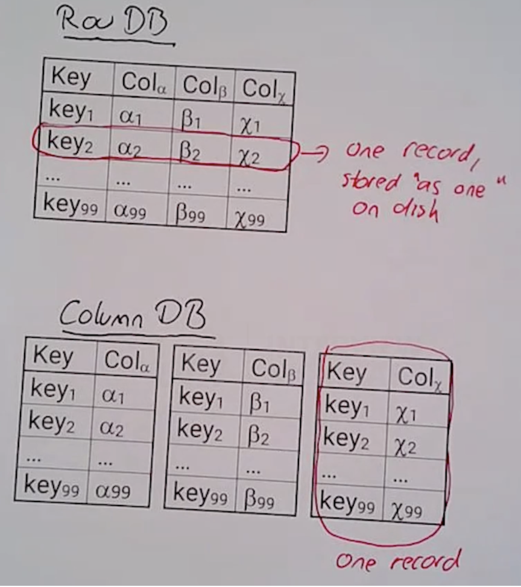
  - Can compress keys also.
- In our case, we will use a column DB because data points over time, continuous data, so we can do some compression.
  - This is called a time series database.
  - Optimized for timestamp being part of the key.
  - Normal DBs don’t work well for timestamp data. Will always be a hotspot on timestamp data because it’s inserted sequentially.

  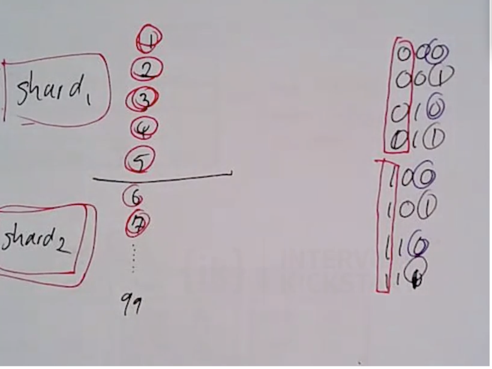

### Data Model
- `[queryId + timestamp]:[computed values]`.

---

## Cache

### Query Dashboard Service
- UI.


