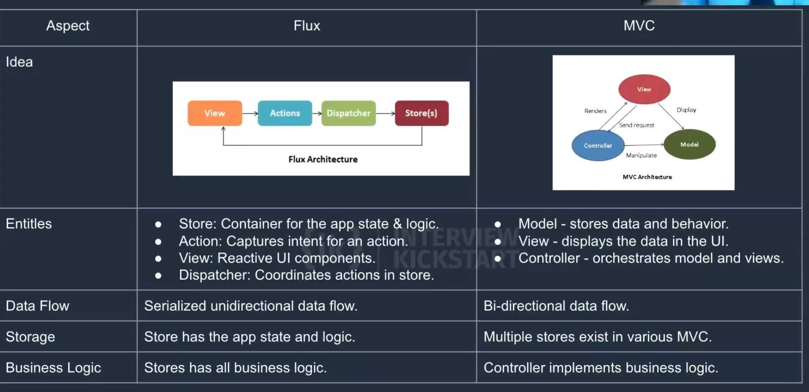

# UI System Design Foundations

---

## UI Components

**Interview Question**

    Imagine you have an application that needs to communicate with 10 different REST based endpoints. Describe how you would approach designing a state management system without using a library; then describe how you would solve the same problem with existing state management frameworks.

**Without using a library:**
- Store response from each endpoint in the component it's called from 
- Read and write any data that needs to be persisted from localStorage

**With a state library (e.g Context API)**
- Wrap application with provider where you want to use application state
- Create a hook that allows for data access via the consumer
- Abstract data normalization and data persistence into the hook so the view doesn't
need to worry about where the data comes from (cached, or fetched)

**Some common FE state management frameworks**

- Redux
- React Context API
- Hookstate

**What problems do these frameworks solve?**

- Data normalization (how do I organize my data) Data persistence (how do I persist my data)
- Data consistency (how to get data into component) Unidirectional Data Flow

**Why use a Framework?**

- Avoid duplicating efforts solving problems that can easily be solved with an existing framework
- Avoid common security pitfalls by using well reviewed frameworks
- Allow yourself to focus on the business logic of your application Decouples your data from your views
- Makes it easier to change data sources if you ever needed to DRY - Don't repeat yourself

---

### Imperative vs. Reactive Programming

**Interview Question**
    You have been asked to create an application for a point of sale system.

1. What paradigm should you choose? Why?

   - Since we've been asked to create a Point of Sale application which requires the system to respond to user events such as charges; a reactive paradigm makes the most sense. It will allow for the framework to handle any events via the javascript event loop.

2. Will your application be data-driven? If so, how?

   - Our application would be data driven since some of the view would be determined by data received from sources such as the Payment Service Providers (e.g Visa).

For example, consider the following user flow:

User attempts payment, tries to validate payment with VISA payment network, payment is declined, application declined payment. The end state was entirely driven by the data received informing the application that the payment was declined

- Imperative code execution is well defined (usually sequential) and responsible for it's execution e.g Java, C++, Python
  - Sequential execution
  - Inheritance
- Reactive - registers a callback and the framework is responsible for executing the callback e.g Javascript
  - Data flows from one function to another
  - Observer pattern
- Functional - executes code by applying and composing smaller functions into larger one's f(g(x)) e.g Haskell

**SPAs and Reactive Programming**
- Single page applications fit very nicely into the reactive programming model. (the React framework's name was no mistake!)
- Allowing javascript event loop to handle callbacks is a perfect example of reactive programming
- It is built on observable (publish/subscribe) & iterator patterns

---

### Flux Pattern

**Interview Question**

    Suppose you are developing a react application that needs to display a user profile. Design a system for fetching and storing the user data to populate a user profile page. How can you ensure the user profile is updated when the underlying data changes? How would you know when to re-render the user profile?

**What is Flux Pattern?**

- A unidirectional data flow pattern
- Common for SPAs


- Store - Stores all state management data. Updates the view with
  subset of data based on the action received.

- Action - Triggers the dispatcher to update the state of the data in the store

- View - the UI components that listen for updates to the store (container components) and re-render when certain data changes

- Dispatcher - Applies actions into the store



---

### Managing State Using Context API

Interview Question
    Design and implement user state management for a react app using Context API.

**React Context API**
Introduced in React 16.3

There were many existing state management libraries at this point React Context API is the native implementation of flux pattern in React.
This Context API allows a value(s) to be stored inside a component such than any of it's children can access it's value
Descendants can access the state without passing properties through the intermediate parent(s). Context is usually retrieved via custom hooks.

---

## Architecture

--- 

### Fetching Data

**Interview Question**

--- 

### Memory vs. Compute

**Interview Question**

    Design an image processing app that meant to work on a phone with limited storage and computing power.

Clarifying Questions
1. **How expensive is it to upload the image to a server in the cloud, and then apply image processing in cloud.**
2. Keep the image in memory, and do all the processing in memory.      

**Understanding Memory & Compute**
- Compute simply means how computationally intensive an operation is.
    - e.g rendering a video vs accessing google
- Memory refers to the amount of space which you have to keep data ready to be used. This is important because one of the most expensive (in terms of time) is copying data from short term memory (computer memory) to long term memory (hard drive).
    - e.g you can't load a 4K movie in memory all at once

- Consider a video editing app
  - There is a lot of different video and audio files that need to be kept in memory
  - Rendering all those files together is a computationally expensive task
- Considerations:
  - Given an environment with limited memory perhaps it makes the most sense to delegate the rendering to a higher powered computer in the cloud.
  - Perhaps uploading the videos elsewhere would allow to free up their local memory and rather utilize network requests to modify their timeline locally, while doing the computation elsewhere.

---

### **FE Memory - Heap & Stack**

- JavaScript has to manage the variables that are in scope at any given time by allocating memory.

  - It does this using two data structures: a **heap** and a **stack**.
    - **Stack** - Static memory allocation
    - **Heap** - Dynamic memory allocation

- Here are some characteristics of each:

|                       | **Stack**                       | **Heap**              |
| --------------------- | ------------------------------- | --------------------- |
| **Data Type(s)**      | Primitive values and References | Objects and Functions |
| **Size**              | Known at compile time           | Known at run time     |
| **Memory Allocation** | Fixed                           | Scales based on       |

---

### **On Demand vs Precomputation**

- In some circumstances, you can preprocess data to avoid any performance degradation during runtime. Here are some examples of precomputation:

  - Server-side rendering
  - Caching stored procedure calls
  - Executing longer queries on a cron job and caching the results for quick access

- In some instances, you need to do the computation during runtime. As a general rule, you should use on-demand compute when you don’t have all the inputs until runtime for a given operation.  
  Some examples include:
  - Image processing
  - Search queries

---

### Offline Web Application & Service Workers

**Interview Question**

    An airline has asked you to design a flight tracking app that it's passengers can use to track the status of their flight while in transit. It's possible that the plane has an internet connection - but there may be times when the connection is lost. 

1. This is a good use case for a PWA, fetch information about the flight and then cache it on their phone. Then, while they are in transit, if the server is not available, use the cache to pull the data. 
---

### When to use Offline Web Applications

**Do we need to support offline capabilities?** 

- You should consider an offline application if:  
  - Users might have a spotty internet connection  
  - Users might need to store (cache) data for future use  
  - Users might not have any internet connection at all  

---

### PWAS / Service Workers
- PWA - browser based applications that are meant to
mimic android / iOS applications without the need to write two different apps
- PWA's utilize standard web apis for data storage
(localStorage/sessionStorage)
- PWA's use service workers to implement a network proxy that can respond to HTTP requests from your application. It can check the availability of a remote resource and cache data if that resource in unavailable so that it can be used later when it becomes available


---


## State Management 

### Stateless vs. Stateful Components 

**Interview Question** 

You have been asked to develop a component, <Dashboard /> which is the root component for the home page of an application.

The Dashboard contains a few different widgets:
- Contact Us Form
- Inbox (which is a list of notifications) 

Outline the component structure of your page and outline which components are stateful, and which are stateless.

**Solution**

```javascript
<Dashboard> // stateful - fetches notifications
  <ContactUsForm>  // stateful - holds form data
    <TextInput /> //stateless
    <Button /> //stateless
  </ContactUsForm>
  <Inbox messages={messages}> //stateless
    {messages.map(message => (
      <Message message={ message }/> // stateless
    )}
  </Inbox>  
</Dashboard>
```


**What is State Management?**

State management is a way to share data within your application. State management can take many forms
  - Components (useState)
  - Libraries (redux, apollo)
  - Browser storage APIs (localStorage, sessionStorage) 

Designing an application with good state management is critical
  - Easy access to whatever data you need
  - Easier to test components when state can easily be stubbed


**What is a stateless component?**
A stateless component which holds no state, it's output is completely dependent on it's input. (pure function)

It does not contain any business logic. 

You typically want the atomic components of your application to be stateless because it makes them more reusable

Examples of stateless components:
<Button onPress={ ... } />
<TextInput onChange={ ... } />
<Text>{...}</Text>


**What is a stateful component?**
Simply it's a component that is a container for data, the data's origin can vary though

- Local State
- Application State
- Browser State

Whenever state changes, the component and all
it's children will re-render.

### Implement Custom Control 

**Interview Question** 

Design a custom control component <SearchBox /> by extending existing controls. 

**Solution** 


 **What Are Custom Controls?**


- Custom controls are UI elements which are derived from smaller UI elements.
- The smaller components are typically stateless and the custom control composes their functionality into something more complex
-  Composability is a key element of custom controls custom
  - Def: Fitting multiple components together (building blocks lego)


**How to make a custom control** 

Define the requirements of your new custom control
  - What are it's atomic elements?
  - Does it need to hold any state?
  - Can I abstract any of the custom control into a smaller component? 

Compose the smaller components into your new custom control

The bulk of the work is in the planning. 

### Design Embeddable Control for Payment and Checkout 

 **Interview Question** 

 Design a portable UI control that provides a secure and compliant way to capture a payment method. 

---

 **Solution** 

**Design a portable UI control that provides secure and compliant way to capture a payment method.**  

1. Provide a console in which developers can create an identifier for their application  
2. Create and host a payment method form that is able to take credit / debit card information as input - and then have it be submitted to the embedded control’s API’s (not the developers)  
3. Allow users to embed the payment method form in their web application  
4. Developers can then manage their user’s payment methods within the providers console  

---

**Why embedded controls?**  

- Principle of DRY - Don't Repeat Yourself  
- Examples:  
  - Payments (Stripe)  
    - PCI / GDPR Compliance (Avoid storing sensitive user data)  
  - Video Hosting (YouTube)  
    - Content moderation  
- Note that each of these problems have their own challenges - and often times as a developer it’s better to use an existing solution rather than building your own. Sometimes you can abstract your efforts into its own embeddable control if it can provide value to others.

i.e. Stripe 


**Designing an Embedded control**

- How will clients communicate with my system?
  - Iframe (postMessage)
  - SDK (identified via API Key)
- What views do I need to provide? How will I provide them?
- Are there any supporting API's I need to create to support my use case?