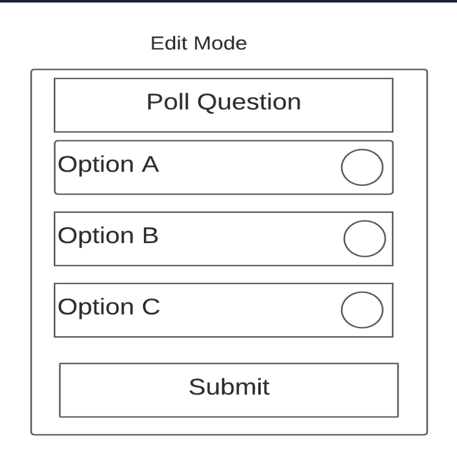
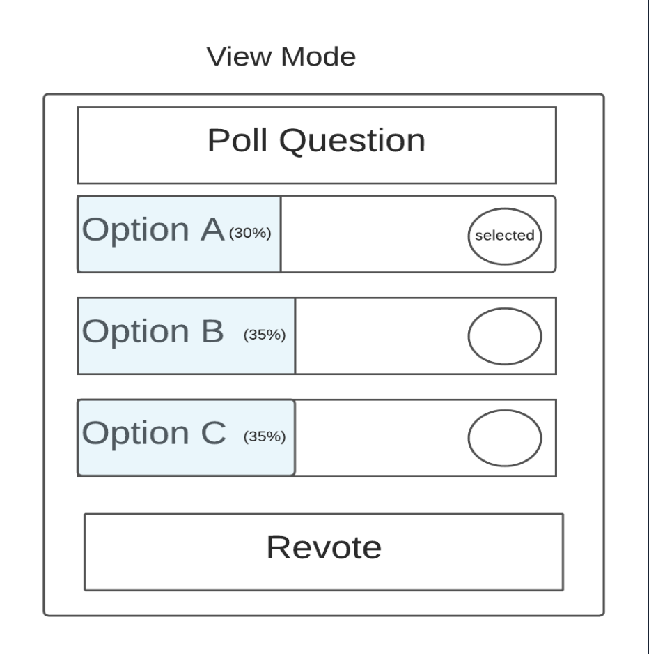
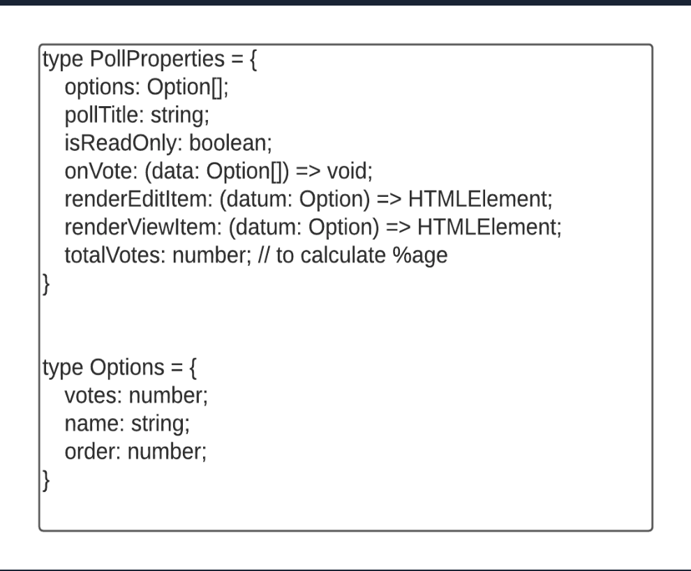
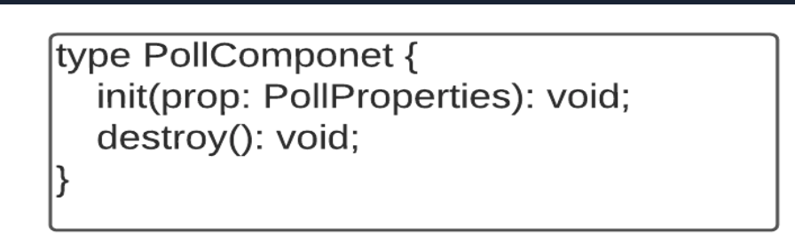
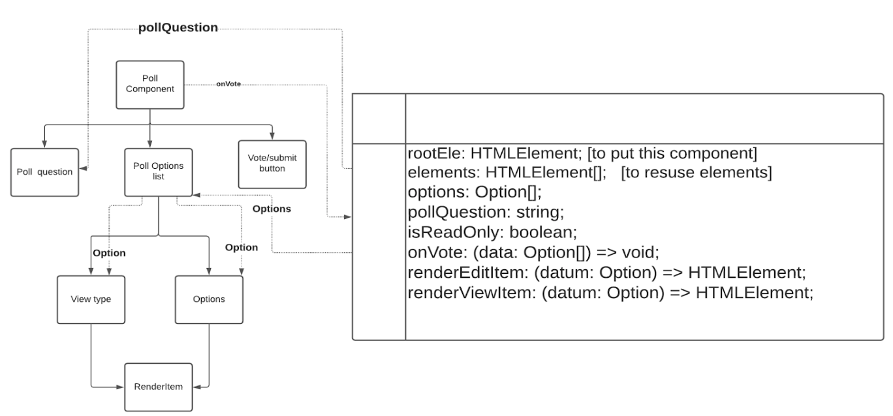

# Design a component providing poll functionality to the user:

    - It should be customizable to users to add the questions and their corresponding options
    - Don’t rely on any framework and just design it generic based on javascript itself.

**Solution:**

One could take a different approach to build and explain the design system of such a question when asked in the interview. Using one of the proven approaches for such scenarios and the points we have learned so far below is one of the ways this system could be designed:

1. **Clarify requirements (functional, not functional) and based on them:**
**Non-Functional Requirement:**
- Users can vote and revote.
- It should be capable of handling both types of polls i.e polls with Multiple answers and ones with single answers.
- Provide Read-only mode for users that are not logged in to applications using this component.
- Components need to provide features to users for enabling customizing of how the options will look using CSS API and user-defined functions.
- Components can be distributed by NPM Package.
- Embeddable integration via iFrame to other websites.

**Functional Requirement:**
- It should work in different modes like sync and async.
- Users should provide a custom render function. 
- It should be configurable for the following: 
    - The most important is user options.
    - Also, callBack functions where if based upon the user clicking an option we want to perform some task.
    - CSS extensions 
    - Render functions 

2) **Categorize the product:**

    The widget should work on different types of devices like mobile, tablet, desktop.

3) **Choose the best approach:**

    As this is a generic component we will be creating an API based on javascript itself.

4) **Draw diagram and design implementation details:**

**Component Design /Architecture:**

So with the kind of requirement, we have let’s design the high level

design for the widget:

    A very simple component design would include the Pool questions and the multiple options that would be returned these are all customizable but the default design will look as shown below:

    View Mode of the same once the user has submitted the choice will look as shown below:

Now, if we talk about the dependencies looking at the above design. The component itself contains three main elements:
- Poll question.
- Poll Options list: This further contains different options itself and its view feature which could be a number of votes or percentages or the only selected option by the user. So these will be rendered as per user-defined function.
Vote Button.

**Next, let’s think about the various properties we would be needing in this component and design them:**

- The first property will be options which will be an array of options that the user wants to give.
- Type option will have votes which will be a number of votes, the order where this option will be also the name which will be a string.
- Next, we will take the poll question as a string.
- A boolean for Read-only mode.
- A call back function for the vote button when the user selects one or more options it will be taken as an array and we can decide what we are going to do with it by either increasing the percentage or number etc.
- Other than this we will have render read and edit item functions which will handle the view of HTML elements once the user has selected any options.
- Next, we will have a function from the user which will return an HTML element based on the data the user will type.
- In the end, we will have also have total Votes to calculator the percentage, etc. This properties we have discussed so far will look like: 

Also, we will need to design the API for that we will be keeping it simple using init and destroy as shown below:

**Component State design and its data flow(Sync with UI/Component):**

- As far as the state design is concerned in addition to the props we have defined earlier we will need two more: one is the root where we will be keeping our root level HTML element for this component and another is elements which we will use to reuse the same element instead of creating new ones with each render hence optimizing the solution.
- So the user will pass the question, vote call back, then options. Data flow will look as below:

5) **Performance Optimization:**

For Optimization we will consider three main factors:

**Network:** As far as network optimization is a concern as this is a widget all we can do to optimize it is : 
    - Minify CSS and JS.
    - Serve the package using CDN.
    - Split the component into different bundles (core, theme, utility) 

**Rendering:** For rendering performance, we can take care of the following factors:
    - As mentioned earlier on each property update we can keep on updating old elements text instead delete or insert new elements.
    - While waiting for the options to load skeleton can be placed to optimize the user experience.
    - We can use flatten CSS selectors and use a CSS naming strategy to improve browser performance.
    - Other than this for animations, we should try using CSS only. This has always an edge over JavaScript animations as far as performance is concerned and provides better fps.

**JavaScript:** 

    Event delegation can be used for clicking the options as this will optimize the widget and make it performance efficient.

6) **Accessibility:**

Accessibility of this component can be improved by having the following things in place:

- Maintain Keyboard Navigation Shortcuts by having tab index i.e our options are accessible by hitting the tab key and we can navigate between them with the keyboard.
- Visual accessibility can be improved by enforcing rem in our application, eg if using a certain zoom level then rems will arrange the font accordingly and it will support custom browser settings.
- To keep it screen reader-friendly we will use Aria-live as we are changing the values we need it to be announced and also Aria-attribute: provide a role to give correct item role wherever required and we can’t use semantic elements.

7) **Business:**

- To make this component usable anywhere we will extract the component as an NPM package and will be available in the NPM registry. 
- We can make the component extensible by providing inheritance capabilities.
- Also, we will be providing Embeddable integration by making the poll component available in the Embeddable route of the application which can have the poll using its ID. This integration can be done via iframe by providing a setup script of that or we can use provider services also.
