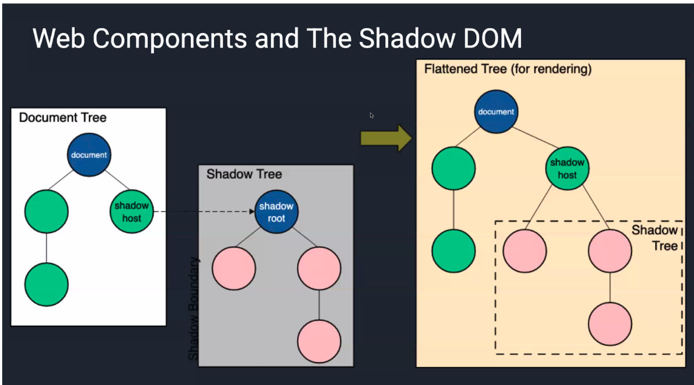

# IK - Web Development
**JD Kilby**

## Topics Covered:
- [JavaScript Events and Event Listeners](#javascript-events-and-event-listeners)
- [Web Components](#web-components)
- [iFrames](#iframes)
- [User Session Management](#user-session-management)
- [Dynamic Updating and Synchronous Connections](#dynamic-updating-and-synchronous-connections)
- [Authentication and Security](#authentication-and-security)

---

## JavaScript Events and Event Listeners

### Potential Interview Problem

Let's talk about our Kickposter app.  
Right now, it reads a page of updates and displays those updates, but it doesn't support pagination (all posts are retrieved at once). This does not scale.  

Assuming we currently have the first page of results, how could we update that code to fetch and display additional posts when the user scrolls to the bottom of the page?  

We need a signal that something happened in the system that we want to act on...

---

### Event Types

There are all kinds of events we can listen to in the browser!  
These include (but aren't limited to):  
- Input (drag and drop, touch screen gestures, gamepad input)  
- On-screen changes (DOM manipulation, animations)  
- Communication (making HTTP requests, real-time messaging)  
- Background operations (Web Workers, performance)  

Listening to the event is just the start—there may be additional work we need to do.  
Once the event has occurred and our listener picks it up, we first need to determine what event we can listen to in order to take the needed action.

---

### Setting Up The Scroll Event

Event listeners need to be attached to something that will trigger the event. For our scroll event:  
- We could listen on a specific HTML element  
  - Might be good for scrolling content in a portion of the page  
- We could listen on the document  
  - Works for scrolling on the entire page  
- We can also listen to this same event on the window  

Let's keep it simple and just listen on the window.

---

### Setting Up Event Listeners

For all of the built-in cases, there are `onevent` style event handlers built into JavaScript to allow handling of those events. In the case of the scroll event, you can add a handler with `onscroll`.

```javascript
window.onscroll = () => {
  console.log("This captures scrolling!");
};
```

We can also handle events by calling `addEventListener`—note that this is the only option for custom events and for modifying how event phases are processed, which we will discuss in a moment.

```javascript
window.addEventListener("scroll", () => {
  console.log("So does this!");
});
```

[Example on CodePen](https://codepen.io/jdkilby/pen/MWNrGbx)

---

### What Do We Need To Do?

We can just fetch more posts on a scroll event!  
We need to check how far the user has scrolled. Once the user reaches a certain point, we can fetch more posts.  

So we'll need to know the height of the document (we are assuming it's going to be larger than the height of the browser). So we'll need to get this value.

How do we calculate how far down the document the user has scrolled?  
**Hint**: What values from the window's properties might be useful to us?

---

### Infinite Scrolling Problem

Let's try to use events to enable infinite scrolling for our web page! Some useful tips for this exercise:  
- **New to React?**  
  - The `useEffect` hook will run once whenever the post container loads—this is a good place for any "one-time" setup, like setting up your listeners.  
  - The `useState` hook can store the state of your data and immediately render any changes, so when we are ready to load more posts, we can just add new posts to our state by calling `setPosts(objectWithNewPostData)`.  
- When you are ready to fetch more posts, you can simulate this by calling `loadMoreData()`, which will generate more posts.  
- To use, import the `loadMoreData` function from the app's utils on line 10:  
  ```javascript
  import { getPostsBackend, loadMoreData } from "../../utils";
  ```

---

### Using The `scroll` Event and Event Handlers

When adding an event handler, especially to something as noisy as `scroll`, it makes sense to try to make the event handler do as little work as possible, as the work you're doing takes place every time the event is called (in the case of our handler, we're doing computations with already calculated values).  

More than one handler can be on a given object by using `addEventListener`:  

```javascript
window.onscroll = HasScrolledToBottomOfPage;  
window.onscroll = logWhenScrolling;  // This overwrites HasScrolledToBottomOfPage  

window.addEventListener("scroll", HasScrolledToBottomOfPage);  
window.addEventListener("scroll", logWhenScrolling);  // This allows for both handlers  
```

---

### Event Object

Every event handler takes an event object as the optional first parameter—typically, we name this parameter "e" or "event" (the latter is better practice).  

This event object is what allows you to have control over the event pipeline while handling an event. Properties on the event object include:  
- `target` - the element that triggered the event  
- `type` - the type of event  
- ... and a lot of properties related to the event chain, more on that next!  

**Simple Example**: [CodePen](https://codepen.io/jdkilby/pen/KKOZRbj)  
**Full Event object specification**: [MDN Docs](https://developer.mozilla.org/en-US/docs/Web/API/Event)  

---

### Understanding the Event Object in JavaScript

The event object is a crucial part of JavaScript event handling. It provides details about an event when it occurs, such as which element triggered it, what type of event it was, and additional properties that help control event behavior.

#### Key Properties of the Event Object

Every event handler in JavaScript has access to an event object, which contains useful information. Some of the most important properties include:

1. **`event.target`**  
   Refers to the element that triggered the event.  
   **Example**: If a button is clicked, `event.target` would be that button.  
   ```javascript
   document.addEventListener("click", function(event) {
       console.log(event.target); // Logs the element that was clicked
   });
   ```

2. **`event.type`**  
   Specifies the type of event that was triggered (e.g., "click", "keydown", "mouseover").  
   **Example**:  
   ```javascript
   document.addEventListener("click", function(event) {
       console.log(event.type); // Logs "click"
   });
   ```

3. **`event.preventDefault()`**  
   Stops the default behavior of an event (e.g., preventing a form from submitting).  
   **Example**:  
   ```javascript
   document.querySelector("a").addEventListener("click", function(event) {
       event.preventDefault(); // Prevents the link from navigating
       console.log("Navigation blocked!");
   });
   ```

4. **`event.stopPropagation()`**  
   Stops the event from bubbling up or capturing down the DOM hierarchy.  
   **Example**:  
   ```javascript
   document.getElementById("child").addEventListener("click", function(event) {
       event.stopPropagation(); // Prevents the event from reaching parent elements
       console.log("Child clicked, but parent won't get the event.");
   });
   ```

5. **`event.currentTarget`**  
   Refers to the element that the event handler is currently attached to.  
   This is useful in cases where the event might have been triggered by a child element.  
   **Example**:  
   ```javascript
   document.getElementById("parent").addEventListener("click", function(event) {
       console.log(event.currentTarget); // Logs the "parent" element
   });
   ```

6. **`event.clientX` & `event.clientY`**  
   These properties give the X and Y coordinates of the mouse when an event occurs.  
   **Example**:  
   ```javascript
   document.addEventListener("click", function(event) {
       console.log(`Mouse clicked at X: ${event.clientX}, Y: ${event.clientY}`);
   });
   ```

---

### Why is the Event Object Important?

- It allows precise control over event handling.  
- It provides valuable context about the event.  
- It helps optimize event-driven programming by preventing unnecessary behaviors.

---

### Event Phases

JavaScript events have 3 phases:  
1. **Capture**: This is when the event travels down the DOM, figuring out exactly which element is the target of the event. In a click, the event travels from the body to the actual div or button you've clicked on.  
2. **Target**: This is when the event actually reaches the target element and triggers the event.  
3. **Bubble**: This is when the event travels back up the DOM to tell all of the parent elements the event did indeed occur.  

**Overview**: [Kirupa](https://www.kirupa.com/html5/event_capturing_bubbling_javascript.htm)  

---

### Other Event Object Properties

- **`currentTarget`**: The element that is currently being processed by the listener (not always the one that triggered the event).  
- **`preventDefault()`**: Stops the 'default' action, such as clicking a link causing the browser to open that link.  
- **`stopPropagation()`**: Stops propagation of the event further through the DOM.  
- **`stopImmediatePropagation()`**: Like `stopPropagation()`, but also prevents the event from triggering listeners on the current element that stopped the propagation.  

[Example on CodePen](https://codepen.io/jdkilby/pen/qBejxeZ)  

---

### Event Propagation: Bubbling & Capturing in JavaScript

When an event is triggered on an element, it doesn’t just affect that element—it follows a three-phase journey through the DOM. This is called event propagation, and it consists of:  
1. **Capturing Phase (Trickling Down)**: The event starts at the top of the DOM (window → document → html → body → ...) and moves down to the target element.  
2. **Target Phase (Event Execution)**: The event reaches the target element (the element that was interacted with). If there’s an event listener on the target, it executes.  
3. **Bubbling Phase (Bubble Up)**: After reaching the target, the event bubbles up through parent elements until it reaches the top (window).  

---

### Stopping Event Propagation

1. **Prevent Bubbling with `event.stopPropagation()`**  
   Prevents the event from reaching parent elements.  
   **Example**:  
   ```javascript
   document.getElementById("child").addEventListener("click", function(event) {
       event.stopPropagation();
       console.log("Child clicked - bubbling stopped");
   });
   ```

2. **Prevent Default Behavior with `event.preventDefault()`**  
   Stops the default browser behavior (e.g., stopping a form from submitting).  
   **Example**:  
   ```javascript
   document.querySelector("a").addEventListener("click", function(event) {
       event.preventDefault();
       console.log("Navigation blocked!");
   });
   ```

---

### When to Use Capturing vs. Bubbling?

| Use Case | Capturing (`{ capture: true }`) | Bubbling (Default) |
|----------|---------------------------------|--------------------|
| Handle events before they reach the target | ✅ | ❌ |
| Event delegation (handle many child elements with one listener) | ❌ | ✅ |
| Stop an event from reaching parents (`stopPropagation`) | ✅ | ✅ |
| Optimize performance in large apps | ✅ | ✅ |

---

### Real-World Example: Event Delegation

Event delegation is an efficient way to handle events on dynamically created elements by attaching a listener to a parent.  

✅ **Without Delegation (Inefficient)**  
Attaching separate event listeners to each button:  
```javascript
document.querySelectorAll("button").forEach((btn) => {
    btn.addEventListener("click", () => {
        console.log("Button clicked!");
    });
});
```
This is bad for performance if you have many buttons.  

✅ **With Event Delegation (Efficient)**  
Attach one listener to the parent instead:  
```javascript
document.getElementById("parent").addEventListener("click", function(event) {
    if (event.target.tagName === "BUTTON") {
        console.log("Button clicked!", event.target.textContent);
    }
});
```
Now, all buttons inside `#parent` are handled with one listener!

---

### Key Takeaways

- Events follow capturing → target → bubbling order.  
- Bubbling is the default, but capturing can be enabled.  
- Use `stopPropagation()` to prevent bubbling or capturing.  
- Event delegation improves performance for dynamic elements.  

---

### When Would I Leverage Event Propagation?

- For `preventDefault`: There are many times when you want to override default browser behavior (e.g., custom actions on form submission buttons).  
- Why use the capture phase and/or `stopPropagation`?  
  - Overlay with a listener that needs to process before (or potentially stop processing) hitting the target.  
  - Special handling for accessibility, validation, or logging before hitting the target.  

**Be careful!**  
Using bubbling over capturing makes your code harder to read, maintain, and debug; it can also cause intentional or unintentional side effects. Especially true of libraries and code bases that aren't fully documented or you understand as a “black box.”  

Any actor in the event chain can `stopPropagation` or `preventDefault`—and there isn't a way to restart the chain from there.

---

## Web Components

WebComponents solve an important problem in web dev: How do I share code and consume 3rd party code without polluting my own CSS/HTML/JavaScript namespaces?  

One of the big issues with taking on 3rd party code is that their CSS/eventing/JavaScript being potentially accessible to other parts of the code—all code becomes an exercise in naming to try to ensure you don't conflict.  

With WebComponents, all of this is properly scoped—your events/CSS/etc live in their own encapsulated area.


---

### Events and Web Components

WebComponents exist within their shadow DOM—so if you send out an event, you must ensure that the `composed` property is set to `true` if you intend for the event to escape the shadow DOM and be consumed externally. That means that WebComponents can have private internal events that can't be accessed outside that shadow DOM.  

Some events (like "click," "blur," "focus") cross the boundary by default. Others (like "scroll" and custom events) do not by default.  

**More info**: [Shadow DOM and Event Propagation](https://pm.dartus.fr/posts/2021/shadow-dom-and-event-propagation/)  
[Example on CodePen](https://codepen.io/jdkilby/pen/YzmQWEe)  

---

### Conclusions

- WebComponents are a great way to provide cross-application functionality, due to the ease of importing them.  
- Existing components can be swapped out without too much trouble with Web Components if desired.  
- Web Components are based on the principle of encapsulation: so sending messages from inside one to outside must be done with care.  

**Note how to talk about this?** If there are multiple frameworks across the company.

---

## iFrames

### Interview Problem

Our little social media site is getting off the ground! The problem is—while we've got good content, we need to bring people to the site—and we're hoping for a more grassroots campaign—not big marketing, but links from other social media apps to us.  

What are some things that we could develop that would push other sites to use or feature our content?

---

### What are iFrames?

iFrames are an inline HTML element that allows you to embed an entire HTML document within another.  

This allows for some really handy encapsulation when the unit of sharing is 'An entire HTML Document'—it ensures that the embedded document's content isn't influenced by the container's environment (other than that the container gets to determine the iFrame's size and its restrictions).  

Some common uses for iFrames include:  
- Embedding third-party services/sites/content  
- External forms  
- Ads, analytics, and tracking  
- Payment systems (isolate payments from your system)  
- Embedding legacy services / sites (e.g., bridging a migration effort)  
- Navigating text documents / site maps (can feel more responsive than true browser navigation)  

**Not so much anymore…**  
- Passing data across sites (e.g., Facebook like/share buttons)  
- External media (e.g., video playback)  

---

### Passing Messages Between Windows

`postMessage` allows communication between Window Objects:  
- Between a window and pop-ups that have been spawned by said window  
- Between a window and embedded iFrames  

`postMessage` is called on the Window object that will receive the message:  
- The parent window will get the `contentWindow` member of the iframe element itself within the DOM and call `postMessage` on that.  
- Within the iFrame, we will call `postMessage` on `window.parent`.  

We listen to the "message" event on the window object to receive messages.  

If you want to test this out, see code here: [CodePen](https://codepen.io/jd)  

---

### How to Restrict an iFrame

iFrames can be restricted in terms of their permissions by running them in 'sandbox' mode. This mode applies the following restrictions:  
- Treat the content as being from a unique origin  
- Block form submission  
- Prevent content from using plugins (through `<embed>`, `<object>`)  
- Block script execution (JavaScript is off)  
- Disable APIs  
- Prevent links from targeting other browsing contexts  
- Prevent the content from navigating its top-level browsing context  
- Block automatically triggered features (such as automatically playing a video or automatically focusing a form control)  

---

### How to (More Granularly) Restrict an iFrame

What if we need one of those features? `sandbox` is actually a full attribute, so we're able to add limited permissions as we need them. A non-inclusive list is as below:  
- `allow-forms`: Allows form submission  
- `allow-modals`: Allows opening modal windows  
- `allow-popups`: Allows popups  
- `allow-popups-to-escape-sandbox`: Allows popups to open new windows without inheriting the sandboxing  
- `allow-same-origin`: Allows the iframe content to be treated as being from the same origin  
- `allow-scripts`: Allows running scripts  

---

### iFrame Security Issues

Giving any control over the current site to another site is a risky endeavor (which is why sandbox exists), but there still exist problems:  
- If you have to turn any allowed attribute on, you're now exposed to potentially malicious attacks through that vector.  
- Allowing scripts can result in arbitrary code being run with it being hard to set firm limits.  
- Allowing navigation can lead to being navigated to a phishing site via the iFrame.  
- Allowing pop-ups can lead to unrestricted ad content.  

---

### Modern iFrame Alternatives

Due to their limitations, there are a few alternatives to iFrames that are more commonly used today!  
- **Video embedding**: Can use the `<video>` tag.  
- **Simple document navigation in single-page applications**: Allowing pseudo-navigation without page reloads.  
- **Operations that need to pass data across sites**: Often come with simple JavaScript inclusions, including the Facebook like/share buttons.  

---

### Conclusions

- iFrames allow you to contain another site's content within your own.  
- They're commonly used for embedding external content.  
- `postMessage` allows you to communicate with the content within iFrames.  
- iFrame content can be restricted via the 'sandbox' mode.  
- Despite the available restrictions, iFrames still need to be considered before use, due to some usability and security issues.  

---

## User Session Management

### Interview Prompt

The website is now pretty built-out! Any user could use this and have a basic experience. One key issue though: any user who logs in is going to have the exact same user experience.  

What are the mechanisms we could use to make sure that users each have their own unique user experience? And what kind of information would we need to store to help users personalize their account? Assume we already have a login system.

---

### What is a User Session?

The user "session," also referred to as their user "journey" or user "click path," is the entirety of their experience between login and log-out. A user session will often contain most major interactions that your website supports.  

A key component of web development is ensuring that users can make meaningful changes during their session that will pave the way for future sessions.  

---

### What Do We Need to Store?

- **Tracking**:  
  - For analytics (e.g., track user clicks, views, spends a majority of their time).  
  - For troubleshooting (e.g., note odd patterns / identify bugs).  
  - For performance (e.g., page load times).  
- **Security**:  
  - Authentication credentials.  
- **Decisions**:  
  - Shopping carts.  
- **Personalization**:  
  - Language, UX customizations.  
- **Privacy**:  
  - Advertising, tracking preferences.  

---

### Cookies

The earliest, and most familiar, solution to the problem of needing to store local data in a world of stateless HTTP communication is the cookie. Cookies are used for all sorts of data management on a site, all with the same goal: remembering information about previous sessions when you revisit a site.  

Common examples include remembering cart information of shopping sites or remembering login information for future visits.  

---

### Types of Cookies (Broadly)

- **Session cookies**: Last for only a single session.  
- **Persistent cookies**: Can persist (e.g., save credentials to avoid logging in again next session).  
- **Essential cookies**: Do not require user consent and are needed for a website to work (e.g., storing credentials, session cookies).  
- **Non-essential cookies**: Do require consent in some jurisdictions (e.g., ad tracking, certain user preferences).  
- **First-party cookies**: Match the domain of where the cookie was set.  
- **Third-party cookies**: Do not match the domain and are often used for tracking and advertising.  

---

### Cookie Attributes

- `name` and `value`: The main “key-value” pair.  
- `domain` and `path`: Provide info about where the cookie is associated.  
- `expires` and `max-age`: Help establish how long the cookie persists.  
- `HTTPOnly`, `SameSite`, and `Secure`: Specify in which context the cookie will be transmitted.  

---

### Cookies Example

We’ll now run through a basic example of how you could use a cookie to save the scroll position on our website!  

Navigate back to `src/components/PostsContainer/PostsContainer.tsx` and we’ll update it with the ability to save our place in the code!  

**Useful tips**:  
- The function `window.scrollTo(x, y)` allows us to scroll to point `x, y` on the screen.  
- The npm module `js-cookie` makes it simple to get and set cookies. You could also directly manipulate cookies with `document.cookie`, but that takes extra work.  

---

### localStorage

`localStorage` is a window property, accessible via JavaScript, that allows the website in question to store key-value pairs specific to that website and access them at any time.  

The biggest difference between saving data in `localStorage` and storing data within a cookie is that `localStorage` can only be read by the client, while cookies are transmitted to the server on each request.  

---

### localStorage Example

We'll now see an example of how a user setting can be saved and accessed via local storage!  

We already have a settings feature located at `src/components/UserSidebar/Settings.tsx`, but let's see if we can add some functionality to it via `localStorage`.  

We'll also have to go back to the `PostsContainer` file in order to access the stored data.  

---

### When to Use localStorage

In general, `localStorage` is the better option any time that you'd not want to send information back to the server. Additionally, `localStorage` provides much more space than a cookie!  

Typically, cookies are limited to a space of 4096 bytes, while `localStorage` can support as much as 5MB per domain.  

**Note**: `localStorage` is a bigger security risk when an XSS attack occurs. Unlike `localStorage`, cookies can be configured to have several properties that make them better for more sensitive information like access tokens. For instance, setting a cookie to "httpOnly" prevents access via JavaScript.  

---

### Session Storage

Additionally to `localStorage`, the HTML5 WebStorage API also supports `sessionStorage`. `sessionStorage` is much like `localStorage` in terms of usage but is limited to a single session. After the window or tab is closed, the `sessionStorage` will be cleared, but the `localStorage` will remain. This makes it a great choice for storing information you'll need only locally and only for one session.  

**Note**: The same security concerns exist for `sessionStorage` as for `localStorage`.  

---

### Conclusions

- A user session is the path the user takes from login to tab close or logout, and any interactions that they have along that path.  
- Information that we need to save during a user session includes tracking information and user-specific personalization information.  
- Cookies are a good option for storing small bits of data that need to be shared between client and server.  
- `localStorage` and `sessionStorage` are better cookie alternatives for info that’s just needed by the client (or very infrequently by the server) as long as the data isn’t sensitive.  

---

## Dynamic Updating and Synchronous Connections

### Interview Prompt

So far, we've designed the components that are put in place to support our social media website. It has all the necessary design elements to support a basic user flow. However, one of the most important elements of social media is having a live feed for users.  

What are some of the approaches you might use to give users the impression of a "live" experience, rather than a static one?

---

### Real-Time Communications On Web

Some use cases for real-time communication on the web include:  
- Financial trading  
- Online games  
- Data visualization dashboards  
- Live Maps  
- Chat tools / collaboration apps (Discord, Slack, etc.)  
- Online Meetings (Zoom, Microsoft Teams)  

All of these applications need the ability to deliver content moment-by-moment, without a user just refreshing a page.  

---

### Constraints of Legacy Communication Protocols

We need a full-duplex (async and bi-directional) application layer that is standard across the web. Most standard communication protocols have some difficulty when it comes to providing synchronous connections:  
- **TCP sockets**: Cannot be opened directly between browser and servers and have no built-in security.  
- **UDP**: Isn’t two-way and does not guarantee data integrity (fine for streaming video, but not your stock trades).  
- **HTTPS**: Is a request-response-based protocol, so it has a lot of overhead for each request.  

Maybe HTTPS could work… but what if there’s something else?

---

### HTTPS Long Polling

Out of the options above, the easiest one to adapt is the HTTPS call. The issue brought up was that it is too much overhead to be constantly pinging the server with requests. We can avoid this by doing what is called "Long Polling."  

In a long polling model, the client pings the server before data is even needed or ready, receives a message back as soon as data is available, and then immediately polls again.  '


---

### WebSockets

Introduced in 2011, WebSocket is a standard communication protocol to send/receive data on the internet. It keeps a persistent bi-directional channel between a client and a server, where both parties can simultaneously emit and listen for events.  

WebSocket frames (the metadata-holding objects that are wrapped around the actual message) are much more efficient in size (2 bytes) compared to HTTP headers (in KBs), and the methodology also eliminates polling and increases server scalability.  

[Example on CodePen](https://codepen.io/jdkilby/pen/XWvVBeP)  


---

### External Libraries for WebSockets

- **Socket.IO**: A commonly used library that abstracts applications from channels.  
  - Automatically picks the best protocol based on the browser's capabilities.  
  - Client-side support for WebSockets is widespread, but there may be use cases (especially on the server-side) where a solution like Socket.IO may be invaluable!  
  - Additional features (e.g., reconnection).  
- **ws**: A more lightweight choice.  

---

### WebSockets Example

Let's see an example of how we could use WebSockets to connect our app to a WebSockets server!  

We'll use this server that you can send messages to and receive your message back in return:  
[WebSocket Echo Server](https://websocket.org/tools/websocket-echo-server/)  

**Demo**: [CodePen](https://codepen.io/jdkilby/pen/XWvVBeP)  

---

### Other Protocols

- **WebRTC**: For peer-to-peer communications.  
  - [More info](https://developer.mozilla.org/en-US/docs/Web/API/WebRTC_API)  
- **Server-Sent Events (SSE)**: If you need one-way communication (from the server to the client).  
  ```javascript
  const eventSource = new EventSource("sourceURL");
  ```  
  - Can listen for the `message` event and custom events.  
  - [More info](https://developer.mozilla.org/en-US/docs/Web/API/Server-sent_events/Using_server-sent_events)  

---

### Conclusions

- Many web applications need at least some synchronous or pseudo-synchronous communication between client and server.  
- Most protocols for communication can't effectively support this.  
- HTTPS can be modified via long polling to achieve this to an acceptable degree.  
- WebSockets allows for more efficient communication than long polling.  
- **Socket.IO**: For beyond basic WebSocket implementation.  
- **ws**: A more lightweight option.  
- Look at **WebRTC** for peer-to-peer communications; if you just need one-way communication from the server to the client, try **SSE** (server-sent events).  

---

## Authentication and Security

### Interview Prompt

Let's say we have our website built out with an existing concept of user-specific information, but lack a system to log users in and out of the website. How would you approach developing a login system for users, and what considerations would you need to have about security?

---

### Basic Password Authentication

While there are some “password-less” authentication approaches, the basic password authentication model is the most common approach to authentication.  

The essential components of password authentication are:  
- Allowing users to register a given username and password (and often an email), pairing that login to their account.  
- Letting users log in with their given username (or email) and password.  
- Providing users a way to reset their password (and/or recover username) in order to gain access to their account without credentials.  

---

### Concerns with Basic Password Authentication

The standard authentication model we’ve seen has a number of security issues, in which someone could easily gain access to another’s account. For our purposes, we’ll focus on three:  
1. **Online Guessing Attacks**  
2. **Eavesdropping**  
3. **Server Compromises**  

All three of the above could result in letting unauthorized people access a user account, and we’ll go over each in turn.  

**There are no silver bullets.** The question is, what are some things we can do to slow attackers down? We don’t want to make the experience so cumbersome that it’s a terrible user experience for the user. There’s no perfect solution, only compromises. It’s a trade-off between security and convenience.  

It also depends on the situation. Are we a bank, or are we something less intrusive like a video game?  

---

### Online Guessing Attacks

The most well-known issue with passwords is a simple one: what if an attacker could simply guess the password of other users? Or what if an attacker, equipped with the ability to generate an endless number of passwords, could easily get to a user's password?  

There are many mitigations to the issue of attackers trying to guess a user's password, and they all work to varying degrees. Some of them include:  
- **Rate Limiting**: As a user tries to guess more and more username/password combinations, start making them wait between attempts. This is effective, except that (1) an attacker can simply make guesses on many accounts instead of just one, and (2) they can make guesses on a user's account to essentially lock them out by rate-limiting!  
- **CAPTCHAS**: Forcing the login attempt to solve a CAPTCHA can help significantly by interrupting bots! Unfortunately, CAPTCHA solves are cheap and can be solved by anyone employed to solve them.  
- **Password requirements**: Forcing the user to make a harder password can help prevent an attacker from guessing it! However, making a user add too many extra parts to their password can end up causing frustration.  

Despite the drawbacks, all of these methods are broadly useful and should be used in tandem for good protection against online guessing attacks.  

Let's go over how we could set up password restrictions in `src/components/SignUpPage/SignUpPage.tsx`.  

**What's a quick way to validate a string for certain requirements?**  
Let's use a regular expression! We can build our own, but for now, let's take this one: [ihateregex.io](https://ihateregex.io/expr/password/)  

May have both a combined regex and also a single regex for each requirement separately, so that I can prompt the user when they’ve passed a requirement. This makes it interactive.  

---

### Eavesdropping

In comparison to online guessing attacks, eavesdropping is a much simpler issue in today's web development environment. The issue in question is how to deal with an attacker simply capturing and looking at the username/password combination that a user sends. If the user and the attacker are connected to the same network, there's no reason they wouldn't be able to see the combination!  

In this case, this is the reason that most modern websites use HTTPS instead of HTTP! HTTPS comes with packet encryption that works for each new connection, meaning a random attacker can't see what username/password combination you send.  

---

### Server Compromises

A final issue that needs to be considered when it comes to user authentication: how do we store username/password information such that even if an attacker gets access to our site's database, they can't get access to an account?  

The solution is simple in concept, if difficult in execution. Instead of storing passwords in the clear, they should be first encrypted, and then stored! The nuances of this are quite deep; but jumping to the optimal solution, we'd ideally store a hash of the password with a random value for each user (a “salt”), and then also store the salt. These two values would allow us to verify the correctness of a password, without an attacker being able to see it!  

Some of it is out of our hands, but we’ll do what we can to observe and report what we see. One of the things we can do to check on the server is, pay attention to patterns on the front end. Can have alerts on the front end. “This command to log in is being run more than I think it should be. Maybe password reset is happening way too frequently. Can also check the response payload to see if there’s any data that’s not supposed to be there.  

---

### Alternatives to Passwords

- **SSO/2FA**: Many of the problems we saw above can also be solved with one or both of either Single Sign-On or Two Factor Authentication!  
  - **Single Sign-On (SSO)**: The most common examples being Google's single account system for all Google apps, or Okta sign-on for different business apps.  
  - **Two Factor Authentication (2FA)**: Adds an extra layer of security by requiring a second form of verification (e.g., SMS code, authenticator app).  
- **OAuth**: OAuth (Open Authorization) 2.0 is an important standard for communication between apps. Rather than being a standard for how users provide credentials to websites, it is a standard for how websites give a user's credentials to each other. 
    - For example, if you logged into your Google account, and wanted to give a third-party app (say ours) access to your Google drive, Google would prefer not to just give us the user's credentials and have us grab the photos straight from their drive 


---

### Practice Problems

#### Authentication / User Sessions

You recently joined a team that has a public website they are looking to add user authentication to.  

1. **Describe (in words) how you would implement a secure authentication flow.**  
2. **Write pseudocode outlining one function for each operation that is a part of your authentication flow and what that function would need to do.**  
3. **Once a user is logged in, describe how you would save which pages the user has viewed.**  

---

### Authentication Flow

1. **User Registration**: The client-facing system will have a login/signup form.  
   - The text input boxes will have included best practices for username/password policies.  
   - The input text will also be validated and sanitized to prevent SQL injections.  
2. **User Login**: The user logs in with their credentials. Upon successful authentication, the server issues a secure token (e.g., JWT) to the client.  
   - Include rate limiting to prevent brute-force attacks.  
   - Include CAPTCHA to help interrupt bots.  
3. **MFA Verification**: Users must verify their identity via a second factor (i.e., email, text message, authenticator, etc)
4. **Session Management**: The front end stores the token securely in a HTTP-only cookie to prevent XSS attacks and includes it in subsequent requests to authenticate the user.
    - HTTPS: Ensure all communication between the frontend and backend is encrypted using HTTPS.
    - Middleware authorization to secure routes
5. **Logout**: Invalidate tokens/Sessions

```javascript
async function registerUser(email, username, password) {
  try {
    let response = await fetch('/registerUser',  {
      method: 'POST', 
      headers: {'Content-Type': 'application/json'},
      body: {username, email, password}
    }); 
    
    if (!response.ok) throw new Error('Registration failed');
    window.location.href = '/login';
  } catch (error) {
    console.error('Registration error:', error.message);
  }
} 


async function loginUser(username, password) {
  try {
    let response = await fetch('/login', {
      method: 'POST',
      headers: {'Content-Type': 'application/json'}, 
      body: {userName, password}
    })


    if (!response.ok) throw new Error('Login failed');


  window.location.href = '/dashboard'


  } catch (error) {
    console.log('Login error: ', error.message);
    alert('Login failed: ${error.message}');
  }
}

async function checkAuthStatus() {
    try {
        const response = await fetch('/api/check-auth', {
            method: 'GET',
            credentials: 'include', // Ensures cookies are included
        });


        if (!response.ok) throw new Error('Not authenticated');


        const { user } = await response.json();
        console.log('User is authenticated:', user);
    } catch (error) {
        console.error('Authentication check failed:', error.message);
        window.location.href = '/login'; // Redirect to login page
    }
}

async function fetchUserProfile() {
    try {
        const response = await fetch('/api/profile', {
            method: 'GET',
            credentials: 'include', // Ensures cookies are included in the request
        });


        if (!response.ok) throw new Error('Failed to fetch profile');


        const userProfile = await response.json();
        console.log('User profile:', userProfile);
        return userProfile 
    } catch (error) {
        console.error('Error fetching profile:', error.message);
    }
}

async function logout() {
  try {
    const response = await fetch('/logout', {
      method: 'POST', 
      credentials: 'include'
    })


    if (!response.ok) throw new Error('Failed to logout');


    return;
  } catch (error) {
    console.error('Error logging out', error.message);
    alert('logout unsuccessful: ', error.message);
  }
}

async function trackPageView(pageUrl) {
    try {
        // Send the viewed page data to the backend
        const response = await fetch('/api/track-page', {
            method: 'POST',
            headers: {'Content-Type': 'application/json'},
            body: JSON.stringify({ pageUrl }),
        });

        if (!response.ok) throw new Error('Failed to track page view');
    } catch (error) {
        console.error('Tracking error:', error.message);
    }
}
```