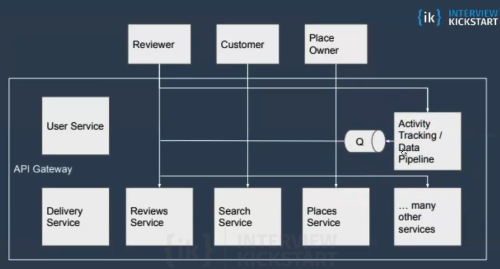
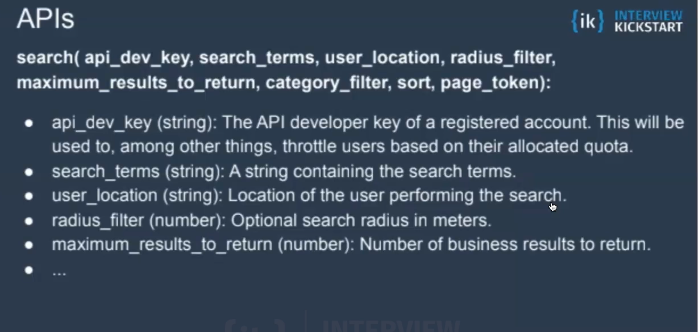
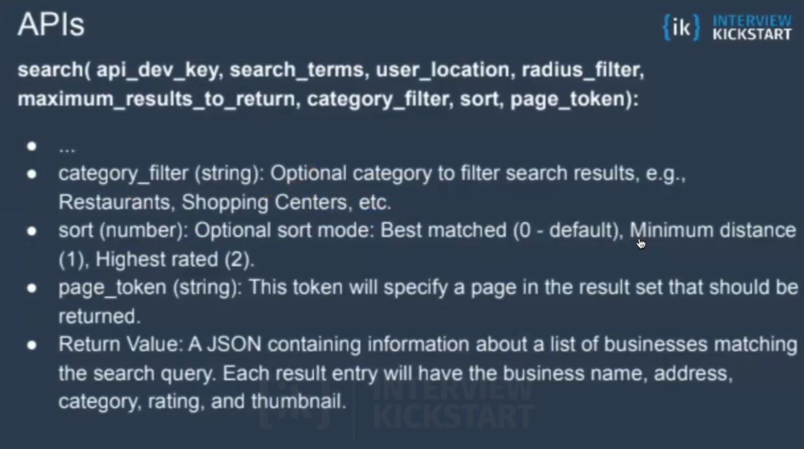
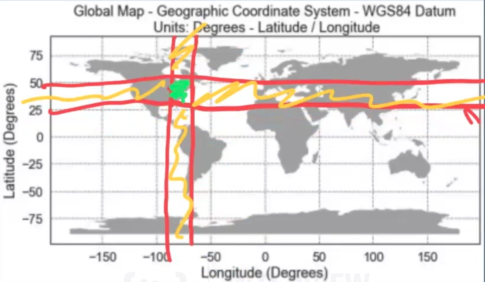
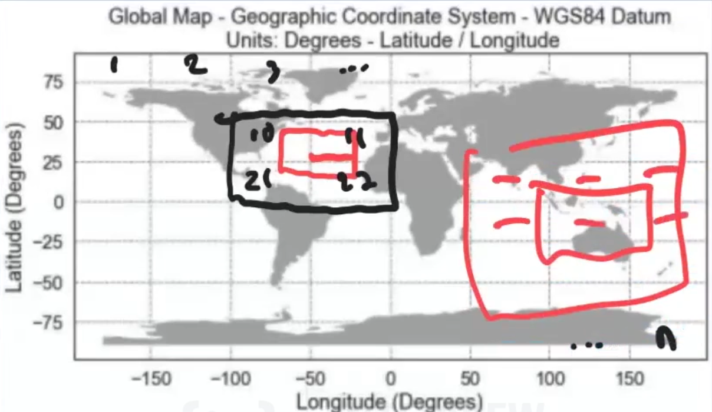
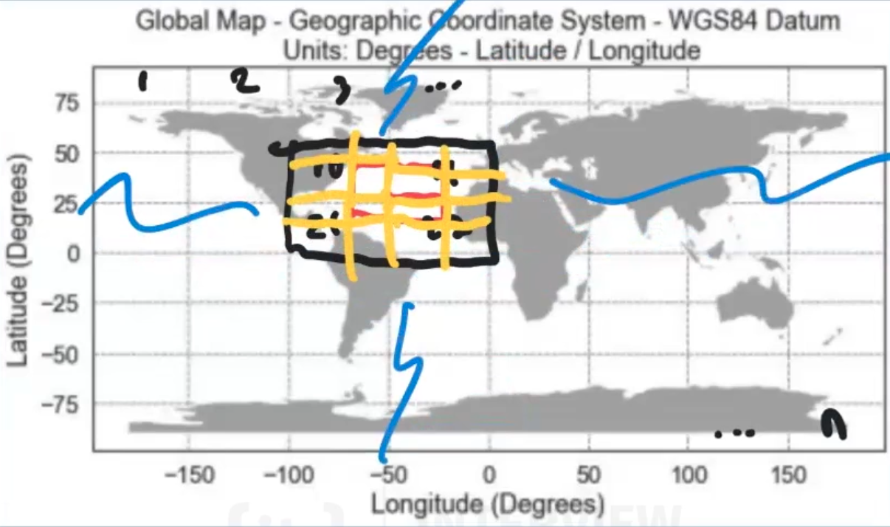
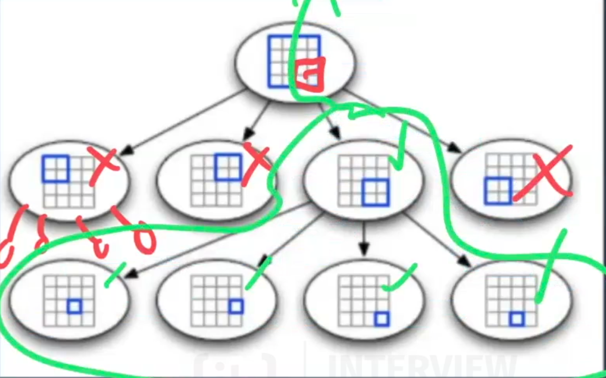
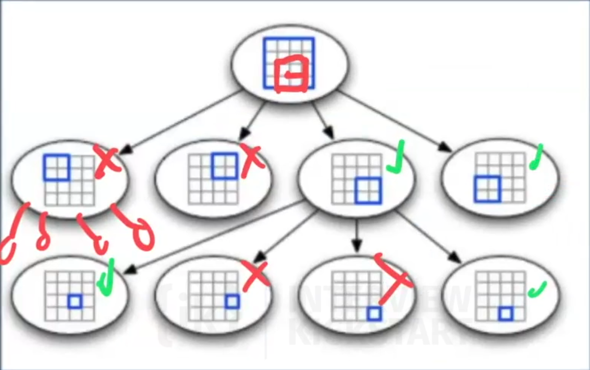

---

**Problem Statement**  

**As given:** “How would you design Yelp?”  

**What that typically means:** Proximity servers are used to discover nearby attractions like places, events, etc. Design a service, where users can search for nearby places like restaurants, theaters, or shopping malls, etc.  

1. Given their location (longitude/latitude), users should be able to find all nearby places within a given radius.  
2. Users should have a real-time search experience with minimum latency.  
3. Our service should support a heavy search load.  

---

This outlines the key requirements for designing a Yelp-like service. Let me know if you need help breaking it down further! 🚀

---

## Functional Requirements 

* ✅ Search for places by text, proximity, etc
* ✅ View place info, reviews, photos
* ✅ Write a review 
* ✅ Notifications
* ✅ Make a reservation 
* ✅ Order delivery 
* ✅ Bookmark places 
* ✅ View activity (reservations, reviews, check-ins)
* ✅ Place recommendations 

**Design Constraints** 

* ✅ 500M Places
* ✅ 100K queries per second 
* ✅ 20% growth in the number of places and QPS each year 




## Scale App Tier 

**APIs**




**How to search by location?**  

**Naive Data Model**  
Key: place_id Value: name, description, latitude, longitude  

To find all the places nearby for a given location with latitude and longitude (100, 85) within a radius of 10Km, the query will be:

```sql
SELECT * FROM places
WHERE latitude BETWEEN 100-10 AND 100+10 // represents boundaries of a square
AND longitude BETWEEN 85-10 AND 85+10; // represents boundaries of a square

```
**NOTE** Will need a geospacial library to actually calculate the radios, can't just simple -/+ 10km. 

**Why this is a terrible solution at scale?** 

The challenge is that searching by latitude and longitude in a traditional database with/without proper indexing is highly inefficient for large datasets. When using simple inequality comparisons (> lat and lat, > long and < long) To find businesses within a bounding box, the database has to perform a full table scan, checking every single record against these conditions. This is also true when searching for terms in the business name or description. This would require a wild-card search across the entire database via a LIKE clause.

Load up two "strings" to load up everything in the center box. The green area represents only a tiny fraction of all the data we have touched in order to facilitate this query, and then we're going to do that for every single query. 

In summary, we are doing a two dimensional search when our data base is well suited for one one dimension. We don't really have a good way to index with equal importance so we can perform our geo spacial range query. 



---

**What can we do to improve this?** 

🔴 Add a zip code (make the search more specific, add additional filter)
* Don't want to rely on a third party service

✅ Add additional table to store grid Ids (precomputed) that map to lat/long values (Divide and Conquer)

We reduce our two dimensional problem into a one dimension key-value lookup

---

**Improved Data Model**  

Key: **place_id**  
Value: name, description, latitude, longitude, **grid_id**  

Key: **grid_id**  
Value: [x1, x2] (x-axis range), [y1, y2] (y-axis range)  

Our query becomes:  

```sql
SELECT * FROM places [same as before] 
AND GridID IN (mainGridID, Left, Right, Top, Bottom, 
               Top-Left, Top-Right, Bottom-Left, Bottom-Right)
```

---



**Big Win** 
We save a bunch of time by only looking at the nearby grids



Here is the extracted text from the image:

---

**🏆 Caching 🏆**  

We can make it faster by storing the grid’s number and the list of its places in memory. As discussed above, we will be having 50 Million grids, and we can assume that each grid id will be of 6 bytes. And as with the mammoth scale of 400 Million places, we can assume the place_id to be of 8 bytes.  

Therefore, the total memory required to cache grid ids and place ids would be 4 GB.  

\[
(50M \times 6) + (400M \times 8) \approx 4GB
\]

This would save use from querying the places table at all, we just query the grids table and say "Our user has this search region, give me all the grids (hit the cache for the grids)

## **Is there a more optimal solution** 

- Our solution so far is not the most optimal solution because of the sparsity of the data. You can image that within a city, the data will be heavily populated, whereas in the country, the data will be very sparse. 

**Non-Uniform Data** 

### Introduce Quad Trees 
[System Design Foundations](../system-design-foundation)

**How to search by location** 

We build our same square search region, and now we need to find the quad treen nodes that overlap with our search region, so we're going to perform a **range tree search.**  



---

**A more sophisticated search**




Each **leaf node** stores a set of points of interests ( 

Once the node reaches capacity (101), create 4 new nodes and continue inserting points of interests into each leaf node.  

**In the real world,** you'll never be on the hook to implement your own quad tree or having to store the quad tree in a db as the place to store the quad tree. In the real world, we'd use an out of the box solution, such as elasticsearch, or if you're using postgress you can use the extension postGIS. Redis also has an out of the box solution for geo-spacial search features. All of these out of the box solutions have their own flavor of geo-spacial search implementation under the good. Some use R-trees, quad trees, geo-indexes, etc. 

But, what you keep in disk, and what you keep in memory, and what you replicate from memory to disk, what you keeping the quad tree, there's a lot of different ways to do it, the interviewer is just testing you on your foundation work. 

## Sharding/Scaling 

**Options** 

### How to map our data to shards?

Shard by region (region based)
- Regions can become imbalanced 
- Slice up the earth somehow and make each region a shard
- Good for data sets that are static. We can take the hit and avoid scatter gather
e.g zip codes, states, etc. 

Pros
- For proximity search, don't have to **scatter gather** 
- [Sharding + Scatter-Gather for Scalable Distributed Systems](../system-design-foundation)

Cons
- Carving up the regions can be tricky because density various alot. 
- Numbers of points of interests may not be the only factor thats relevant. Different usage patterns
this will cause more load on that shard. 

Shard by location ID (POI e.g. restaurant) **random sharding** 
- Random distribute our points of interest
- Different quad trees on each shard -> **scatter gather** 
- Also need separate mapping of places -> quad tree servers to recreate dead replicas. 
- Good for data that's dynamic, or points of interests are moving around all the time. Internal analytics. Etc. 

Cons
- Hotspots (miama), no we have to ask all the shards for points of interest

## Always do two things in system design. 

1. **Connect the dots** 
- If i know how to design yelp, then I know how to design tinder, and how is tinder different then yelp? 

2. Check out the **tech blogs** for the actually companies to figure out what they did.

https://gis.stackexchange.com/questions/18330/using-geohash-for-proximity-searches